# 基础逻辑门
## Verilog HDL简介
Verilog HDL 设计语言支持3种设计风格： 门级，数据流级和行为级。 门级和数据流级设计风格通常用于
设计组合逻辑电路，而行为级设计风格既可以用于设计组合逻辑电路又可以设计时序逻辑电路。本次实验
通过使用Vivado 2015.1软件工具，以Basys3和Nexys4 DDR开发板为目标板，设计简单的组合逻辑电路来
展示3种设计风格的用法。请参考Vivado手册了解如何使用Vivado工具创建工程并验证数字电路。
## Nexys4 DDR简介
Nexys4 DDR 特性如下: (译者注：开发板各批次参数不同，仅供参考  
• 128 MiB DDR 2 SDRAM  
• 16Mbytes SPI (quad 模式) PCM 非易失型存储器  
• 16Mbytes 并行 PCM 非易失型存储器  
• 10/100 以太网PHY  
• USB-UART 和 USB-HID 端口(用于鼠标和键盘)  
• 8-bit VGA 端口  
• 100MHz CMOS 振荡器  
• 72个I/O连接到扩展连接器  
• GPIO 包括 8个LED， 5个按键开关，8个拨码开关和2个4位7段数码管  
Nexys4 DDR 开发板如下图所示   

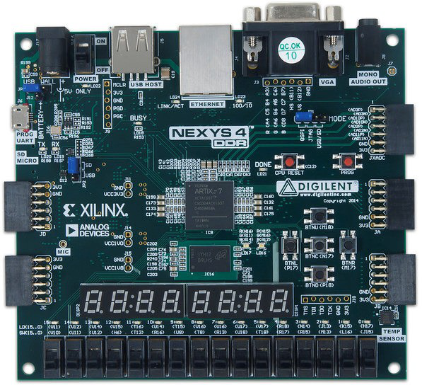
 

## 门级建模
Verilog HDL 支持内建的原始的门级设计。门级支持包括多输入、多输出、三态和拉态。 多输入门支持包括： and, nand, or, nor, xor, 和xnor，它们的输入为2个及以上，输出只有1个。多输出门支持包括buf 和 not ，它们的输出为2个及以上，输入只有1个。 Verilog HDL语言还支持三态门： bufif0, bufif1, notif0, 和notif1。这些三态门有一个输入，一个控制信号和一个输出。拉门支持包括  
pullup和 pulldown，只有一个输出（没有输入）。这些门的零延迟的基本语法如下： 

	and | nand | or | nor | xor | xnor [instance name] (out, in1, …, inN); // [] is optional and | is  
	selection  
	buf | not [instance name] (out1, out2, …, out2, input);    
	bufif0 | bufif1 | notif0 | notif1 [instance name] (outputA, inputB, controlC);  
	pullup | pulldown [instance name] (output A);  
你也可以在同一语句中，用逗号分隔，创建多个相同类型门的实例，比如：  

Verilog HDL语言也允许在实例化门电路时加入延迟。 加入的延迟来自输入或输出。这些延迟可以表达为上升、下降或关断延迟；在一个实例中可以使用1、2或3种延迟。关断延迟可以用于输出能被关掉的门   (如 notif1).
比如，  

	and #5 A1(Out, in1, in2);	// the rise and fall delays are 5 units   
	and #(2,5) A2(out2, in1, in2);	// the rise delay is 2 unit and the fall delay is 5  
	units notif1 #(2, 5, 4) A3(out3, in2, ctrl1); //the rise delay is 2, the fall delay is 5, and the turn- off delay is 4 unit  

## 实验目标
完成本次实验后，你将有能力:
- 使用门级、数据流级和行为级3种风格设计一位和多位组合逻辑电路
- 设计模型读取拨码开关和按键开关并输出到LED和7段数码管
- 仿真并理解设计的输出
- 创建分层的设计
- 综合，实现并生成比特流文件
- 下载比特流文件到开发板，并验证功能
## 使用门级建模风格设计2-to-1多路选择器并下载验证结果
由我们数字电路课本的知识我们知道一个2-to-1多路选择器的电路大致如下如所示：

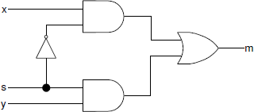
     
### 实验步骤
1. 打开 Vivado并创建空白工程，取名为 lab1.1 (参考 Vivado2015.1 手册 Step 1)。

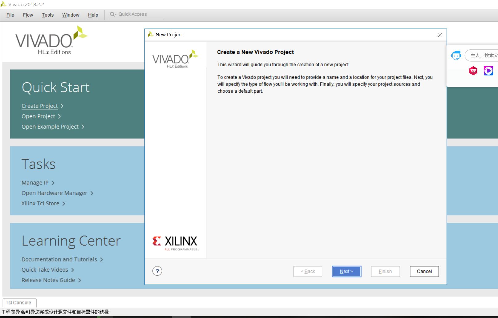
 

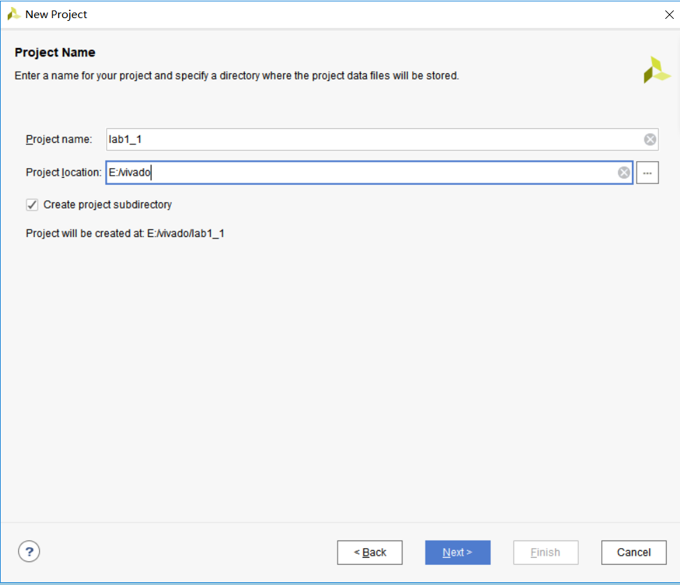
 

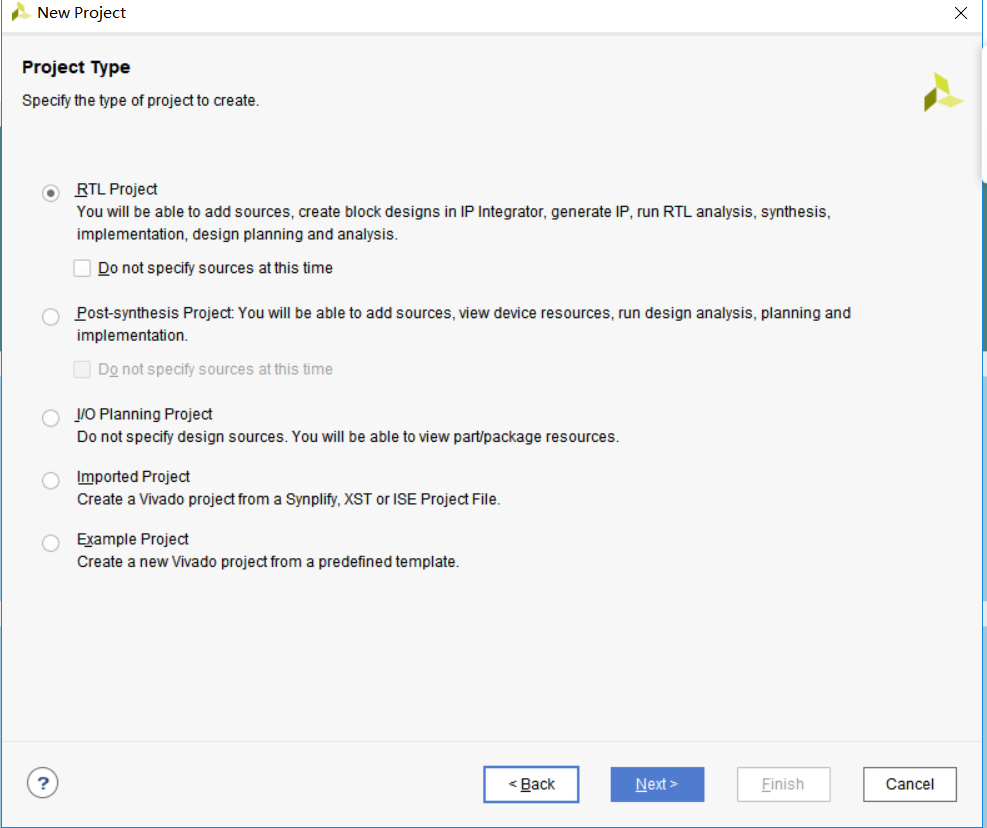
 

创建文件create file

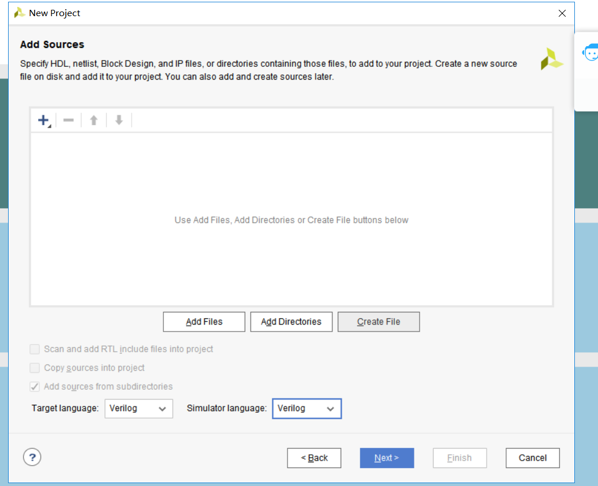
 

添加xdc文件

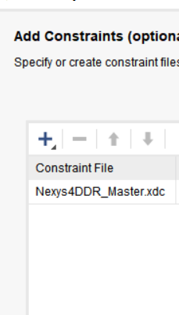
 

选择配置文件  

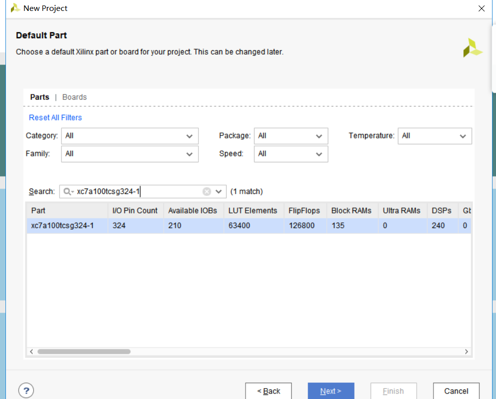
 
2.  使用门级建模风格创建Verilog module包含3个输入(in1,in2,select)和1个输出(out) (参考Vivado2015.1手册 Step 1).

提示：单击在New Project窗口，Add Source上的绿色加号按钮。然后单击Create File。修改文件名为lab1_1_1，单击OK。确认目标语言和仿真语言都设置为Verilog。单击两次Next。

3.  将适合开发板的XDC文件添加到工程。

提示：单击在New Project窗口Add Constraints上的绿色加号按钮。单击AddFile.选择Basys3_Master.xdc (Basys3)或Nexys4DDR_Master.xdc (Nexys4 DDR)。点击Next。

4.	在New Project窗口选择xc7a35tcpg236-1(Basys3)或xc7a100tcsg324-1(Nexys4 DDR)。单击
Next。单击Finish。

5. 一个定义Module的窗口会出现， 通过单击Port Name并输入变量名，创建3个输入 (in1, in2, select) 和1个输出(out) 。 通过单击下拉列表选择正确的方向修改 Direction。单击OK.

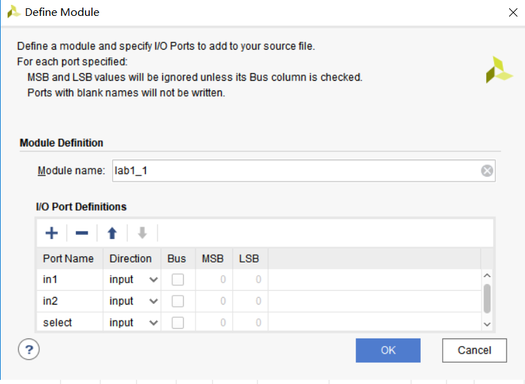
 

6.		打开lab1.1.v 文件编辑其中内容。 在分号 (;)后添加上文电路的结构逻辑。选择File > Save File或 CRTL-S保存。

7. 单击RTL Analysis上的 Elaborated Design选项卡。
8. 单击 Schematic 查看门级建模的设计。
### 参考代码和门级建模的设计
我们可以使用门级建模的方式写，verilog的代码如下：

    module lab1_1(
        input in1,in2,
        input select,
        output out
        );
        wire temp1,temp2,temp3;
        not (temp1,select);
        and (temp2,temp1,in1);
        and (temp3,select,in2);
        or (out,temp2,temp3);
    endmodule

点击Schematic 查看门级建模的设计  

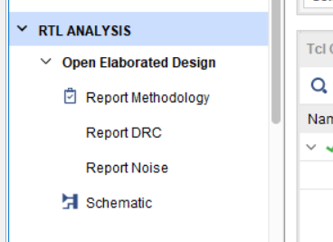
 
我们可以看到大致如下的电路：

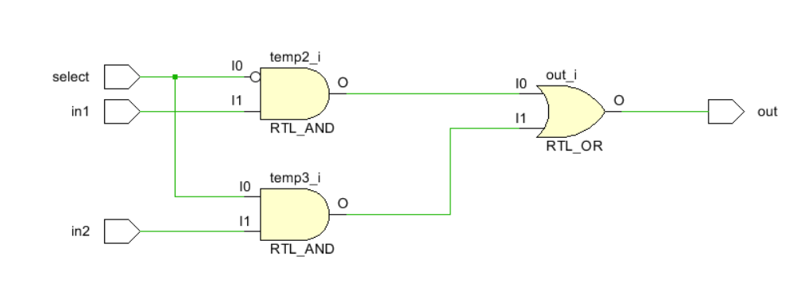
 
由此我们可以知道我们设计的门级建模的确是对的。

编辑XDC文件。去注释并将 SW0 和 SW1赋给in1 和 in2, SW7 给 select, LED0给out。保存XDC文件。
 生成比特流文件，将其下载到Basys3或Nexys4 DDR开发板，并验证功能 

打开xdc文件

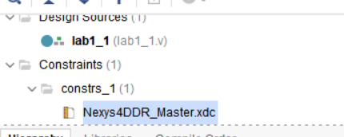
 

修改xdc文件对应段落：  

    set_property -dict { PACKAGE_PIN J15   IOSTANDARD LVCMOS33 } [get_ports { in1 }]; #IO_L24N_T3_RS0_15 Sch=sw[0]
    set_property -dict { PACKAGE_PIN L16   IOSTANDARD LVCMOS33 } [get_ports { in2 }]; #IO_L3N_T0_DQS_EMCCLK_14 Sch=sw[1]
    #set_property -dict { PACKAGE_PIN M13   IOSTANDARD LVCMOS33 } [get_ports { sw[2] }]; #IO_L6N_T0_D08_VREF_14 Sch=sw[2]
    #set_property -dict { PACKAGE_PIN R15   IOSTANDARD LVCMOS33 } [get_ports { sw[3] }]; #IO_L13N_T2_MRCC_14 Sch=sw[3]
    #set_property -dict { PACKAGE_PIN R17   IOSTANDARD LVCMOS33 } [get_ports { sw[4] }]; #IO_L12N_T1_MRCC_14 Sch=sw[4]
    #set_property -dict { PACKAGE_PIN T18   IOSTANDARD LVCMOS33 } [get_ports { sw[5] }]; #IO_L7N_T1_D10_14 Sch=sw[5]
    #set_property -dict { PACKAGE_PIN U18   IOSTANDARD LVCMOS33 } [get_ports { sw[6] }]; #IO_L17N_T2_A13_D29_14 Sch=sw[6]
    set_property -dict { PACKAGE_PIN R13   IOSTANDARD LVCMOS33 } [get_ports { select }]; #IO_L5N_T0_D07_14 Sch=sw[7]
    #set_property -dict { PACKAGE_PIN T8    IOSTANDARD LVCMOS18 } [get_ports { sw[8] }]; #IO_L24N_T3_34 Sch=sw[8]
    #set_property -dict { PACKAGE_PIN U8    IOSTANDARD LVCMOS18 } [get_ports { sw[9] }]; #IO_25_34 Sch=sw[9]
    #set_property -dict { PACKAGE_PIN R16   IOSTANDARD LVCMOS33 } [get_ports { sw[10] }]; #IO_L15P_T2_DQS_RDWR_B_14 Sch=sw[10]
    #set_property -dict { PACKAGE_PIN T13   IOSTANDARD LVCMOS33 } [get_ports { sw[11] }]; #IO_L23P_T3_A03_D19_14 Sch=sw[11]
    #set_property -dict { PACKAGE_PIN H6    IOSTANDARD LVCMOS33 } [get_ports { sw[12] }]; #IO_L24P_T3_35 Sch=sw[12]
    #set_property -dict { PACKAGE_PIN U12   IOSTANDARD LVCMOS33 } [get_ports { sw[13] }]; #IO_L20P_T3_A08_D24_14 Sch=sw[13]
    #set_property -dict { PACKAGE_PIN U11   IOSTANDARD LVCMOS33 } [get_ports { sw[14] }]; #IO_L19N_T3_A09_D25_VREF_14 Sch=sw[14]
    #set_property -dict { PACKAGE_PIN V10   IOSTANDARD LVCMOS33 } [get_ports { sw[15] }]; #IO_L21P_T3_DQS_14 Sch=sw[15]

    ## LEDs

     set_property -dict { PACKAGE_PIN H17   IOSTANDARD LVCMOS33 } [get_ports { out }]; #IO_L18P_T2_A24_15 Sch=led[0]
    # set_property -dict { PACKAGE_PIN K15   IOSTANDARD LVCMOS33 } [get_ports { led[1] }]; #IO_L24P_T3_RS1_15 Sch=led[1]
    # set_property -dict { PACKAGE_PIN J13   IOSTANDARD LVCMOS33 } [get_ports { led[2] }]; #IO_L17N_T2_A25_15 Sch=led[2]
    # set_property -dict { PACKAGE_PIN N14   IOSTANDARD LVCMOS33 } [get_ports { led[3] }]; #IO_L8P_T1_D11_14 Sch=led[3]
    # set_property -dict { PACKAGE_PIN R18   IOSTANDARD LVCMOS33 } [get_ports { led[4] }]; #IO_L7P_T1_D09_14 Sch=led[4]
    # set_property -dict { PACKAGE_PIN V17   IOSTANDARD LVCMOS33 } [get_ports { led[5] }]; #IO_L18N_T2_A11_D27_14 Sch=led[5]
    # set_property -dict { PACKAGE_PIN U17   IOSTANDARD LVCMOS33 } [get_ports { led[6] }]; #IO_L17P_T2_A14_D30_14 Sch=led[6]
    # set_property -dict { PACKAGE_PIN U16   IOSTANDARD LVCMOS33 } [get_ports { led[7] }]; #IO_L18P_T2_A12_D28_14 Sch=led[7]
    #set_property -dict { PACKAGE_PIN V16   IOSTANDARD LVCMOS33 } [get_ports { led[8] }]; #IO_L16N_T2_A15_D31_14 Sch=led[8]
    #set_property -dict { PACKAGE_PIN T15   IOSTANDARD LVCMOS33 } [get_ports { led[9] }]; #IO_L14N_T2_SRCC_14 Sch=led[9]
    #set_property -dict { PACKAGE_PIN U14   IOSTANDARD LVCMOS33 } [get_ports { led[10] }]; #IO_L22P_T3_A05_D21_14 Sch=led[10]
    #set_property -dict { PACKAGE_PIN T16   IOSTANDARD LVCMOS33 } [get_ports { led[11] }]; #IO_L15N_T2_DQS_DOUT_CSO_B_14 Sch=led[11]
    #set_property -dict { PACKAGE_PIN V15   IOSTANDARD LVCMOS33 } [get_ports { led[12] }]; #IO_L16P_T2_CSI_B_14 Sch=led[12]
    #set_property -dict { PACKAGE_PIN V14   IOSTANDARD LVCMOS33 } [get_ports { led[13] }]; #IO_L22N_T3_A04_D20_14 Sch=led[13]
    #set_property -dict { PACKAGE_PIN V12   IOSTANDARD LVCMOS33 } [get_ports { led[14] }]; #IO_L20N_T3_A07_D23_14 Sch=led[14]
    #set_property -dict { PACKAGE_PIN V11   IOSTANDARD LVCMOS33 } [get_ports { led[15] }]; #IO_L21N_T3_DQS_A06_D22_14 Sch=led[15]

## 数据流级建模
数据流级建模风格主要用于描述组合逻辑电路。一种基本的手法就是使用持续赋值(continuous assignment)。 在持续赋值中，一个值被指派到一种叫做线网(net)的数据类型。  
持续赋值的语法为：  

	assign [delay] LHS_net = RHS_expression; 

其中LHS_net是1bit或多bit的目标线网,而RHS_expression是一个包含各种运算符(operator)的表达式  (expression) 。该语句在任何时候都对源操作数值的任何更改进行运算，并将结果经过延迟单元后赋值给目标线网。在Part 1 中的门级建模风格的例子可以用数据流级建模风格的持续赋值表达。比如：   

	assign out1 = in1 & in2; // perform and function on in1 and in2 and assign the result to out1
	assign out2 = not in1;
	assign #2 z[0] = ~(ABAR & BBAR & EN); // perform the desired function and assign the result after 2 units

持续赋值语句中的目标可以是下面的一种:  

1. 标量线网scalar net (比如上面第1和2个例子)  
2. 向量线网Vector net  
3. 向量线网的常数位选定Constant bit-select of a vector (比如上面第3个例子)  
4. 向量线网的常数部分选定Constant part-select of a vector  
5. 以上任意的拼接    

我们再举一些例子，其中用到了标量和向量线网：

    wire COUNT, CIN;    // scalar net declaration
    wire [3:0] SUM, A, B;   // vector nets declaration
    assign {COUT,SUM} = A + B + CIN; // A and B vectors are added with CIN and the result is
    // assigned to a concatenated vector of a scalar and vector nets

需要注意的是，多个持续赋值不能使用同一个目标线网。
## 使用数据流级建模风格设计2-to-1多路选择器并下载验证结果
对应电路图：  

 

### 实验步骤
1. 打开Vivado并创建空白工程取名为 lab1.2。
2. 使用数据流级建模风格，创建一个 Verilog module并增加2个2-bit 输入 (in1[1:0], in2[1:0])，1个1bit
选择信号输入(select)和一个2-bit输出(out[1:0])。
3. 添加XDC文件到工程。 编辑XDC文件，将SW0 和 SW1赋给in1[1:0], SW2 和 SW3赋给in2[1:0]， SW7 赋给 select， LED0和 LED1 赋给 out[1:0].
4. 综合你的设计。
5. 实现你的设计。

### 参考代码和数据流级建模的设计
由于这里的选择信号select只有一位，在使用数据流级建模的时候，我们需要对简单的选择信号进行简单的位扩展，让选择器更加适合我们使用的情况。  
我们可以编写如下的代码来表达：

    module lab1_2(
        input [1:0]in1,in2,
        input select,
        output [1:0]out
        );
        wire [1:0]temp1,temp2,temp3,temp4;
       assign temp4={select,select};
       assign temp1={~select,~select};
       assign temp2=temp1&in1;
       assign temp3=temp4&in2;
       assign out=temp2|temp3;
    endmodule

点击Schematic 查看门级建模的设计    
我们可以看到大致如下的电路：  

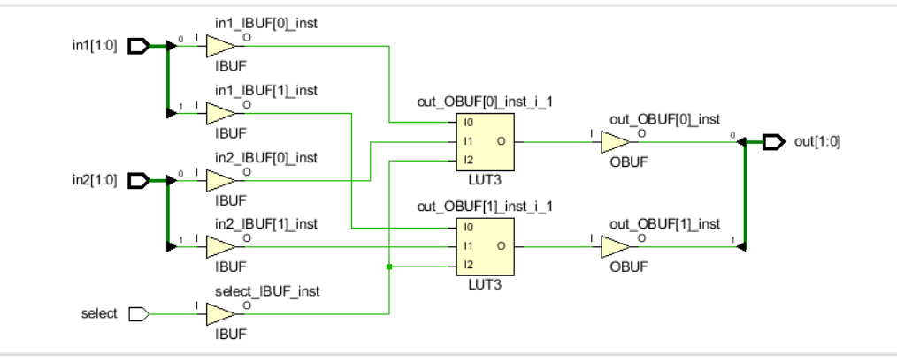
 

编辑XDC文件。去注释并将 SW0 和 SW1赋给in1 和 in2, SW7 给 selecet, LED0给out。保存XDC文件。
 生成比特流文件，将其下载到Basys3或Nexys4 DDR开发板，并验证功能 
## 行为级建模
行为级建模通常用于描述复杂的电路。行为级建模主要用于设计时序逻辑电路，但也可以用于设计纯组合逻辑电路。一个电路的行为级建模（语句）如下：  

    initial Statements  
    always Statements  

一个模块可以包含任意数量的initial和always语句，并且可以在其中包含一个或多个过程语句。这些initial和always语句会同时执行（换句话说，它们用于描述并行的过程，即它们在模块中出现的顺序没有关系），而过程语句是按序执行的（换句话说，它们出现的顺序有影响）。   

initial和always语句都在time=0时刻执行，在其余时间只有always语句执行。语法如下：  

    initial [timing_control] procedural_statements;  
    always [timing_control] procedural_statements;  

**其中的过程语句procedural_statement是下面之一：**   
过程赋值procedural assignment    
条件语句conditional statement   
案例语句case statement   
循环语句loop statement   
等待语句wait statement   

**initial语句是不可综合的（non-synthesizable）通常用在测试中。always语句是可综合的(synthesizable）并且最终产生的电路可以是组合的也可以是时序的。为了生成组合逻辑电路， always块：(i)不能是对边沿敏感的 (ii)条件语句的每一个分支都需要定义好输出 (iii)case语句中的每个案例（case）需要定义所有输出且必须有一个默认情况（default case）。有关这个话题的更详细讨论在Lab 7中涉及。语句的目标(LHS)须为寄存器（reg）类型; 可以是标量或向量。**举个例子：  

    reg m; // scalar reg type  
    reg [7:0] switches; // vector reg type  

下面是一个2-to-1多路选择器模型的例子。

    always @ (x or y or s)
    if(s==0)
    m=y;
    end
    else
    m=x;

## 仿真（测试文件）
要测试我们设计的模块功能是否正常，最直接的办法就是烧写到FPGA芯片中进行验证，但是这种方式往往结果并不直观，且出现问题后也不容易定位。为提高工作效率，我们可通过电脑仿真的方式进行功能验证，待仿真通过后，再烧写到FPGA中，这样可以快速排除电路中存在的绝大多数bug。在电脑上进行仿真，除了我们设计的功能模块之外，还需要另一模块——testbench，用于产生被测模块所需的激励信号。由于testbench只是用于电脑端的仿真，而不需要最终综合成电路，因此其写法更加灵活，可以使用verilog语法中的一些不可综合的语句，如initial、#、$display、$readmemb、forever等。  
假设我们的被测模块完成以下功能  

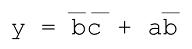
 

其verilog代码为：

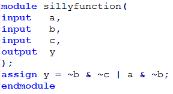
 

测试方法可以大致分为3种，这里我们会对三种测试方法都做介绍，但在这个实验中使用的简单测试文件，其他两种方法会在之后的实验中再具体使用：

### 简单测试文件
最简单的测试文件可以写成如下形式：

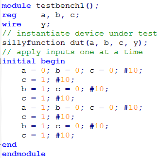
 

语法说明：  
testbench文件一般不包含任何输入输出信号  
将被测模块实例化，被测模块的输入信号定义成reg类型，输出信号定义成wire类型。  
initial：通过initial块构造输入信号的波形，同一initial块内部的语句是串行执行的，多个initial块之间并发执行。

###  自检测试文件
带自检功能的测试文件如下所示，可以对输出结果进行判断，并打印错误信息

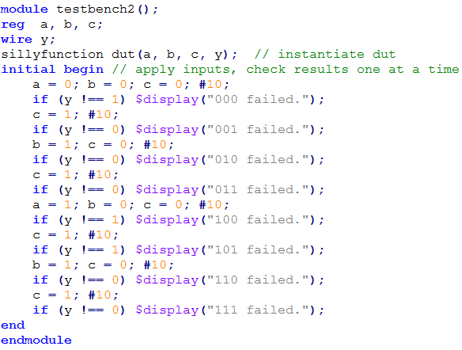
 

模块的输入信号给定之后，就有有结果输出，将实际输出结果于预期结果做比较，如果不同，则打印出错误信息。
### 测试向量
通过测试向量进行仿真
将输入信号的各种组合以及对应的输出结果构成一测试向量，则每个向量中都包含了一种输入状态，以及该状态下的期望输出结果
将该向量导入一内存数组
构造一时钟信号
在时钟的上升沿，将一个向量赋值给被测模块输入端，并在时钟的下降沿对被测模块输出与期望输出结果进行对比，如果不相同，则记录下该向量，至此向量全部测试完毕。  
向量测试文件（example.tv）:包含a、b、c以及y_expected  

    000_1
    001_0
    010_0
    011_0
    100_1
    101_1
    110_0
    111_0

测试文件

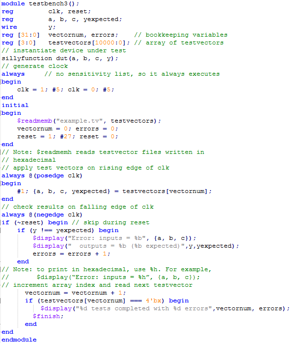
 

前面介绍了三种测试方法，三种方法各有其优缺点。  
简单测试文件编写简单，容易上手，但需要人工判断仿真结果的正确性；  
带自检的测试文件可以将错误信息打印出来，但编写稍微复杂一些，且激励波形仍需通过人工输入代码来完成；  
测试向量法测试文件编写最为复杂，还需要编写一个用于跟被测模块结果进行比较的黄金模型，但此种方法测试最为充分，且后续维护起来也最容易。  

## 使用行为级建模风格设计2-to-1多路选择器并下载验证结果
对应电路图：   

 
### 实验步骤
1. 打开Vivado并创建空白工程取名为 lab1.3。

2.	使用行为级建模风格，创建一个 Verilog module并增加2个2-bit 输入 (in1[1:0], in2[1:0])，1个1bit
选择信号输入(select)和一个2-bit输出(out[1:0])。

3. 添加XDC文件到工程。 编辑XDC文件，将SW0 和 SW1赋给in1[1:0], SW2 和 SW3赋给in2[1:0]， SW7 赋给 select， LED0和 LED1 赋给 out[1:0].

4. 对你的设计仿真(行为级仿真behavioral simulation) 100 ns，并分析输出。

5.   综合你的设计。

6.  实现你的设计。
### 参考代码和数据流级建模的设计 

    module lab1_3(  
        input [1:0]in1,in2,
        input select,
        output reg [1:0]out
        );
       always@(*)
       begin
           if(select)
           out=in2;
           else 
           out=in1;
       end
    endmodule

点击Schematic 查看门级建模的设计    
我们可以看到大致如下的电路： 

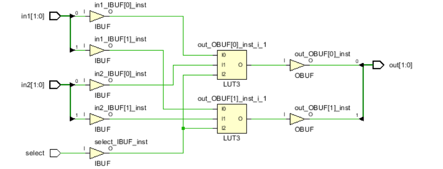
 

编辑XDC文件。去注释并将 SW0 和 SW1赋给in1 和 in2, SW7 给 selecet, LED0给out。保存XDC文件。
 生成比特流文件，将其下载到Basys3或Nexys4 DDR开发板，并验证功能 

### 仿真代码的编写和测试

首先，添加仿真代码：  

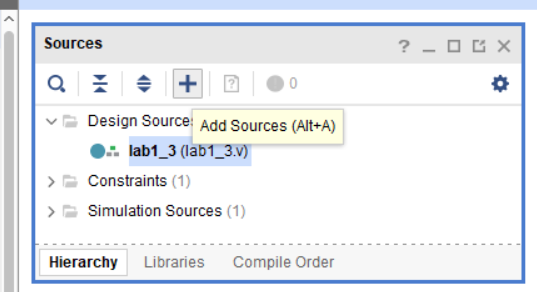
 

选择点击add source或者使用快捷键ALT+A来打开，选择add or create simulation sources

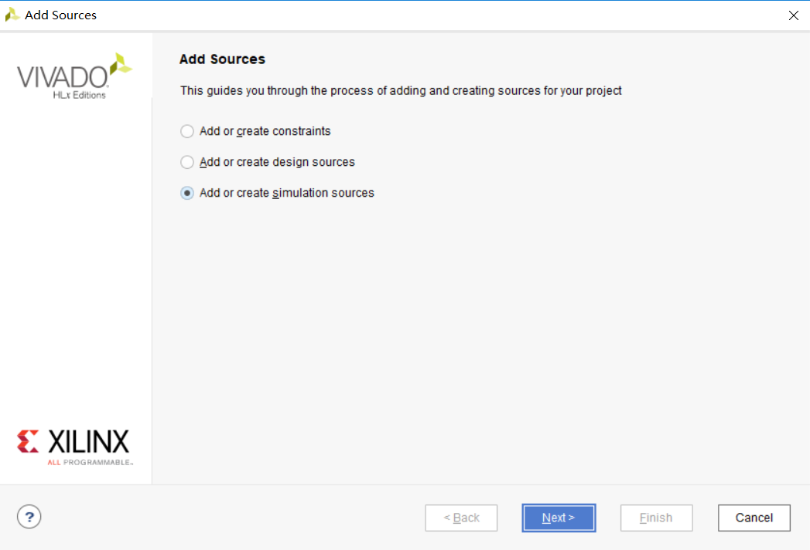
 

创建文件lab1.3.tb，把之前lab1.3中的代码中的输入定义为reg类型（可以直接赋值），输出定义为wire类型，之前的文件实例化进入仿真代码。

    module lab1_3_tb(
        );
         reg [1:0]in1,in2;
         reg select;
         wire [1:0]out;
         lab1_3 dut(in1,in2,select,out);  //实例化模块
         initial begin
            in1=0; in2=0; select=0; #10;
            in1=1; #10;
            in2=2; #10;
            select=1; #10;
            in1=2; #10;
            in2=3; #10;
            select=0; #10;
            in1=0;   #10;
            select=1; #10;
         end
    endmodule

把测试模块定义为顶层模块：

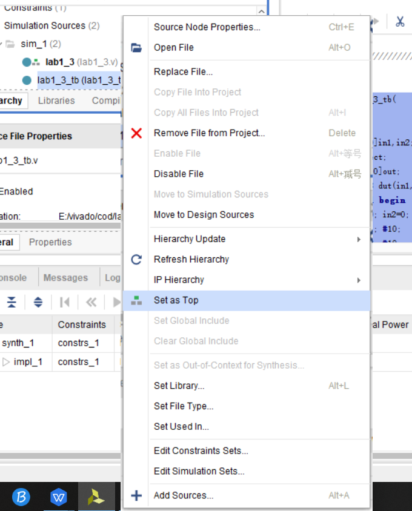
 

设定仿真的配置（simulation settings）:

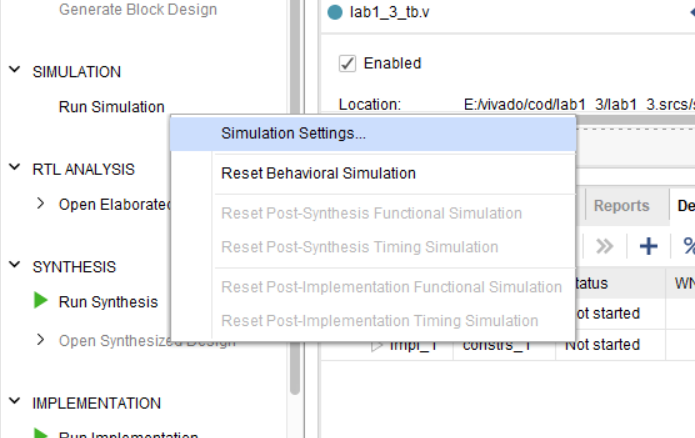
 

设置仿真时间为100ns：

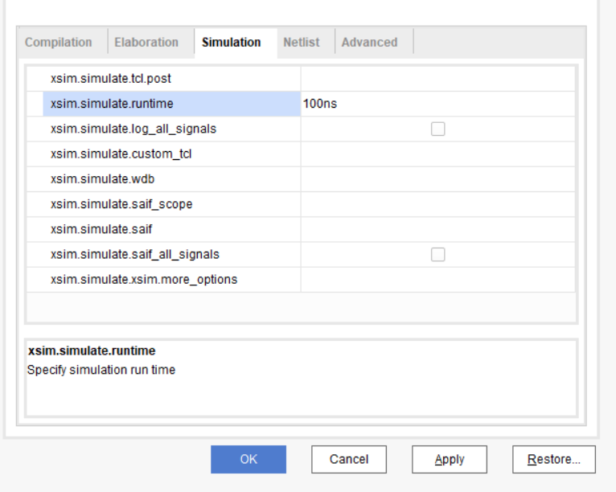
 

开始仿真：

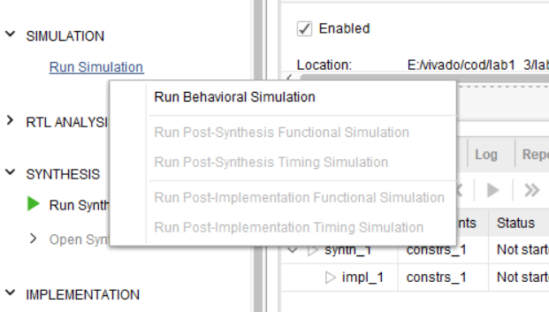
 

查看仿真，判断我们代码的正确性：

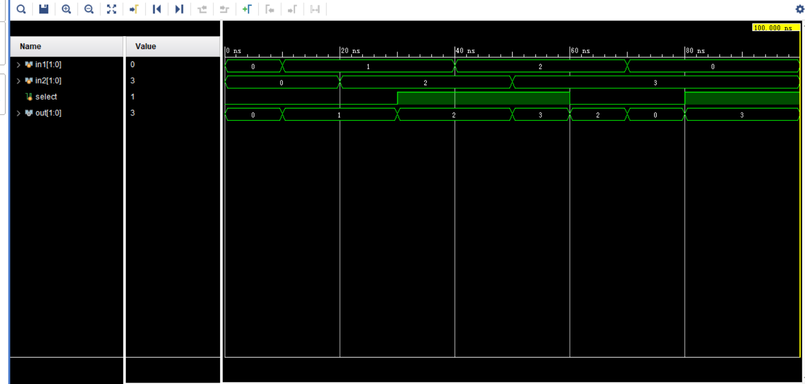
 
## 扩展实验内容
用门级建模的方式,数据流建模或者行为级建模的方式设计一个4选1的选择器，要求将 SW0 ， SW1，SW2，SW3赋给in1，in2, in3，in4，SW7，SW8 给 selecet1 ，select2.保存XDC文件。先编写仿真代码来测试其正确性，然后生成比特流文件，将其下载到Basys3或Nexys4 DDR开发板，并验证功能 

## 总结
本次实验中，你创建了多个Vivado工程设计了各种电路模型。你实现了设计并在硬件和仿真环境中验证了功能正确性。 你学会了三种建模风格。门级和数据流级建模主要用于组合电路，而行为级建模支持组合和时序电路。本实验中你使用了行为级建模风格完成了组合电路的设计。在后面几个实验中，你会使用数据流级建模设计各种组合电路，从 Lab 7开始，你将使用行为级建模设计时序电路。


