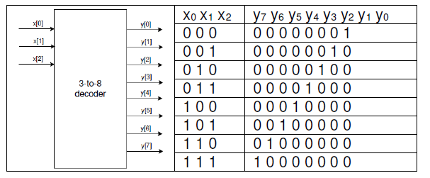
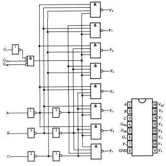
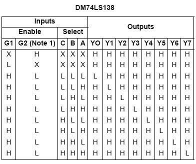
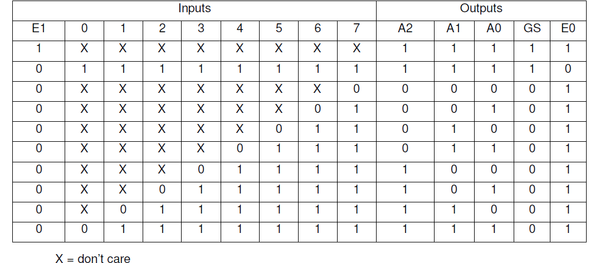

# 复杂组合逻辑电路

## 编码器，译码器和存储器介绍

布尔表达式可以用以输出多变量布尔函数值，像 assign 这样的数据流构造可以用来模拟这样的布尔函数。存在多输入和多输出的电路，在这个实验中要求你参照关于如何使用 Vivado 工具创建工程和验证数字电路的教程，设计编码器，译码器和只读存储器。

## 实验目标

- 利用行为建模设计多输出译码器
- 利用行为建模设计编码器
- 利用 Verilog 提供的 reg 数据类型和 `$readmemb` 系统函数设计只读存储器

## 设计一个 3-8 译码器。以 SW2-SW0 为输入，LED7-LED0 为输出；使用数据流建模结构

### 多输出译码电路

译码器是拥有多个输出的组合逻辑电路。它们被广泛用于存储芯片中，用来选择输入地址所寻址的一个字。例如一个 8 字宽的内存会拥有 3 位地址输入。译码器解码 3 位的输入地址产生一个选择信号，从 8 个字中选择地址相应的字。3-8 译码器的符号以及真值表如下：



这样的电路也称为二进制译码器，并且由于每个输出都有唯一的输入组合，所以可以使用数据流语句建模。

### 实验步骤

1. 打开 Vivado 并创建一个空工程并命名为 lab3_1。

2. 创建并添加一个 Verilog 模块，命名为 decoder.3to8.dataflow.v，然后定义译码器的三位输入 x 和 8 位输出 y。使用数据流建模。

3. 编写仿真文件来验证代码的正确

4. 在工程中添加适当的管脚约束的 XDC 文件，并加入相关联的管脚，将 x 分配给 SW2-
SW0，将 y 分配给 LED7-LED0。注意对于一个给定的输入组合，只有一个 LED 会亮。

5. 综合，实现设计。

6. 生成比特流文件，下载到 Nexys4 开发板上，验证功能。

### 参考代码

```verilog
module decoder_3to8_dataflow(
    input [2:0]x,
    output reg [7:0]y
    );
    always@(*)
        case(x)
        3'b000: y=8'b0000_0001;
        3'b001: y=8'b0000_0010;
        3'b010: y=8'b0000_0100;
        3'b011: y=8'b0000_1000;
        3'b100: y=8'b0001_0000;
        3'b101: y=8'b0010_0000;
        3'b110: y=8'b0100_0000;
        3'b111: y=8'b1000_0000;
    endcase
endmodule
```

## 设计实现一个流行 IC 74138，使用数据流建模和你在 1-1 中使用的译码器

### 74138 译码器

集成三线—八线译码器 74138 除了 3 线到 8 线的基本译码输入输出端外，为便于扩展成更多位的译码电路和实现数据分配功能，74138 还有三个输入使能端 EN1，EN2A 和 EN2B。74138 真值表和内部逻辑图如下图：





所示符号图中，输入输出低电平有效用极性指示符表示，同时极性指示符又标明了信号方向。74138 的三个输入使能 (又称选通 ST) 信号之间是与逻辑关系，EN1 高电平有效，EN2A 和 EN2B 低电平有效。只有在所有使能端都为有效电平 (EN1EN2AEN2B=100) 时，74138 才对输入进行译码，相应输出端为低电平，即输出信号为低电平有效。在 EN1EN2AEN2B ≠100 时，译码器停止译码，输出无效电平 (高电平)。  
这和你在 1 中创建的非常相似，它只是增加了控制（使能）信号 G1，/G2A，/G2B。这使得在有些系统中的解码更加简单。

### 实验步骤

1. 打开 Vivado 创建一个空工程，命名为 lab3_2.

2. 创建并添加 Verilog 模块，命名为 decoder_74138_dataflow，实例化你在 1-1 中开发的模块。添加额外的逻辑，使用数据流建模结构建模所设计的功能。

3. 编写仿真文件来验证代码的正确

4. 将你在 1 中使用的 XDC 文件添加到工程。修改 XDC 文件，将 g1 分配给 SW7，g2a_n 分配给 SW6，g2b_n 分配给 SW5。

5. 综合实现你的设计。

6. 生成比特流文件，下载到 Nexys4 开发板上，验证功能。

### 参考代码和分析

首先，修改 lab1 的 decoder_3to8_dataflow 模块，在其中加入 enable 信号

```verilog
module decoder_3to8_dataflow(
    input enable,
    input [2:0]x,
    output reg [7:0]y
    );
    always@(*)
    if(enable)
        case(x)
        3'b000: y=8'b0000_0001;
        3'b001: y=8'b0000_0010;
        3'b010: y=8'b0000_0100;
        3'b011: y=8'b0000_1000;
        3'b100: y=8'b0001_0000;
        3'b101: y=8'b0010_0000;
        3'b110: y=8'b0100_0000;
        3'b111: y=8'b1000_0000;
    endcase
    else y=8'b0000_0000;
endmodule
```

之后，decoder_74138_dataflow 模块的具体实现：

```verilog
module decoder_74138_dataflow(
    input g1,
    input g2a_n,
    input g2b_n,
    input [2:0]x,
    output [7:0]y
    );
    reg enable;
    always@(*)
    begin
        if(g1==1&&g2a_n==0&&g2b_n==0)
        enable=1;
        else enable=0;
    end
    decoder_3to8_dataflow A(enable,x,y);
endmodule
```

## 设计一个 8-3 编码器  

### 多输出编码电路

编码器电路是出于对标准化，速度，保密性，安全性或者通过缩小尺寸来节省空间的考虑，将信息从一种形式（编码）转换为另一种形式（编码）的电路。在数字电路中，编码信息可以减小信息存储所用的空间，确定功能的优先级。广泛使用的编码电路的例子有，优先编码器，哈弗曼编码器等

### 8-3 编码器真值表



### 实验步骤

1. 打开 Vivado 创建一个名为 lab3_3 的空工程。

2. 创建并添加以 v 和 enable_in_n 为输入，以 y，enable_out 和 gs 为输出的 Verilog 模块。v 是一个 8 位的输入（表中标为 0 到 7），输入 en_in 只有一位（E1），输出 y 为 3 位（A2，A1，A0），en_out 为一位（E0），gs 为一位（GS）。

3. 在工程中添加适当的管脚约束的 XDC 文件，并加入相关联的管脚约束。将输入 v 分配给 SW7-SW0，enable.in.n 分配给 SW15，y 分配给 LED2-LED0，enable_out 分配给 LED7，gs 分配给 LED6。

4. 综合实现此设计。

5. 生成比特流文件，下载到 Nexys4 开发板上，验证功能。

### 参考代码和分析

```verilog
module lab3_3(
    input enable_in_n,
    input [7:0]v,
    output reg [2:0]y,
    output reg enable_out,
    output reg gs
    );
    always@(*)
    begin
        if(enable_in_n)
        {y[2:0],gs,enable_out}=5'b11111;
        else if(v[7]==0)
        {y[2:0],gs,enable_out}=5'b00001;
        else if(v[6]==0)
        {y[2:0],gs,enable_out}=5'b00101;
        else if(v[5]==0)
        {y[2:0],gs,enable_out}=5'b01001;
        else if(v[4]==0)
        {y[2:0],gs,enable_out}=5'b01101;
        else if(v[3]==0)
        {y[2:0],gs,enable_out}=5'b10001;
        else if(v[2]==0)
        {y[2:0],gs,enable_out}=5'b10101;
        else if(v[1]==0)
        {y[2:0],gs,enable_out}=5'b11001;
        else if(v[0]==0)
        {y[2:0],gs,enable_out}=5'b11101;
        else
        {y[2:0],gs,enable_out}=5'b11110;
    end
endmodule
```

## 设计一个 2 位比较器，用于比较两个 2-bit 的数字，并输出字 A 的十进制值大于、小于或者等于 B。你要模拟 ROM 并会用到$readmemb 函数

### 只读存储器

只读存储器（ROM）由互联阵列组成，由于存储二进制信息数组。它一旦存储了二进制信息，可以随时读取，但不能更改。大型的 ROM 通常用于存储不能被系统中其他电路更改的程序或者数据，小型的 ROM 可以用来实现组合电路。ROM 使用类似于 1-1 中的译码器来寻址特定的存储位置。

一个拥有 m 个地址输入引脚和 n 个数据输出引脚的 ROM 可以存储个字，每个字为 n 位。当给出一个地址访问这一存储器时，地址相应位置的字通过输出引脚读出。

在 Verilog 语言中，存储器可以使用 reg 数据类型的二维数组定义，如下：

```verilog
reg [3:0] MY_ROM [15:0];
```

上面代码中 reg 是数据类型，MY_ROM 是一个 16×4 的内存，拥有 16 个地址，每个地址的宽度为 4bit。如果满足下面两个条件，这块内存就是只读的：（i）这块内存只能被读，不能被写入；（ii）内存应该以期望的数据初始化。Verilog 语言提供一个系统函数$readmemb 可以使用特定内容初始化内存。下面是定义并使用一个 4×2 的 ROM 的例子。

```verilog
module ROM_4x2 (ROM_data, ROM_addr);
    output [1:0] ROM_data;
    input [1:0] ROM_addr;
    reg [1:0] ROM [3:0]; // defining 4x2 ROM
    assign ROM_data = ROM[ROM_addr];
    // reading ROM content at the address ROM_addr
    initial $readmemb (“ROM_data.txt”, ROM, 0, 3);
    // load ROM content from ROM_data.txt file
endmodule
```

在此例中，ROM_data.txt 文件应该与 verilog 模块放在同一目录下（因为引用时没有使用绝对路径），并且文件中可以有 8 行或者更少，比如：

```verilog
10
0x
11
00
```

注意，如果行数少于 ROM 的大小，则未指定的位置将会用 0 初始化，另外还有另一个系统函数$readmembh 允许数据文件使用十六进制编写。

### verilog 中$readmemb 和$readmemh 的使用

因为之前自己学习 verilog 中编写 readme 的文件，不是很懂是怎么写的，所以菜菜的我还去查了查用法，方便大家学习。（请你们不要嘲笑菜菜的助教啦）
在 Verilog 语法中，一共有以下六种用法：

1. `$readmemb("<数据文件名>",<存储器名>);`
2. `$readmemb("<数据文件名>",<存储器名>,<起始地址>);`
3. `$readmemb("<数据文件名>",<存储器名>,<起始地址>,<终止地址>);`
4. `$readmemh("<数据文件名>",<存储器名>);`
5. `$readmemh("<数据文件名>",<存储器名>,<起始地址>);`
6. `$readmemh("<数据文件名>",<存储器名>,<起始地址>,<终止地址>);`

示例：`$readmemb` 的使用

先在 Verilog 代码目录下准备一个文件 `file1.txt`，存入数据：`1111 1010 0101 1x1z 1_1 1111` 或者 `11111010 0101 1x1z 1_1_1_111` 存在一行每个用空格隔开，跟分行存，输出结果是一样的，但是若在一行中不用空格隔开会出错，编译器会试图把一整行数据存在一个四位的存储单元中。

这些在你们之后初始化 rom 或者 ram 的 memory 都是很常用的啦（可能要到 cod 的时候吧）

### 实验步骤

1. 打开 Vivado 并创建一个名为 lab3_4 的工程。

2. 使用 ROM 和$readmemb 系统函数创建并添加一个 Verilog 模块，该模块拥有两个输入（a，b）和三个输出（lt，gt 和 eq）。

3. 在工程中添加适当的管脚约束的 XDC 文件，并加入相关联的管脚约束。将 a 分配给 SW3 到 SW2，b 分配给 SW1 到 SW0，lt 分配给 LED2，gt 分配给 LED1，eq 分配给 LED0。

4. 创建并添加描述设计输出的文本文件

    上表列出了 b 与 a 比较前两项，继续这样的比较直到 b 和 a 都达到 11 为止。

    |a|b|lt|gt|eq|
    |:----:|:----:|:----:|:----:|:----:|
    |00|00|0|0|1|
    |00|01|1|0|0|
    |00|10|1|0|0|
    |00|11|1|0|0|
    |01|00|0|1|0|
    |01|01|0|0|1|
    |01|10|1|0|0|
    |01|11|1|0|0|
    |10|00|0|1|0|
    |10|01|0|1|0|
    |10|10|0|0|1|
    |10|11|1|0|0|
    |11|00|0|1|0|
    |11|01|0|1|0|
    |11|10|0|1|0|
    |11|11|0|0|1|
    ​
    将上表的比较结果保存在一个.txt 文件中，然后点击位于 Flow Navigator 下的 Add Sources 按钮。选择 Add or create design sources 并点击 next。点击绿色的 plus 按钮然后点击 add file。添加你所创建的.txt 文件然后点击 finish.

5. 综合实现此设计。

6. 生成比特流文件，下载到 Nexys4 开发板上，验证功能。

### 参考代码和分析

```verilog
module lab3_4(
    input [1:0]a,
    input [1:0]b,
    output lt,
    output gt,
    output eq
    );
    reg [2:0] rom [15:0];

    initial $readmemb ("compare.mem", rom);
    assign {lt,gt,eq}=rom[{a,b}];
endmodule
```

可以采用相对路径或者绝对路径的方式写入 readme txt 文件，但是之前文档介绍的 add source 的方法 vivado 不支持 txt 格式，所以我们在这里采用添加 mem 文件的方法加入文件，这样的方法更加简单一点。  
comare.mem 文件具体内容：  

```verilog
001
100
100
100
010
001
100
100
010
010
001
100
010
010
010
001
```

## 扩展实验内容

### 使用 ROM 实现一个 2 位乘 2 位的乘法器，将结果以二进制形式输出到四个 LED 灯上

#### 具体要求

1. 打开 Vivado 并创建一个名为 lab3_kuozhan1 的空工程。

2. 使用 ROM 和 `$readmemb` 系统函数创建并添加一个拥有两个两位输入（a，b）和一个四位输出（product）的 Verilog 模块。

3. 在工程中添加适当的管脚约束的 XDC 文件，并加入相关联的管脚约束。将 a 分配给 SW3-SW2，b 分配给 SW1-SW0，product 分配给 LED3-LED0。

4. 创建并添加描述设计输出的文本文件。

5. 综合实现此设计。

6. 生成比特流文件，下载到 Nexys4 开发板上验证功能。

### 使用在两个 lab1 中设计的 3-8 译码器扩展成一个 4-16 的译码器

1. 打开 Vivado 并创建一个空工程并命名为 lab3_kuozhan2。

2. 创建并添加 Verilog 模块，定义译码器的四位输入 x 和 16 位输出 y.

3. 编写仿真文件来验证代码的正确

4. 在工程中添加适当的管脚约束的 XDC 文件，并加入相关联的管脚，将 x 分配给 SW3-
SW0，将 y 分配给 LED15-LED0。注意对于一个给定的输入组合，只有一个 LED 会亮。

5. 综合，实现设计。

6. 生成比特流文件，下载到 Nexys4 开发板上，验证功能。

#### 具体要求

## 总结

在本次试验中，你学到了如何对多输出电路如译码器、编码器和 ROM 建模；你也学到了如何使用系统函数 `$readmemb` 对 ROM 进行初始化。Verilog 还支持很多系统函数，你将在下一个实验中学习另外一些。
