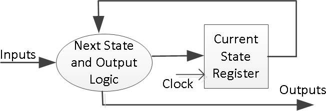
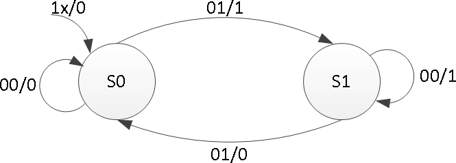
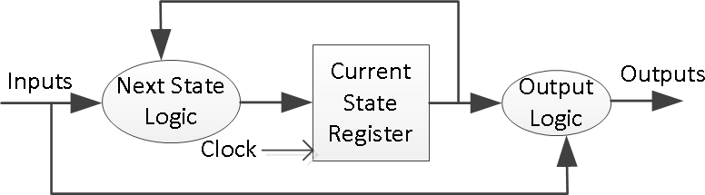
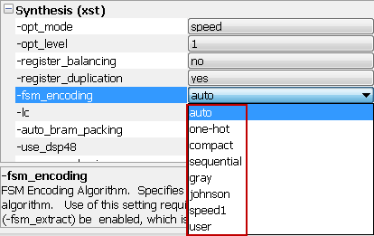
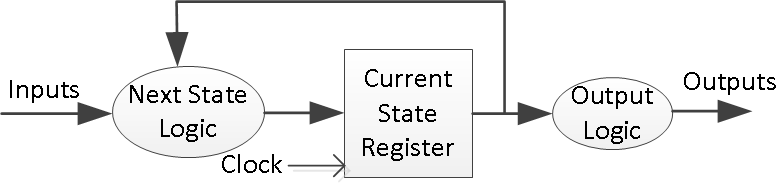
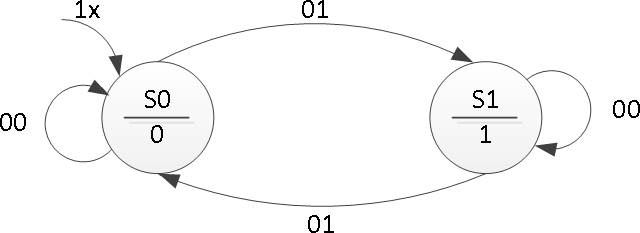
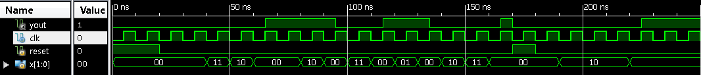
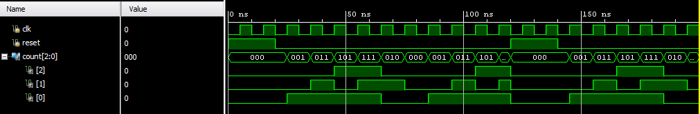

# 有限状态机

## 有限状态机简介

有限状态机 (FSM) 是许多数字系统中用来控制系统和数据流路径行为的时序电路。FSM 的实例包括控制单元和时序。本实验介绍了两种类型的 FSM（Mealy 和 Moore）的概念，以及开发此类状态机的建模方式。请参阅 Vivado 教程，了解如何使用 Vivado 工具创建项目和验证数字电路。

## 实验目标

在本次实验中，你将会学到：  

- 对 Mealy FSMs 建模  
- 对 Moore FSMs 建模  

## Mealy FSM（米利型有限状态机）

有限状态机（FSM）或称简单状态机用于设计计算机程序和时序逻辑电路。它被设想为抽象机器，可以处于有限数量的用户定义状态之一。机器一次只能处于一种状态; 它在任何给定时间所处的状态称为当前状态。当由触发事件或条件启动时，它可以从一种状态改变为另一种状态; 这称为过渡。特定 FSM 由其状态列表和每个转换的触发条件定义。  
在现代社会中的许多设备中可以观察到状态机的踪影，这些设备根据发生的事件序列执行预定的动作序列。简单的例子是自动售货机，当存放硬币的金额达到商品价格时分配产品；电梯在把乘客送达楼上后才会下降；交通灯按一定的时间改变信号来控制车流；以及需要输入一串正确的数字才能打开的组合锁。  
状态机使用两种基本类型建模--Mealy 和 Moore。在 Mealy 机器中，输出取决于当前状态和当前输入。在 Moore 机器中，输出仅取决于当前状态。
Mealy 型状态机的一般模型由组合过程电路和状态寄存器组成，组合过程电路生成输出和下一个状态，状态寄存器保存当前状态，如下图所示。状态寄存器通常建模为 D 触发器。状态寄存器必须对时钟边缘敏感。其他块可以使用 always 过程块或 always 过程块和 dataflow 建模语句的混合来建模；always 过程块必须对所有输入敏感，并且必须为每个分支定义所有输出，以便将其建模为组合块。两段式 Mealy 机器可以表示为
  


下面是奇偶校验校验机的状态图和相关模型：  



```verilog
module mealy_2processes(input clk, input reset, input x, output reg parity); reg state, nextstate;
parameter S0=0, S1=1;
always @(posedge clk or posedge reset) // always block to update state if (reset)
state <= S0;
else
state <= nextstate;

always @(state or x) // always block to compute both output & nextstate begin
parity = 1'b0; case(state)
S0: if(x)
begin
parity = 1; nextstate = S1;
end else
nextstate = S0;
S1: if(x)
nextstate = S0;
else begin
parity = 1; nextstate = S1;

end

end default:
nextstate = S0; endcase

endmodule
```

三段式 Mealy 机器的图示及其建模如下：  



```verilog
module mealy_3processes(input clk, input reset, input x, output reg parity); reg state, nextstate;
parameter S0=0, S1=1;
always @(posedge clk or posedge reset) // always block to update state if (reset)
state <= S0;
else
state <= nextstate;
always @(state or x) // always block to compute output begin
parity = 1'b0; case(state)
S0: if(x)
parity = 1; S1: if(!x)
parity = 1;
endcase end
always @(state or x) // always block to compute nextstate begin
nextstate = S0; case(state)
S0: if(x)
nextstate = S1; S1: if(!x)
nextstate = S1; endcase
end endmodule
```

状态分配可以使用独热码（one – hot code），二进制编码，格雷码以及其他编码。通常，综合工具将确定状态分配的编码，但用户也可以通过更改综合属性来强制特定编码，如下所示。状态分配编码将对状态寄存器中使用的位数产生影响；独热编码使用最多的位数，但解码非常快，二进制编码使用最少的位数，但解码较长。



## 使用三段式 Mealy 状态机的实现一个序列检测器

### 实验要求

Mealy 状态机有一个输入（ain）和一个输出（yout）。当且仅当接收到的 1 的总数可被 3 整除时，输出为 1（提示：0 也算被 3 整除，但是，在复位周期中不把计数器归为 0，复位信号过后把计数器归 0——参考模拟波形时间= 200。设计一个 testbench 并通过 behavioral simulation 验证模型。使用 SW15 作为时钟输入，SW0 作为输入，BTNU 按钮作为电路的复位输入，LED7：LED4 上的 1s 计数和作为 yout 输出的 LED0。完成设计流程，生成比特流，并将其下载到 Basys3 或 Nexys4 DDR 板。验证功能。

### 实验步骤

1. 打开 Vivado 并创建一个空工程并命名为 lab10_1。

2. 创建并添加使用 SW15 作为时钟输入，SW0 作为输入，BTNU 按钮作为电路的复位输入，LED7：LED4 上的 1s 计数和作为 yout 输出的 LED0。

3. 编写仿真文件来验证代码的正确

4. 在工程中添加适当的管脚约束的 XDC 文件，并加入相关联的管脚，使用 SW15 作为时钟输入，SW0 作为输入，BTNU 按钮作为电路的复位输入，LED7：LED4 上的 1s 计数和作为 yout 输出的 LED0。

5. 综合，实现设计。

6. 生成比特流文件，下载到 Nexys4 开发板上，验证功能。

### 参考代码和分析

```verilog
module lab10_1(
    input clk,
    input rst,
    input ain,
    output reg [3:0]count,
    output reg yout
    );
    parameter s0=0, s1=1,s2=2;
    reg [1:0]state,nextstate;
    always@(posedge clk or posedge rst)
    begin
        if(rst)
        begin
            state<=s0;
            count<=4'b0;
        end
        else
        begin
            state<=nextstate;
            if(ain)
            count<=count+1;
        end
    end

    always@(*)
    begin
        yout=0;
        case(state)
        s0:if(!ain)
        yout=1;
        s2:if(ain)
        yout=1;
        endcase
    end

    always@(*)
    begin
        case(state)
        s0:if(ain)
        nextstate=s1;
        else
        nextstate=s0;
        s1:if(ain)
        nextstate=s2;
        else
        nextstate=s1;
        s2:if(ain)
        nextstate=s0;
        else
        nextstate=s2;
        endcase
    end
endmodule
```

米利型的输出是和当前状态以及输入都相关的，所以这里是这样的情况。但是如果是摩尔型的话输入只与当前状态相关，之后也会有介绍。

## Moore FSM（摩尔型有限状态机）

Moore 型有限状态机的一般模型如下所示。其输出由状态寄存器块生成。使用当前输入和当前状态确定下一状态。这里的状态寄存器也使用 D 触发器建模。通常，Moore 机器使用三个块来描述，其中一个块必须是顺序的，另外两个块可以使用 always 块或 always 和 dataflow 建模结构的组合来建模。




以下是使用 Moore 型有限状态机实现的奇偶校验器的状态图。与之关联模型如下所示。  



```verilog
module moore_3processes(input clk, input reset, input x, output reg parity); reg state, nextstate;
parameter S0=0, S1=1;
always @(posedge clk or posedge reset) // always block to update state if (reset)
state <= S0;
else
state <= nextstate;

always @(state) // always block to compute output begin
case(state)
S0: parity = 0; S1: parity = 1;
endcase
end
always @(state or x) // always block to compute nextstate begin
nextstate = S0; case(state)
S0: if(x)
nextstate = S1; S1: if(!x)
nextstate = S1;
endcase
end
endmodule
```

在本例中，输出块很简单，可以使用 dataflow 建模构造进行建模。可以使用以下代码代替 always 块。您还需要将输出类型从 reg 更改为 wire。

```verilog
assign parity = (state==S0) ? 1'b0: 1'b1;
```

## 使用三段式 Moore 状态机的实现一个序列检测器

### 实验要求

Moore 状态机有一个输入（ain）和一个输出（yout）。当且仅当接收到的 1 的总数可被 3 整除时，输出为 1（提示：0 也算被 3 整除，但是，在复位周期中不把计数器归为 0，复位信号过后把计数器归 0——参考模拟波形时间= 200。设计一个 testbench 并通过 behavioral simulation 验证模型。使用 SW15 作为时钟输入，SW0 作为输入，BTNU 按钮作为电路的复位输入，LED7：LED4 上的 1s 计数和作为 yout 输出的 LED0。完成设计流程，生成比特流，并将其下载到 Basys3 或 Nexys4 DDR 板。验证功能。

### 实验步骤

1. 打开 Vivado 并创建一个空工程并命名为 lab10_2。

2. 创建并添加使用 SW15 作为时钟输入，SW0 作为输入，BTNU 按钮作为电路的复位输入，LED7：LED4 上的 1s 计数和作为 yout 输出的 LED0。

3. 编写仿真文件来验证代码的正确

4. 在工程中添加适当的管脚约束的 XDC 文件，并加入相关联的管脚，使用 SW15 作为时钟输入，SW0 作为输入，BTNU 按钮作为电路的复位输入，LED7：LED4 上的 1s 计数和作为 yout 输出的 LED0。

5. 综合，实现设计。

6. 生成比特流文件，下载到 Nexys4 开发板上，验证功能。

### 参考代码和分析

```verilog
module lab10_2(
    input clk,
    input rst,
    input ain,
    output reg [3:0]count,
    output reg yout
    );
    parameter s0=0, s1=1,s2=2;
    reg [1:0]state,nextstate;
    always@(posedge clk or posedge rst)
    begin
        if(rst)
        begin
            state<=s0;
            count<=4'b0;
        end
        else
        begin
            state<=nextstate;
            if(ain)
            count<=count+1;
        end
    end
    always@(*)
    begin
        case(state)
        s0:yout=1;
        default:yout=0;
        endcase
    end
    always@(*)
    begin
        case(state)
        s0:if(ain)
        nextstate=s1;
        else
        nextstate=s0;
        s1:if(ain)
        nextstate=s2;
        else
        nextstate=s1;
        s2:if(ain)
        nextstate=s0;
        else
        nextstate=s2;
        endcase
    end
endmodule
```

摩尔型相较米利型输出的状态只与输入相关

## 扩展实验内容

### 扩展实验 1

使用三段式 Moore 状态机或者 Mealy 状态机实现一个序列检测器。

Moore 状态机有两个输入（`ain [1:0]`）和一个输出（`yout`）。除非出现以下输入序列之一，否则输出将从 0 开始并保持为常量值：

1. 输入序列 `ain [1:0] = 01,00` 使输出变为 0  
2. 输入序列 `ain [1:0] = 11,00` 使输出变为 1  
3. 输入序列 `ain [1:0] = 10,00` 使输出切换。

#### 实验要求

打开 Vivado 并创建一个空工程并命名为 lab10_kuozhan1。设计一个 testbench（类似于下面显示的波形）并通过 behavioral simulation 验证模型。使用 SW15 作为时钟输入，SW1-SW0 作为 ain [1:0]输入，BTNU 按钮作为电路的复位输入，LED0 作为 yout 输出。完成设计流程，生成比特流，并将其下载到 Basys3 或 Nexys4 DDR 板。验证功能。
仿真示意图如下：
  


### 扩展实验 2

使用 ROM 设计一个特定的计数计数器（下面列出的计数序列）来开发一个 Mealy 状态机。

#### 实验要求

打开 Vivado 并创建一个空工程并命名为 lab10_kuozhan2。设计一个 testbench 并通过 behavioral simulation 验证模型。使用 SW15 作为时钟输入，BTNU 按钮作为电路的复位输入，LED2：LED0 作为计数器的计数输出。完成设计流程，生成比特流，并将其下载到 Basys3 或 Nexys4 DDR 板。验证功能。

计数序列是：000, 001, 011, 101, 111, 010 (repeat) 000, …



## 总结

在这个实验中，您学习了 Mealy 和 Moore 状态机建模方法。还设计并实现了序列检测器、序列生成器和编码转换器，实践了两段和三段式的状态机。
