# FPGA 基础知识介绍

FPGA（Field－Programmable Gate Array），即现场可编程门阵列，它是在 PAL、GAL、CPLD 等可编程器件的基础上进一步发展的产物。它是作为专用集成电路（ASIC）领域中的一种半定制电路而出现的，既解决了定制电路的不足，又克服了原有可编程器件门电路数有限的缺点。

目前 FPGA 的两大主要厂商为 xilinx 和 altera。

Xilinx：公司网址为：[www.xilinx.com](https://www.xilinx.com/)。FPGA 市场的龙头老大，市场份额接近 50%，其主要产品包括：Sparten 系列、Virtex 系列、Artix 系列、Kintex 系列、Virtex 系列等

开发工具：其第六代及以前的产品的开发工具为 ISE，从第七代产品开始，已全部转移到 vivado 平台。

Altera：公司网址为：[www.altera.com](https://www.altera.com/)，FPGA 市场的二当家，市场份额 40% 以上，2015 年 6 月被 Intel 以 167 亿美元收购。主要产品包含：Max 系列、Cyclone 系列、Arria 系列、Stratix 系列等。主要开发工具：Quartus

此外，Lattice、Actel、Atmel 等公司也有 FPGA 产品，由于市场份额小，市面上很少见到，此处不再介绍。

FPGA 产品种类多种多样，但原理都是相同的。我们只要理解了其基本结构，学习起来还是非常轻松的。

在介绍 FPGA 之前，先对数字电路中所学的知识做一个简单的回顾。

现如今的集成电路绝大部分采用 CMOS 工艺，CMOS 电路是互补型金属氧化物半导体电路 (Complementary Metal-Oxide-Semiconductor) 的英文字头缩写，它由绝缘场效应晶体管组成，由于只有一种载流子，因而是一种单极型晶体管集成电路，其基本结构是一个 N 沟道 MOS 管和一个 P 沟道 MOS 管。NMOS 和 PMOS 可以认为是两种开关电路，两种电路均包含 G（栅极）、D（漏极）、S（源极）三个极：

对于 NMOS，当 G 为高电平时，D、S 导通，否则截止

对于 PMOS，当 G 为低电平时，D、S 导通，否则截止

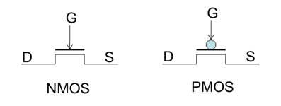

一个 NMOS 和一个 PMOS 可构成一个 CMOS 反相器：

vi 为高电平时，PMOS 截止，NMOS 导通，vo 输出低电平

vi 为低电平时，PMOS 导通，NMOS 截止，vo 输出高电平

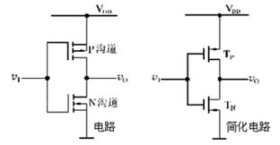

其逻辑表达式可写成：

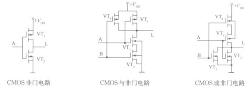

同理，可构成 CMOS 的与非门、或非门

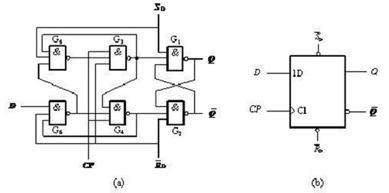

通过非门、与非门、或非门可实现所有的组合逻辑电路，多个与非门可组成一个带有复位、置位功能的 D 触发器，而 D 触发器则是时序逻辑电路的最核心部件。

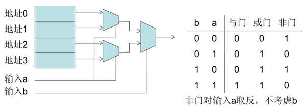

由此可知，通过非门、与非门、或非门的有序堆叠，可实现任意功能的数字电路，如果有一款电路，其基本单元可配置成各种基本门，则其就具备了硬件编程能力。FPGA 就是这种芯片，它基于查找表（LUT：Look Up Table）技术的可编程逻辑器件，通过配置，LUT 可实现与门、或门、与非门、或非门或者其他简单组合逻辑功能，其本质上就是 1bit 位宽的 RAM

我们以一个 2 输入的查找表为例，来做讲解

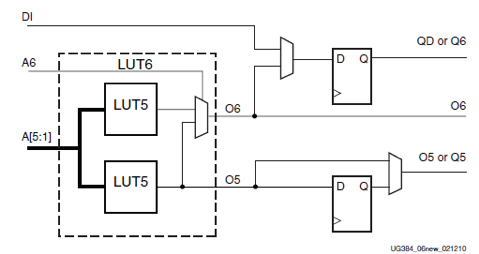

以目前比较流行的 Spartan6 芯片为例，来说明

其最底层便是一个 6 输入查找表（可拆成两个 5 输入 LUT 使用）以及两个 D 触发器的结构

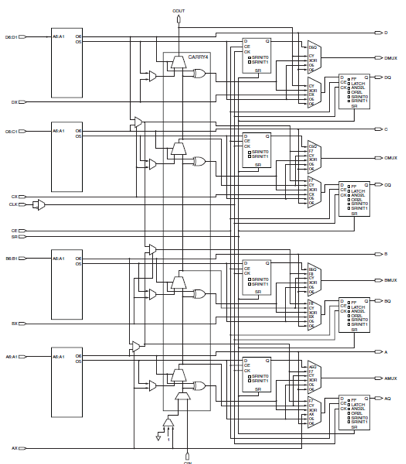

Slice 是 Xilinx FPGA 的最基本单元，包含 4 个 6 输入 LUT 及 8 个 D 触发器

Xilinx 的 FPGA 中包含三类 Slice：SliceL、SliceM、SliceX，三类 slice 本质上是相同的，只不过在细节上有一些差别，此处不再详细展开。

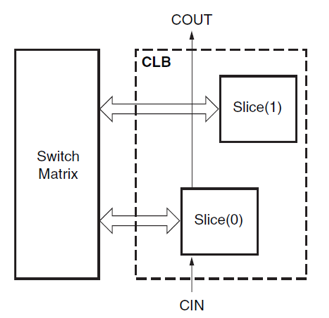

CLB（Configurable Logic Blocks）是 Sparten6 的主要资源，包含两个 Slice，如下图所示：

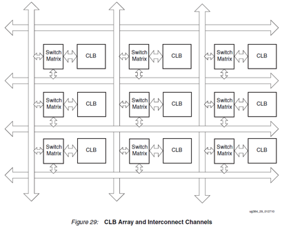

多个 CLB 再加上丰富的互联开关，便构成了 Xilinx 公司 FPGA 的最核心框架。

下图是 xilinx 一款型号为 XC6SLC45T 的 FPGA 在 planAhead 中的视图

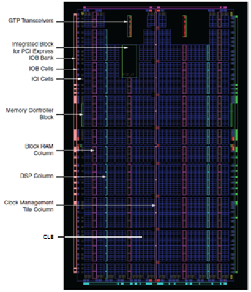

从图中可以看出，FPGA 内部，除了大量的 CLB 资源，用于实现可编程逻辑外，还有一些其它的硬件资源，包括 block ram、内存控制器、时钟管理（CMT）单元、数字信号处理（DSP）端口控制（IOB）单元等，大大提高了其可编程性，几乎可以实现所有的数字电路功能。

下面是在 planahead 中对 xc6slx4-2tqg144 芯片的截图，通过这些图片，可以对其结构有一个整体的了解。更多的细节性问题，需要大家在实际使用过程中逐步掌握。

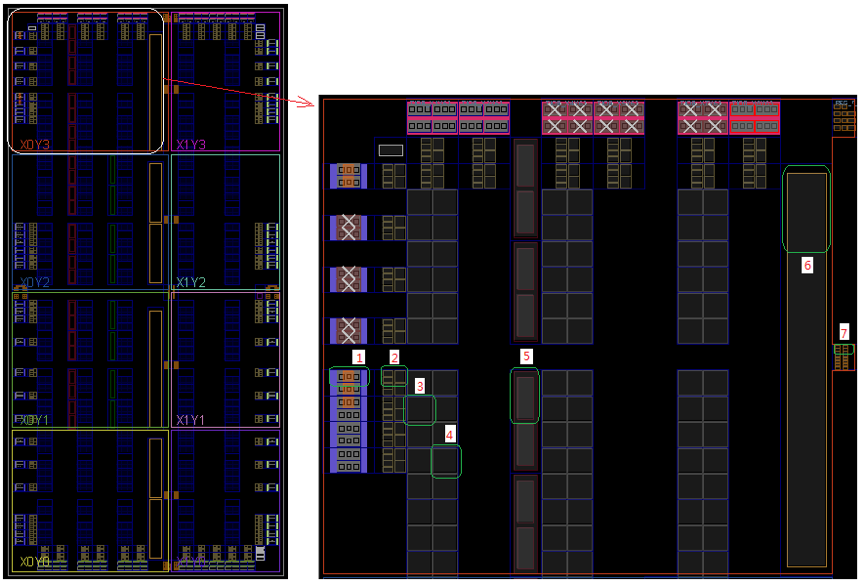

输入输出块，包含了焊盘及其相关电路

ILOGIC、OLOGIC、IODELAY 部分

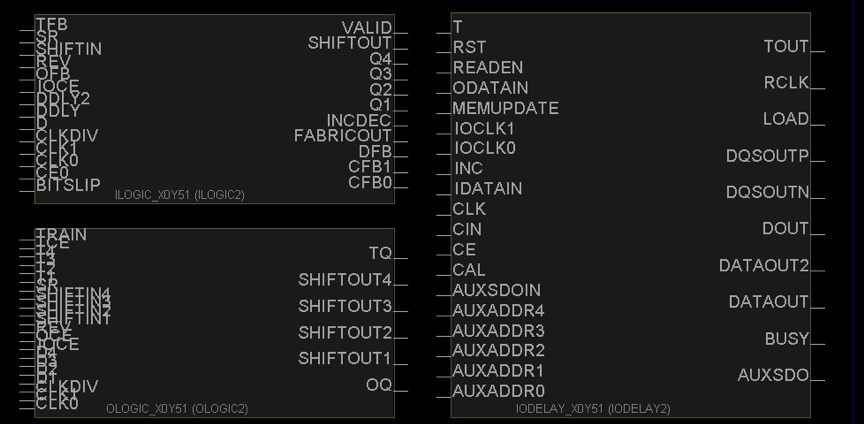

Slice

Slice

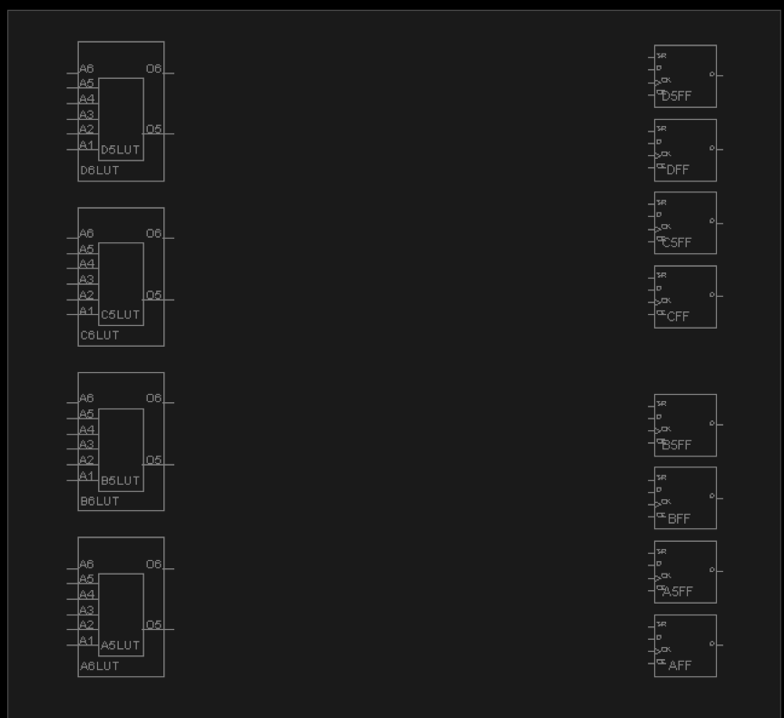

Block RAM 资源

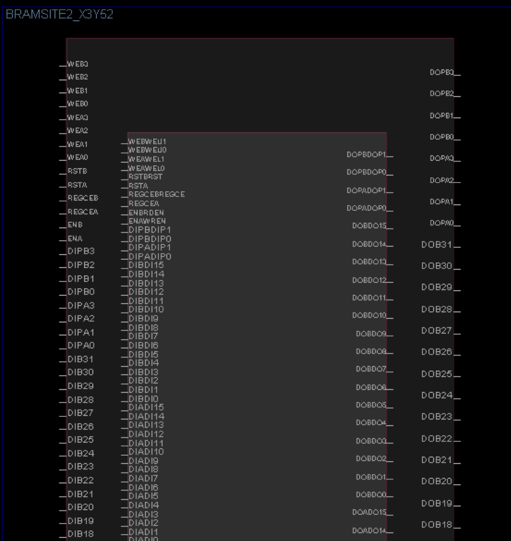

时钟管理单元

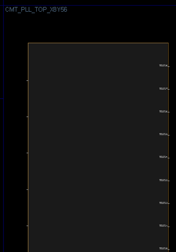

时钟驱动电路

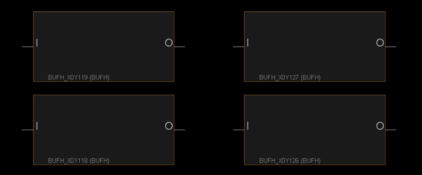

FPGA 依靠其强大、全方面、多维度的可编程能力，在航空航天、电子通信、银行金融、医疗设备、信息存储、数据处理、ASIC 原型验证等许多行业或领域发挥着极其重要的作用
