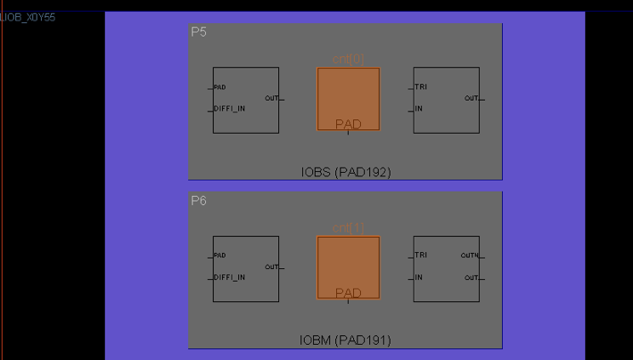
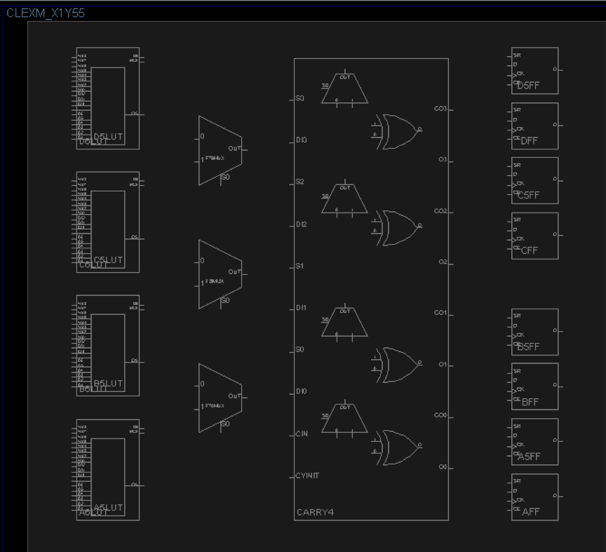

#  FPGA基础知识介绍

FPGA（Field－Programmable Gate Array），即现场可编程门阵列，它是在PAL、GAL、CPLD等可编程器件的基础上进一步发展的产物。它是作为专用集成电路（ASIC）领域中的一种半定制电路而出现的，既解决了定制电路的不足，又克服了原有可编程器件门电路数有限的缺点。

目前FPGA的两大主要厂商为xilinx和altera。

Xilinx：公司网址为：[www.xilinx.com](http://www.xilinx.com/)。FPGA市场的龙头老大，市场份额接近50%，其主要产品包括：Sparten系列、Virtex系列、Artix系列、Kintex系列、Virtex系列等

开发工具：其第六代及以前的产品的开发工具为ISE ，从第七代产品开始，已全部转移到vivado平台。

Altera：公司网址为：[www.altera.com](http://www.altera.com/)，FPGA市场的二当家，市场份额40%以上，2015年6月被Intel以167亿美元收购。主要产品包含：Max系列、Cyclone系列、Arria系列、Stratix系列等。主要开发工具：Quartus

此外，Lattice、Actel、Atmel等公司也有FPGA产品，由于市场份额小，市面上很少见到，此处不再介绍。

FPGA产品种类多种多样，但原理都是相同的。我们只要理解了其基本结构，学习起来还是非常轻松的。

在介绍FPGA之前，先对数字电路中所学的知识做一个简单的回顾。

现如今的集成电路绝大部分采用CMOS工艺，CMOS电路是互补型金属氧化物半导体电路(Complementary Metal-Oxide-Semiconductor)的英文字头缩写，它由绝缘场效应晶体管组成，由于只有一种载流子，因而是一种单极型晶体管集成电路，其基本结构是一个N沟道MOS管和一个P沟道MOS管。NMOS和PMOS可以认为是两种开关电路，两种电路均包含G（栅极）、D（漏极）、S（源极）三个极：

对于NMOS，当G为高电平时，D、S导通，否则截止

对于PMOS，当G为低电平时，D、S导通，否则截止

 

一个NMOS和一个PMOS可构成一个CMOS反相器：

vi为高电平时，PMOS截止，NMOS导通，vo输出低电平

vi为低电平时，PMOS导通，NMOS截止，vo输出高电平

 

其逻辑表达式可写成 ： 

 

同理，可构成CMOS的与非门、或非门

 

通过非门、与非门、或非门可实现所有的组合逻辑电路，多个与非门可组成一个带有复位、置位功能的D触发器，而D触发器则是时序逻辑电路的最核心部件。

 

由此可知，通过非门、与非门、或非门的有序堆叠，可实现任意功能的数字电路，如果有一款电路，其基本单元可配置成各种基本门，则其就具备了硬件编程能力。FPGA就是这种芯片，它基于查找表（LUT：Look Up Table）技术的可编程逻辑器件，通过配置，LUT可实现与门、或门、与非门、或非门或者其他简单组合逻辑功能，其本质上就是1bit位宽的RAM

我们以一个2输入的查找表为例，来做讲解

 

以目前比较流行的Spartan6芯片为例，来说明

其最底层便是一个6输入查找表（可拆成两个5输入LUT使用）以及两个D触发器的结构

 

Slice是Xilinx FPGA的最基本单元，包含4个6输入LUT及8个D触发器

Xilinx的FPGA中包含三类Slice ：SliceL、SliceM、SliceX，三类slice本质上是相同的，只不过在细节上有一些差别，此处不再详细展开。

 

CLB（Configurable Logic Blocks）是Sparten6 的主要资源，包含两个Slice，如下图所示：

 

多个CLB再加上丰富的互联开关，便构成了Xilinx公司FPGA的最核心框架。

下图是xilinx一款型号为XC6SLC45T的FPGA在planAhead中的视图

 

从图中可以看出，FPGA内部，除了大量的CLB资源，用于实现可编程逻辑外，还有一些其它的硬件资源，包括block ram、内存控制器、时钟管理（CMT）单元、数字信号处理（DSP）端口控制（IOB）单元等，大大提高了其可编程性，几乎可以实现所有的数字电路功能。

下面是在planahead中对xc6slx4-2tqg144芯片的截图，通过这些图片，可以对其结构有一个整体的了解。更多的细节性问题，需要大家在实际使用过程中逐步掌握。

 
v
输入输出块，包含了焊盘及其相关电路

 

ILOGIC、OLOGIC、IODELAY部分

 

Slice

 

Slice

 

block ram资源

 

时钟管理单元

 

时钟驱动电路

 

FPGA依靠其强大、全方面、多维度的可编程能力，在航空航天、电子通信、银行金融、医疗设备、信息存储、数据处理、ASIC原型验证等许多行业或领域发挥着极其重要的作用

