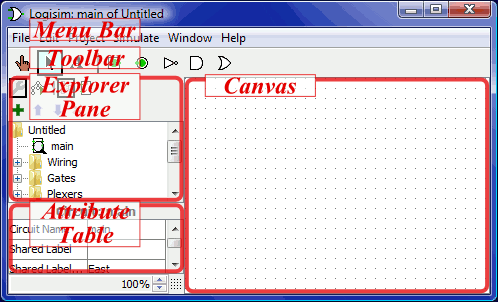
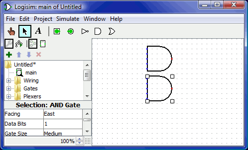
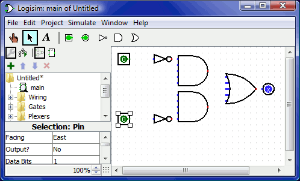
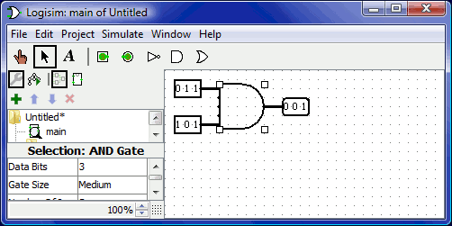
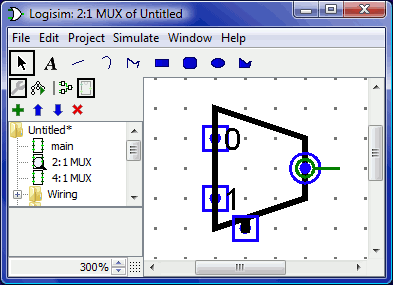

# LogiSim 工具

## LogiSim 简介

Logisim 是一种用于设计和模拟数字逻辑电路的教育工具。凭借其简单的工具栏界面和构建它们时的电路仿真，它非常简单，有助于学习与逻辑电路相关的最基本概念。由于能够从较小的子电路构建更大的电路，并通过鼠标拖动来绘制电线束，因此可以使用 Logisim 来设计和仿真用于相关课程的教学目的。

## LogiSim 下载

可以通过 Logisim 的官网下载适合你机器的 Logisim 的软件，启动 Logisim 应用程序。[下载网址](http://www.cburch.com/logisim/download.html)  

## LogiSim 使用简介

### LogiSim 初次启动

您启动 Logisim 时，您将看到类似于以下内容的窗口。由于您可能使用的系统与我的不同，因此某些细节可能略有不同。  

所有 Logisim 分为三个部分，称为资源管理器窗格，属性表和 画布。上面这些部分是菜单栏和工具栏。

我们可以快速处理资源管理器窗格和属性表。此外，菜单栏不言自明。  
这留下了工具栏和画布。画布是你画电路的地方; 并且工具栏包含您将用于完成此任务的工具。

### 示例（制作一个异或门）

由数电课本上的知识我们可以得知，异或门的电路大致如下图：  

我建议首先将门插入一种骨架，然后再用线连接它们来建立一个电路。我们要做的第一件事就是添加两个 AND 门。单击工具栏中的 AND 工具 (列出倒数第二个工具）。然后在编辑区域中单击您想要第一个 AND 门的位置。一定要为左边的东西留出足够的空间。然后再次单击 AND 工具并将第二个 AND 门置于其下方。  

注意 AND 门左侧的五个点。这些是可以连接电线的点。碰巧我们只将其中两个用于我们的 XOR 电路; 但对于其他电路，您可能会发现有两条以上的电线连接到 AND 门是有用的。
现在添加其他门。首先单击 OR 工具（ ）; 然后单击您想要的位置。并使用 NOT 工具（ ）将两个 NOT 门放入画布。  
我在 NOT 门和 AND 门之间留了一点空间; 但是，如果你愿意的话，你可以将它们相互对立，并节省你以后用电线连接它们的努力。
现在我们要将两个输入 x 和 y 添加到图中。选择输入工具（ ），然后放下引脚。您还应该使用输出工具（ ）在 OR 门的输出旁边放置一个输出引脚。（同样，我在 OR 门和输出引脚之间留下一点空间，但您可以选择将它们放在彼此旁边。）  
如果您决定不喜欢放置内容的位置，则可以使用编辑工具（ ）将其选中并将其拖动到所需位置。或者，您可以通过从“编辑”菜单中选择“删除”或按 Delete 键将其完全删除。
当您放置电路的每个组件时，您会注意到，只要放置组件，Logisim 就会恢复到编辑工具，以便您可以移动最近放置的组件或（我们很快就会看到）连接组件通过创建电线给他人。如果要添加最近放置的组件的副本，则快捷方式是按 Control-D 复制选择。（某些计算机使用其他键作为菜单，例如 Macintoshes 上的 Command 键。您可以使用 D 键按下该键。）  
在画布上阻止所有组件后，您就可以开始添加电线了。选择编辑工具（ ）。当光标位于接收导线的点上方时，将在其周围绘制一个小的绿色圆圈。在那里按下鼠标按钮并尽可能地拖动电线。
添加电线时 Logisim 非常智能：每当电线在另一根电线上结束时，Logisim 会自动连接它们。您还可以使用编辑工具拖动其中一个端点来“扩展”或“缩短”导线。
Logisim 中的电线必须是水平或垂直的。为了将上输入连接到 NOT 门和 AND 门，我添加了三条不同的线。
  
Logisim 自动将电线连接到门和彼此。这包括如上所述在 T 交叉点自动绘制圆，表示导线已连接。
在绘制电线时，您可能会看到一些蓝色或灰色电线。
 Logisim 中的蓝色表示该点的值为“未知”，灰色表示该线未连接任何东西。当你正在建造一个电路时，这不是什么大问题。但是当你完成它时，你的电线都不应该是蓝色或灰色。（OR 门的未连接腿仍然是蓝色的：没关系。） 

如果你认为一切都应该连接后你有蓝色或灰色线，那么就会出现问题。将电线连接到正确的位置非常重要。Logisim 在组件上绘制小点以指示电线应该连接的位置。当你继续，你会看到点从蓝色变为浅色或深绿色。
连接好所有电线后，插入的所有电线本身都会呈浅绿色或深绿色。  
我们的最后一步是测试我们的电路，以确保它真正做到我们想要的。Logisim 已经在模拟电路了。让我们再看看我们在哪里。  

注意，输入引脚都包含 0; 输出引脚也是如此。这已经告诉我们，当两个输入都为 0 时，电路已经计算出 0。
现在尝试另一种输入组合。选择戳工具小手图案（ ）并通过单击它们开始戳输入。每次你戳一个输入，它的值将切换。例如，我们可能会首先查看底部输入。

当您更改输入值时，Logisim 将向您显示哪些值沿着导线向下移动，方法是将它们指示为绿色以指示 1 值或将深绿色（几乎为黑色）指示为 0 值。您还可以看到输出值已更改为 1。
到目前为止，我们已经测试了真值表的前两行，输出（0 和 1）与所需的输出相匹配。  

通过不同的组合戳开关，我们可以验证其他两行。如果他们都匹配，那么我们就完成了：电路工作！  
要归档已完成的工作，您可能需要保存或打印电路。文件菜单允许这样，当然它也允许您退出 Logisim。但为什么现在退出？
现在您已经完成了教程，您可以通过构建自己的电路来试验 Logisim。如果您想构建具有更复杂功能的电路，那么您应该浏览帮助系统的其余部分，看看您还能做些什么。Logisim 是一个功能强大的程序，允许您构建和测试大型电路; 这个一步一步的过程只是划伤了表面。

### 输入个数设置

在一个电路中，logisim 默认一个门支持有五个输入，但是我们同样也可以调整输入个数的数量，点击一个门查看他的属性，并修改输入个数： 

在异或门中，我们可以把这个输入的个数改为 2 个。

### 位宽设置

电路中每个元件的每个输入和输出都有一个与之相关的位宽。通常位宽为 1，并且无法改变它，但 Logisim 的许多内置组件都包含允许您自定义其输入和输出的位宽的属性。
下面的屏幕截图显示了一个简单的电路，用于查找两个三位输入的按位 AND。注意三位输出是两个输入的按位 AND。所有组件都经过自定义，可通过其 Data Bits 属性处理三位数据; 屏幕截图显示 AND 门属性，包括 3 的 Data Bits 属性。  

Logisim 中的所有组件都为每个输入和输出定义了一个位宽。相反，导线的位宽未定义：相反，导线的宽度适应其所连接的组件。如果导线连接两个要求不同位宽的组件，Logisim 会抱怨“不兼容的宽度”并以橙色表示有问题的位置。在下面，输出引脚的数据位属性已更改为 1，因此 Logisim 抱怨线路无法将三位值连接到一位值。  

连接不兼容位置的电线（以橙色绘制）不带值。
对于单比特电线，您可以一目了然地看到电线带有什么价值，因为 Logisim 根据值对电线颜色或深绿色进行着色。它不显示多位线的值：它们只是黑色。但是，您可以使用戳工具（ ）单击它来探测导线。  

此探测功能有助于使用线束调试电路。

### 创建子电路

#### 创建电路

每个 Logisim 项目实际上都是一个电路库。在最简单的形式中，每个项目只有一个电路（默认情况下称为“main”），但很容易添加更多：从“项目”菜单中选择“添加电路...”，然后为新电路键入您喜欢的任何名称想要创造。
假设我们要构建一个名为“2:1 MUX”的 2 对 1 多路复用器。添加电路后，Logisim 将如下所示。

在资源管理器窗格中，您现在可以看到项目现在包含两个电路，“main”和“2:1 MUX”。Logisim 在当前正在观看的电路图标上绘制放大镜; 当前电路名称也出现在窗口的标题栏中。
编辑电路后看起来像 2:1 多路复用器，我们可能会得到以下电路。

#### 使用子电路

现在假设我们想要使用 2 对 1 多路复用器的实例构建 4 对 1 多路复用器。当然，我们首先会创建一个新电路，我们将其称为“4:1 MUX”。要增加 2 到 1 多路复用器到我们的电路中，我们点击 2:1 多路复用器电路，一旦在资源管理器窗格中选择它作为一个工具，那么我们可以通过画面内点击添加它的副本，表示为框。

如果要双击资源管理器窗格中的 2:1 MUX 电路，则窗口将切换为编辑 2:1 MUX 电路。
在构建电路之后，我们最终得到以下结果。

我们用于 4 对 1 多路复用器的电路使用 3 对 2 对 1 多路复用器，每个多路复用器都绘制成一个带有引脚的盒子。此框上的引脚对应于 2:1 MUX 电路中的输入和输出引脚。盒子西侧的两个引脚对应于 2:1 MUX 电路中面向东的两个引脚; 盒子东侧的引脚对应于 2:1 MUX 的朝西引脚（恰好是输出引脚）; 盒子南侧的针脚对应于 2:1 MUX 的朝北针脚。盒子西侧的两个引脚的顺序对应于子电路设计中的自上而下的顺序。（如果盒子的北侧或南侧有多个引脚，它们将对应于子电路中相同的左右顺序。）
如果子电路布局中的引脚具有与之关联的标签，则 当用户将鼠标悬停在子电路组件的相应位置上时，Logisim 将在尖端（即临时文本框）中显示该标签。（如果您发现这些提示很烦人，可以通过“首选项”窗口的“布局”选项卡禁用它们。）  

### 编辑子电路外观

#### 默认外观

默认情况下，当子电路放置在较大的电路中时，它被绘制为一个矩形，其中一个凹口表示子电路布局的北端。引脚将根据它们的面向放置在矩形的边框上：布局中朝东的引脚（通常出现在布局的西侧）将放置在矩形的西侧，根据其自上而下的排序布局。根据布局中从左到右的顺序，布局中朝南的引脚（通常朝向布局的北侧）将放置在矩形的北侧。
默认矩形可以选择包含一些将出现在矩形中间的字母。要指定此项，请选择选择工具（ ）并单击电路布局的背景。这将显示属性表中的电路属性，包括共享标签，共享标签面和共享标签字体属性。共享标签属性的值将绘制在矩形的中心; “共享标签面”属性可自定义文本的绘制方向，当然“共享标签字体”属性可自定义使用的字体。

#### 定制外观

默认外观非常实用，Logisim 确实存在多年，没有其他选择。但是，如果您希望以不同方式绘制子电路，可以从“项目”菜单中选择“编辑电路外观”，Logisim 的界面将从其常规布局编辑界面切换到用于绘制电路外观的界面。（您也可以单击  资源管理器窗格上方工具栏中的最右侧图标。）下面，我们正在编辑 2:1 多路复用器的外观，以便使用通常的梯形而不是矩形绘制。
  
对于如上所示绘制的 2:1 多路复用器的外观，4:1 多路复用器的布局将如下所示。  

外观编辑器就像传统的绘图程序，但是有一些特殊符号用于指示绘图在放置到电路布局时的工作方式。无法删除这些特殊符号。  
绿色圆圈有一条线从它出来，我们称之为锚。每个子电路外观中只有一个锚点。电路中的每个元件都有一个标识其位置的点; 用户在创建新组件时会看到这一点：鼠标单击只标识一个位置，组件相对于该位置放置（通常在鼠标位置具有主输出）锚点标识鼠标相对于整个绘图的位置子电路已创建。  
锚也标识外观的面向，如锚点的线指向其圆的方向所示。将子电路放入布局时，用户可以改变子电路的面向; 锚的面向指示外观朝向的方向。在我们的示例中，锚点朝向东方，4:1 多路复用器中的每个子电路实例也面向东方，因此它们都以与 2:1 多路复用器外观相同的方向绘制。  
带有圆点的蓝色圆圈和正方形是子电路的 端口。电路中的输入和输出引脚数量与端口数一样多。对应于输入的端口绘制为正方形，而对应于输出的端口绘制为圆形。每个端口指示连接到电路的导线如何与布局中的输入或输出引脚相对应。  
当您选择一个端口时，Logisim 将通过在窗口右下角弹出布局的微型图表来指示相应的引脚，相应的引脚用蓝色绘制。选择所有端口时不会发生这种情况。  
工具栏包含用于添加其他形状的工具，如下所示，其中包含 shift 和 alt 键如何修改工具行为的说明。此外，在按下控制键的情况下单击或拖动鼠标会将鼠标位置捕捉到最近的网格点。  

## 参考文献

[LogSim 用户手册](http://www.doc88.com/p-1466403426738.html)  
[配置 java 环境变量](https://www.cnblogs.com/cnwutianhao/p/5487758.html)
