# 常用外设原理介绍

下面对一些常见外设进行介绍

### LED

LED 灯，又称 LED 发光二极管，原理图如下所示

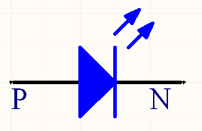

LED 发光二极管有 P、N 两极，具有普通二极管的单向导电性，当 P 极电压高于 N 极电压，且达到一定阈值之后（一般为 0.7V，与其材质有关），二极管开始导通，并开始发光。反之，二极管无法导通，不会发光。由于 LED 灯导通后电阻几乎为零，应此在实际使用过程中往往会串接上一个 1～10K 左右的电阻，以达到限流的作用。一般来说，发光二极管的工作电流在 10mA 左右，可根据电源电压、LED 压降、工作电流计算出串接电阻的阻值大小。

实际电路中有两种连接方式：1，N 极接地，P 极通过一个电阻后与控制端相连。2，P 极通过串接电阻后与电源相连，N 极作为控制端。如下所示

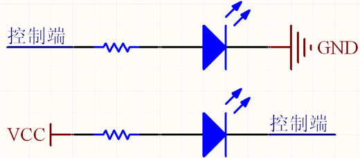

以方式 1 为例来说，当控制端输出电压为高电平时，LED 灯亮；当控制端输出电压为低电平时，LED 灯灭。第二种情况与此类似，不再赘述。

### 拨动开关

拨动开关是一种比较简单的输入设备，一般具有两个档位，实物图如下所示

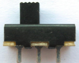

其使用方式如下图所示

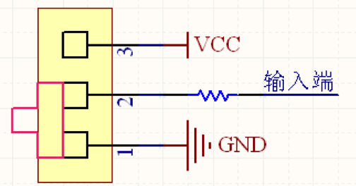

将 1 与地相连，3 与电源相连，2 通过一串接电阻后作为输入端。当拨动开关处于 1、2 短接的档位时，输入端为低电平；拨动开关处于 2、3 短接的档位时，输入端为高电平。因此，通过改变拨动开关的档位，便可以控制输入端的高低电平。

### 独立按键

按键是另外一种比较常见的输入设备，其外形多种多样，但工作方式基本相同。

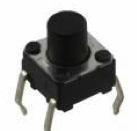

如上图所示的四脚按键，其内部两两相连。原理图如下所示

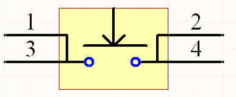

按键默认状态时 1、3 短接，2、4 短接，按键按下后，1、2、3、4 全部短接在一起。一种用法如下所示

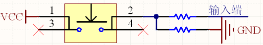

其中串接的两个电阻均为 10K，按键按下时，输入端为高电平；松开后，输入端为低电平。此种连接方式下，输入端的默认电平为低电平。

还有一种连接方式，如下图所示，输入端的默认电平为高电平，此种连接方式常用于一些低电平有效的信号输入，如复位信号等。对于复位信号来说，电容的存在可以使得系统在刚刚上电时，输入端保持一定时间的低电平，从而达到上电复位的目的，复位时间的长短由电阻及电容共同决定。

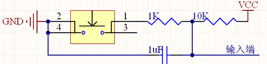

此外，还有一种自锁式的按键开关，在开关按钮第一次按时，开关接通并保持，即自锁，在开关按钮第二次按时，开关断开，同时开关按钮弹出来。自锁式按键的功能与拨动开关基本相同，此处不再详细说明。

### 七段数码管

我们最常用的是七段式和八段式 LED 数码管，八段比七段多了一个小数点，其他基本相同。

所谓的八段就是指数码管里有八个小 LED 发光二极管，通过控制不同的 LED 的亮灭来显示出不同的字形。数码管又分为共阴极和共阳极两种类型，其实共阴极就是将八个 LED 的阴极连在一起，让其接地，这样给任何一个 LED 的另一端高电平，它便能点亮。而共阳极就是将八个 LED 的阳极连在一起。其原理图如下。

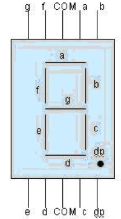 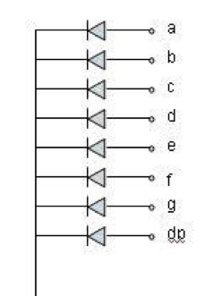 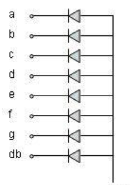

其中引脚图的两个 COM 端连在一起，是公共端，共阴数码管要将其接地，共阳数码管将其接正电源。一个八段数码管称为一位，多个数码管并列在一起可构成多位数码管，它们的段选线（即 a,b,c,d,e,f,g,dp）连在一起，而各自的公共端称为位选线。显示时，都从段选线送入字符编码，而选中哪个位选线，那个数码管便会被点亮。数码管的 8 段，对应一个字节的 8 位，a 对应最低位，dp 对应最高位。所以如果想让数码管显示数字 0，那么共阴数码管的字符编码为 00111111，即 0x3f；共阳数码管的字符编码为 11000000，即 0xc0。可以看出两个编码的各位正好相反。

一位数码管要显示字符 0~F，则对应的编码如下所示：

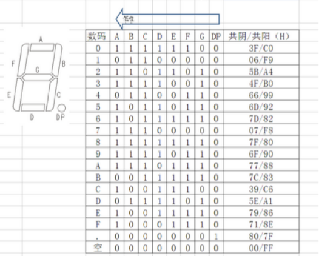

数码管本质上也是由 LED 构成的，因此在实际使用中，需要串接限流电阻，以共阳极数码管为例来说：

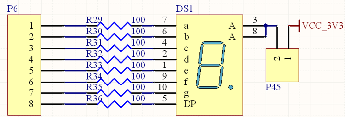

### 动态数码管

一个数码管称为一位，多个数码管并列在一起可构成多位数码管，它们的段选线（即 a,b,c,d,e,f,g,dp）连在一起，而各自的公共端称为位选线。显示时，都从段选线送入字符编码，而选中哪个位选线，那个数码管便会被点亮。

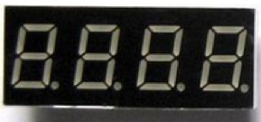

目前常用的是 4 位一体的数码管。其接口电路是把所有数码管的 8 个笔划段 a-h（h 即 dp 端）同名端连接起来，而每一个数码管由一个独立的公共极 COM 端控制。对于这种结构的数码管，采用动态显示的方法是最为广泛的一种显示方式之一。

下图所示的电路是由两个 4 位的共阳极数码管组成的一个 8 位的动态扫描显示电路。为增加驱动能力，在每个位选线处增加了一个 PNP 三极管。

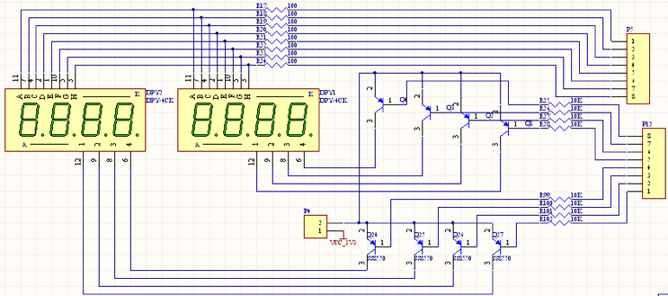

v
对于此 8 位的共阳极数码管，如要其显示&quot;8.8.8.8.8.8.8.8.&quot;，需要做如下工作：1，将 A～H 的段选线全部设为低电平。2，将 8 个位选线全部设为高电平。但是，由于位选线是由 PNP 三极管构成的反相器所驱动，因此只有将相应三极管的基极（B 极）（即端口 1）设为低电平，三极管导通，位选线才会变为高电平。综上所述，上图中的电路，P5 端口及 P12 端口全部变为低电平的时候，数码管才能显示&quot;8.8.8.8.8.8.8.8.&quot;。

那如何操作才能使得该数码管上显示不同的数据呢？答案是时分复用。即采用动态扫描的方式。例如，要在该数码管上显示&quot;12345678&quot;，应该如下实现

1，时刻 1，将最左侧的数码管的位选线置为有效，其余 7 个全部置为无效，同时将段选线设为显示 1 的数值（此处为 0x06）

2，时刻 2，将最左侧第二个数码管的位选线置为有效，其余 7 个全部置为无效，同时将段选线设为显示 2 的数值（此处为 0x5B）

3，时刻 3～8 依次类推，直至到最右侧数码管显示为 8

4，循环重复上述 1～3 过程。

通过上述操作，则 8 个数码管能够分别显示不同的数值，但每一时刻只有一个数码管处于发光状态。如上述过程足够快（每秒钟循环 30 次以上），由于人眼的视觉残留效应，会感觉到 8 个数码管在同时发光，并且显示出不同的数值。

注意，循环频率也不宜过快，以 30～100Hz 为宜。

### LED 点阵

LED 点阵分为共阴极和共阳极两类，如下图所示，左边为共阴极右边为共阳极。

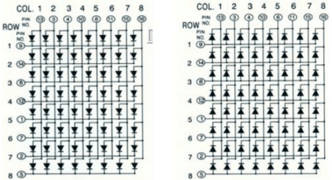

以 8×8 共阴极 LED 点阵为例，共包含 64 个 LED 灯，构成 8 行 8 列的点阵，每一行的 8 个 LED 灯的阴极接在一起，由行使能信号控制，阳极分别接到 8 个列控制信号上。同理，每一列的 8 个 LED 灯的阳极接在一起，由列使能信号控制，阴极分别接到 8 个行使能信号上。通过 8 个行使能信号及 8 个列使能信号，可以独立的控制 64 个 LED 中每一个灯的亮灭。但是通常情况下，都是采用行扫描的方式进行显示。

LED 阵列的显示方式是按显示编码的顺序，一行一行地显示。每一行的显示时间大约为 4ms，由于人类的视觉暂留现象，将感觉到 8 行 LED 是在同时显示的。若显示的时间太短，则亮度不够，若显示的时间太长，将会感觉到闪烁。本文采用低电平逐行扫描，高电平输出显示信号。即轮流给行信号输出低电平，在任意时刻只有一行发光二极管是处于可以被点亮的状态，其它行都处于熄灭状态。

如下图所示，使用 4 个 8×8 的 LED 点阵，可以扩展成一个 16×16 的 LED 点阵，为增加驱动能力，可以通过一 PNP 反向放大器来控制行选择信号。

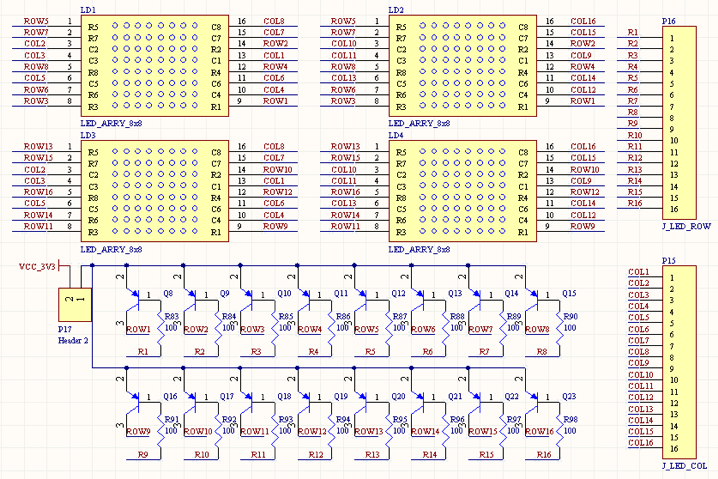

### 1602 液晶屏

字符型液晶显示模块是一种专门用于显示字母、数字、符号等点阵式 LCD，目前常用 16\*1，16\*2，20\*2 和 40\*2 行等的模块。16\*2 的显示模块通常称为 1602.

1602LCD 分为带背光和不带背光两种，基控制器大部分为 HD44780，带背光的比不带背光的厚，是否带背光在应用中并无差别。

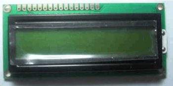
 % include image.html file="nexys/20.png" %}

1602LCD 采用标准的 14 脚（无背光）或 16 脚（带背光）接口，各引脚接口说明如下所示

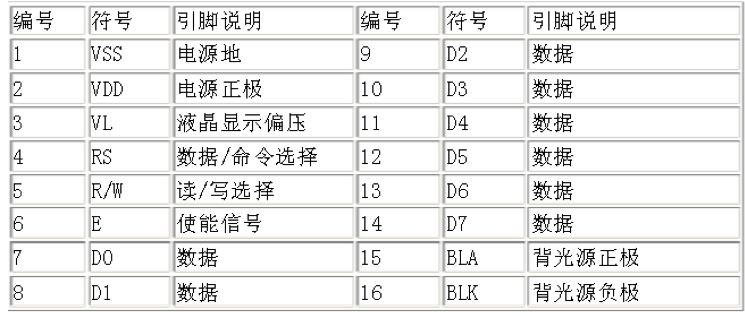

第 1 脚：VSS 为地电源。

第 2 脚：VDD 接 5V 正电源。

第 3 脚：VL 为液晶显示器对比度调整端，接正电源时对比度最弱，接地时对比度最高，对比度过高时会产生&quot;鬼影&quot;，使用时可以通过一个 10K 的电位器调整对比度。

第 4 脚：RS 为寄存器选择，高电平时选择数据寄存器、低电平时选择指令寄存器。

第 5 脚：R/W 为读写信号线，高电平时进行读操作，低电平时进行写操作。当 RS 和 R/W 共同为低电平时可以写入指令或者显示地址，当 RS 为低电平 R/W 为高电平时可以读忙信号，当 RS 为高电平 R/W 为低电平时可以写入数据。

第 6 脚：E 端为使能端，当 E 端由高电平跳变成低电平时，液晶模块执行命令。

第 7～14 脚：D0～D7 为 8 位双向数据线。

第 15 脚：背光源正极（无背光器件无此管脚）。

第 16 脚：背光源负极（无背光器件无此管脚）。

1602 液晶模块内部的控制器共有 11 条控制指令，如下所示

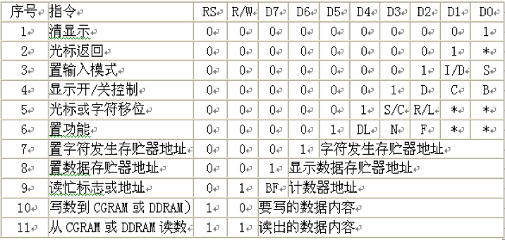

1602 液晶模块的读写操作、屏幕和光标的操作都是通过指令编程来实现的。（说明：1 为高电平、0 为低电平）

指令 1：清显示，指令码 01H，光标复位到地址 00H 位置。

指令 2：光标复位，光标返回到地址 00H。

指令 3：光标和显示模式设置 I/D：光标移动方向，高电平右移，低电平左移 S:屏幕上所有文字是否左移或者右移。高电平表示有效，低电平则无效。

指令 4：显示开关控制。D：控制整体显示的开与关，高电平表示开显示，低电平表示关显示 C：控制光标的开与关，高电平表示有光标，低电平表示无光标 B：控制光标是否闪烁，高电平闪烁，低电平不闪烁。

指令 5：光标或显示移位 S/C：高电平时移动显示的文字，低电平时移动光标。

指令 6：功能设置命令 DL：高电平时为 4 位总线，低电平时为 8 位总线 N：低电平时为单行显示，高电平时双行显示 F: 低电平时显示 5x7 的点阵字符，高电平时显示 5x10 的点阵字符。

指令 7：字符发生器 RAM 地址设置。

指令 8：DDRAM 地址设置。

指令 9：读忙信号和光标地址 BF：为忙标志位，高电平表示忙，此时模块不能接收命令或者数据，如果为低电平表示不忙。

指令 10：写数据。

指令 11：读数据。

读写操作时序如图所示：

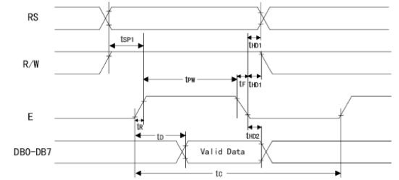

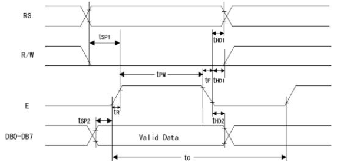

读操作时序

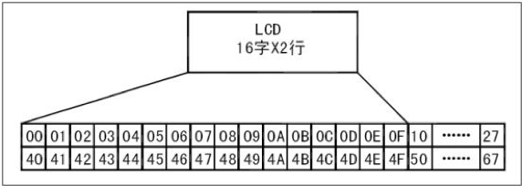

写操作时序

液晶显示模块是一个慢显示器件，所以在执行每条指令之前一定要确认模块的忙标志为低电平，表示不忙，否则此指令失效。要显示字符时要先输入显示字符地址，也就是告诉模块在哪里显示字符，图 10-57 是 1602 的内部显示地址。

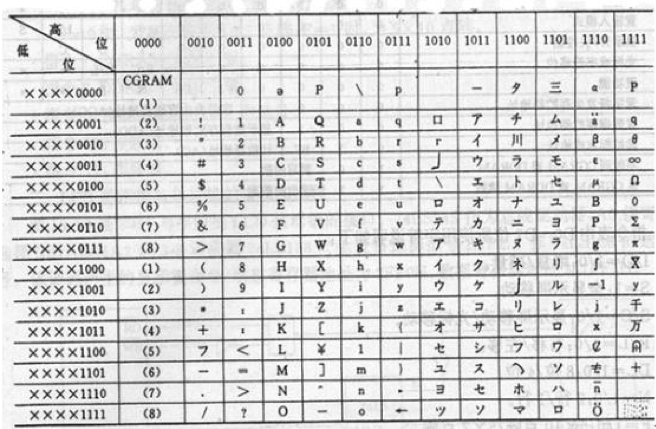

1602LCD 内部显示地址

例如第二行第一个字符的地址是 40H，那么是否直接写入 40H 就可以将光标定位在第二行第一个字符的位置呢？这样不行，因为写入显示地址时要求最高位 D7 恒定为高电平 1 所以实际写入的数据应该是 01000000B（40H）+10000000B(80H)=11000000B(C0H)。

在对液晶模块的初始化中要先设置其显示模式，在液晶模块显示字符时光标是自动右移的，无需人工干预。每次输入指令前都要判断液晶模块是否处于忙的状态。

1602 液晶模块内部的字符发生存储器（CGROM）已经存储了 160 个不同的点阵字符图形，如图 10-58 所示，这些字符有：阿拉伯数字、英文字母的大小写、常用的符号、和日文假名等，每一个字符都有一个固定的代码，比如大写的英文字母&quot;A&quot;的代码是 01000001B（41H），显示时模块把地址 41H 中的点阵字符图形显示出来，我们就能看到字母&quot;A&quot;

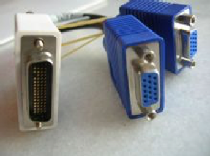

字符代码与图形对应图

1602LCD 的一般初始化（复位）过程

延时 15mS

写指令 38H（不检测忙信号）

延时 5mS

写指令 38H（不检测忙信号）

延时 5mS

写指令 38H（不检测忙信号）

以后每次写指令、读/写数据操作均需要检测忙信号

写指令 38H：显示模式设置

写指令 08H：显示关闭

写指令 01H：显示清屏

写指令 06H：显示光标移动设置

写指令 0CH：显示开及光标设置

### VGA 接口

VGA（Video Graphics Array）视频图形阵列是 IBM 于 1987 年提出的一个使用模拟信号的电脑显示标准。VGA 接口即电脑采用 VGA 标准输出数据的专用接口。VGA 接口共有 15 针，分成 3 排，每排 5 个孔，显卡上应用最为广泛的接口类型，绝大多数显卡都带有此种接口。它传输红、绿、蓝模拟信号以及同步信号 (水平和垂直信号)。

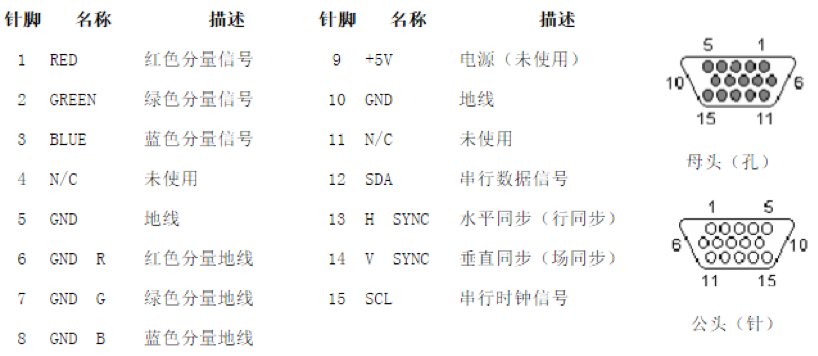

VGA 接口是一种 D 型接口，上面共有 15 针孔，分成三排，每排五个。其中，除了 2 根 NC（Not Connect) 信号、3 根显示数据总线和 5 个 GND 信号，比较重要的是 3 根 RGB 彩色分量信号和 2 根扫描同步信号 HSYNC 和 VSYNC 针。VGA 接口中彩色分量采用 RS343 电平标准。RS343 电平标准的峰值电压为 1V。VGA 接口是显卡上应用最为广泛的接口类型，多数的显卡都带有此种接口。有些不带 VGA 接口而带有 DVI(Digital Visual Interface 数字视频接口）接口的显卡，也可以通过一个简单的转接头将 DVI 接口转成 VGA 接口，通常没有 VGA 接口的显卡会附赠这样的转接头。

大多数计算机与外部显示设备之间都是通过模拟 VGA 接口连接，计算机内部以数字方式生成的显示图像信息，被显卡中的数字/模拟转换器转变为 R、G、B 三原色信号和行、场同步信号，信号通过电缆传输到显示设备中。对于模拟显示设备，如模拟 CRT 显示器，信号被直接送到相应的处理电路，驱动控制显像管生成图像。而对于 LCD、DLP 等数字显示设备，显示设备中需配置相应的 A/D（模拟/数字）转换器，将模拟信号转变为数字信号。在经过 D/A 和 A/D 两次转换后，不可避免地造成了一些图像细节的损失。VGA 接口应用于 CRT 显示器无可厚非，但用于连接液晶之类的显示设备，则转换过程的图像损失会使显示效果略微下降。

而且可以从接口处来判断显卡是独显还是集成显卡，VGA 接口竖置的说明是集成显卡，VGA 接口横置说明是独立显卡（一般的台式主机都可以用此方法来查看）

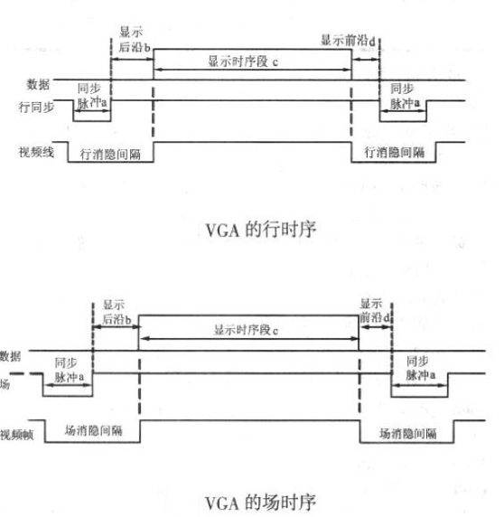 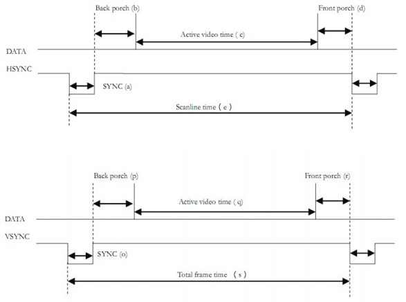

显示器扫描方式分为逐行扫描和隔行扫描：逐行扫描是扫描从屏幕左上角一点开始，从左像右逐点扫描，每扫描完一行，电子束回到屏幕的左边下一行的起始位置，在这期间，CRT 对电子束进行消隐，每行结束时，用行同步信号进行同步；当扫描完所有的行，形成一帧，用场同步信号进行场同步，并使扫描回到屏幕左上方，同时进行场消隐，开始下一帧。隔行扫描是指电子束扫描时每隔一行扫一线，完成一屏后在返回来扫描剩下的线，隔行扫描的显示器闪烁的厉害，会让使用者的眼睛疲劳。

  完成一行扫描的时间称为水平扫描时间，其倒数称为行频率；完成一帧（整屏）扫描的时间称为垂直扫描时间，其倒数称为场频率，即刷新一屏的频率，常见的有 60Hz，75Hz 等等。标准的 VGA 显示的场频 60Hz，行频 31.5KHz。

  行场消隐信号：是针对老式显像管的成像扫描电路而言的。电子枪所发出的电子束从屏幕的左上角开始向右扫描，一行扫完需将电子束从右边移回到左边以便扫描第二行。在移动期间就必须有一个信号加到电路上，使得电子束不能发出。不然这个回扫线会破坏屏幕图像的。这个阻止回扫线产生的信号就叫作消隐信号，场信号的消隐也是一个道理。

  显示带宽：带宽指的显示器可以处理的频率范围。如果是 60Hz 刷新频率的 VGA，其带宽达 640x480x60=18.4MHz,70Hz 的刷新频率 1024x768 分辨率的 SVGA，其带宽达 1024x768x70=55.1MHz。

  时钟频率：以<640x480@59.94Hz>(60Hz) 为例，每场对应 525 个行周期 (525=10+2+480+33),其中 480 为显示行。每场有场同步信号，该脉冲宽度为 2 个行周期的负脉冲，每显示行包括 800 点时钟，其中 640 点为有效显示区，每一行有一个行同步信号，该脉冲宽度为 96 个点时钟。由此可知：行频为 525\*59.94=31469Hz，需要点时钟频率：525\*800\*59.94 约 25MHz.

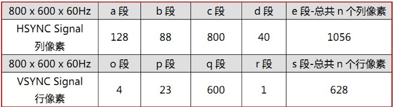

VESA 中定义行时序和场时序都需要同步脉冲（Sync a）、显示后沿（Back porch b）、显示时序段（Display interval c）和显示前沿（Front porch d）四部分。VGA 工业标准显示模式要求：行同步，场同步都为负极性，即同步脉冲要求是负脉冲。

  由 VGA 的行时序可知：没一行都有一个负极性行同步脉冲（Sync a），是数据行的结束标志，同时也是下一行的开始标志。在同步脉冲之后为显示后沿（Back porch b），在显示时序段（Display interval c）显示器为亮的过程，RGB 数据驱动一行上的每一个像素点，从而显示一行。在一行的最后为显示前沿（Front porch d）。在显示时间段（Display interval c）之外没有图像投射到屏幕是插入消隐信号。同步脉冲 (Sync a)、显示后沿（Back porch b）和显示前沿（Front porch d）都是在行消隐间隔内 (Horizontal Blanking Interval)，当消隐有效时，RGB 信号无效，屏幕不显示数据。

  VGA 的场时序与行时序基本一样，每一帧的负极性脉冲（Sync a）是一帧的结束标志，同时也是下一帧的开始标志。而显示数据是一帧的所有行数据。

下面以 800x600@60Hz 分辨率威力详细讲解 VGA 时序：

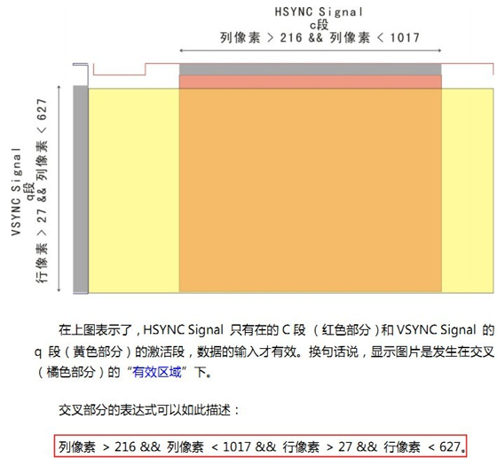

为简化设计，本实验平台采用的是 8 位，256 色的 VGA 视频接口，如下图所示，通过不同阻值的限流电阻，将数字信号转换成模拟信号。

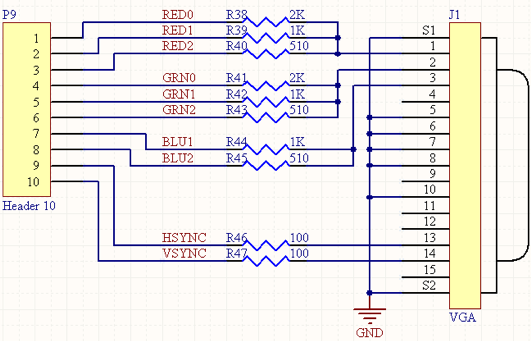

### RS232 接口

串口是计算机上一种非常通用的设备通信协议

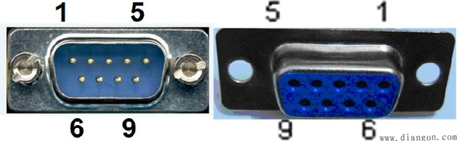 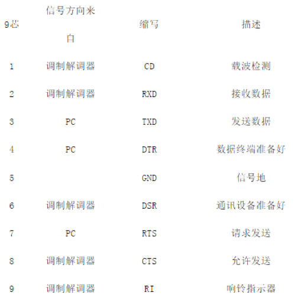

两个串口连接时，接收数据针脚与发送数据针脚相连，彼此交叉，信号地对应相接即可

RS-232 串口通信最远距离是 50 英尺

RS232 可做到双向传输，全双工通讯，最高传输速率 20kbps

RS-232C

上传送的数字量采用负逻辑，且与地对称。逻辑 1：-3 ～-15V，逻辑 0：+3～+15V，所以与单片机连接时常常需要加入电平转换芯片，如下图所示

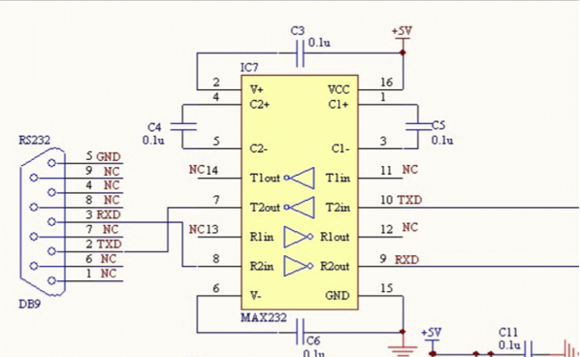

串口通信参数：

a）波特率：RS-232-C 标准规定的数据传输速率为每秒 50、75、100、150、300、600、1200、2400、4800、9600、19200 波特。

b）数据位：标准的值是 5、7 和 8 位，如何设置取决于你想传送的信息。比如，标准的 ASCII 码是 0～127（7 位）；扩展的 ASCII 码是 0～255（8 位）。

c）停止位：用于表示单个包的最后一位，典型的值为 1，1.5 和 2 位。由于数是在传输线上定时的，并且每一个设备有其自己的时钟，很可能在通信中两台设备间出现了小小的不同步。因此停止位不仅仅是表示传输的结束，并且提供计算机校正时钟同步的机会。

d）奇偶校验位：在串口通信中一种简单的检错方式。对于偶和奇校验的情况，串口会设置校验位（数据位后面的一位），用一个值确保传输的数据有偶个或者奇个逻辑高位。例如，如果数据是 011，那么对于偶校验，校验位为 0，保证逻辑高的位数是偶数个。如果是奇校验，校验位位 1，这样就有 3 个逻辑高位。

串口通信的传输格式：

串行通信中，线路空闲时，线路的 TTL 电平总是高，经反向 RS232 的电平总是低。一个数据的开始 RS232 线路为高电平，结束时 Rs232 为低电平。数据总是从低位向高位一位一位的传输。示波器读数时，左边是数据的高位。例如，对于 16 进制数据 55aaH，当采用 8 位数据位、1 位停止位传输时，它在信号线上的波形如图所示。

 55H=01010101B，取反后 10101010B，加入一个起始位 1，一个停止位 0，55H 的数据格式为 1010101010B；aaH=10101010B，取反后 01010101B，加入一个起始位 1，一个停止位 0，55H 的数据格式为 1101010100B

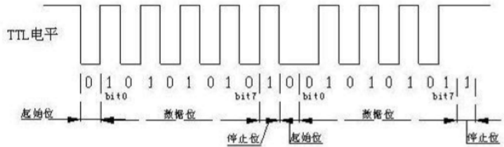 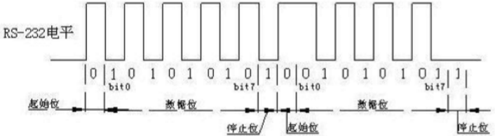

串口通信的接收过程：（异步通信：接收器和发送器有各自的时钟；同步通信：发送器和接收器由同一个时钟源控制。RS232 是异步通信）

（1）开始通信时，信号线为空闲（逻辑 1）,当检测到由 1 到 0 的跳变时，开始对&quot;接收时钟&quot;计数。

（2）当计到 8 个时钟时，对输入信号进行检测，若仍为低电平，则确认这是&quot;起始位&quot;，而不是干扰信号。

（3）接收端检测到起始位后，隔 16 个接收时钟，对输入信号检测一次，把对应的值作为 D0 位数据。若为逻辑 1, 作为数据位 1；若为逻辑 0，作为数据位 0。

（4）再隔 16 个接收时钟，对输入信号检测一次，把对应的值作为 D1 位数据。„.，直到全部数据位都输入。

（5）检测校验位 P（如果有的话）。

（6）接收到规定的数据位个数和校验位后，通信接口电路希望收到停止位 S(逻辑 1)，若此时未收到逻辑 1，说明出现了错误，在状态寄存器中置&quot;帧错误&quot;标志。若没有错误，对全部数据位进行奇偶校验，无校验错时，把数据位从移位寄存器中送数据输入寄存器。若校验错，在状态寄存器中置奇偶错标志。

（7）本幀信息全部接收完，把线路上出现的高电平作为空闲位。

1. （8）当信号再次变为低时，开始进入下一幀的检测。

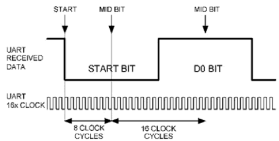

单片机常用 11.0592M 的的晶振，这个奇怪数字是有来历的：波特率为 9600BPS 每位位宽 t1=1/9600s 晶振周期 t2=1/11.0592/1000000S 单片机机器周期 t3=12\*t2 t1/t3=96，即对于 9600BPS 的串口，单片机对其以 96 倍的速率进行采样。如果单片机晶振用的不正确，会对串口接受产生误码。

### PS2 接口

PS/2接口用于许多现代的鼠标和键盘,由IBM最初开发和使用｡物理上的PS/2接口有两种类型的连接器:5脚的DIN和6脚的mini-DIN｡图1就是两种连接器的引脚定义｡使用中,主机提供+5V电源给鼠标,鼠标的地连接到主机电源地上｡

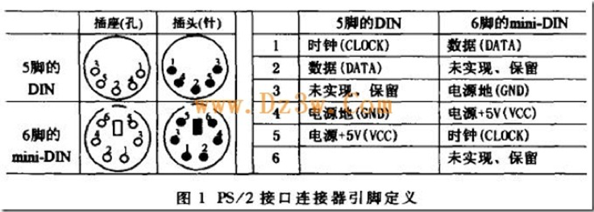

PS/2鼠标接口采用一种双向同步串行协议｡即每在时钟线上发一个脉冲,就在数据线上发送一位数据｡在相互传输中,主机拥有总线控制权,即它可以在任何时候抑制鼠标的发送｡方法是把时钟线一直拉低,鼠标就不能产生时钟信号和发送数据｡在两个方向的传输中,时钟信号都是由鼠标产生,即主机不产生通信时钟信号｡

       如果主机要发送数据,它必须控制鼠标产生时钟信号｡方法如下:主机首先下拉时钟线至少100μs抑制通信,然后再下拉数据线,最后释放时钟线｡通过这一时序控制鼠标产生时钟信号｡当鼠标检测到这个时序状态,会在10ms内产生时钟信号｡如图3中 A 时序段｡主机和鼠标之间,传输数据帧的时序如图2､图3所示｡2.2 数据包结构在主机程序中,利用每个数据位的时钟脉冲触发中断,在中断例程中实现数据位的判断和接收｡在实验过程中,通过合适的编程,能够正确控制并接收鼠标数据｡但该方案有一点不足,由于每个CLOCK都要产生一次中断,中断频繁,需要耗用大量的主机资源｡

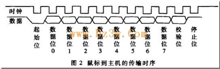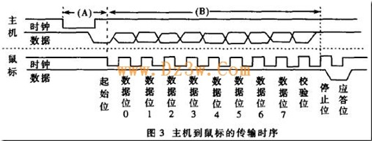

 PS/2鼠标的四种工作模式是:Reset模式,当鼠标上电或主机发复位命令 0xFF 给它时进入这种模式;Stream 模式鼠标的默认模式，当鼠标上电或复位完成后，自动进入此模式，鼠标基本上以此模式工作;Remote 模式，只有在主机发送了模式设置命令 0xF0 后，鼠标才进入这种模式;Wrap 模式，这种模式只用于测试鼠标与主机连接是否正确｡

       PS/2鼠标在工作过程中,会及时把它的状态数据发送给主机｡每次发送4个字节：BYTE1 BYTE2 BYTE3 BYTE4

定义分别是：

BYTE1 --

       |--bit7:   1   表示   Y   坐标的变化量超出－256   ~   255的范围,0表示没有溢出

       |--bit6:   1   表示   X   坐标的变化量超出－256   ~   255的范围，0表示没有溢出

       |--bit5:   Y   坐标变化的符号位，1表示负数，即鼠标向下移动

       |--bit4:   X   坐标变化的符号位，1表示负数，即鼠标向左移动

       |--bit3:     恒为1

       |--bit2:     1表示中键按下

       |--bit1:     1表示右键按下

       |--bit0:     1表示左键按下

BYTE2 -- X 坐标变化量，与 byte 的 bit4 组成 9 位符号数，负数表示向左移，正数表右移。用补码表示变化量

BYTE3 -- Y 坐标变化量，与 byte 的 bit5 组成 9 位符号数，负数表示向下移，正数表上移。用补码表示变化量

BYTE4 -- 滚轮变化。

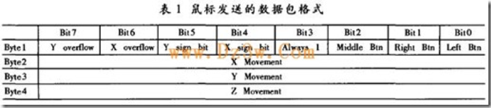

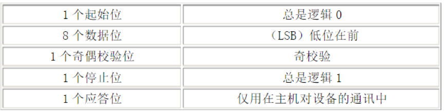

如果数据位中1的个数为偶数，校验位就为1；如果数据位中1的个数为奇数，校验位就为0；总之，数据位中1的个数加上校验位中1的个数总为奇数，因此总进行奇校验。

ps2 设备的 clock 和 data 都是集电极开路的，平时都是高电平。当 ps2 设备等待发送数据时，它首先检查 clock 是否为高。如果为低，则认为 PC 抑制了通讯，此时它缓冲数据直到获得总线的控制权。如果 clock 为高电平，ps2 则开始向 PC 发送数据。

一般都是由 ps2 设备产生时钟信号。发送按帧格式。数据位在 clock 为高电平时准备好，在 clock 下降沿被 PC 读入。

数据从键盘/鼠标发送到主机或从主机发送到键盘/鼠标，时钟都是 PS2 设备产生。主机对时钟控制有优先权，即主机想发送控制指令给 PS2 设备时，可以拉低时钟线至少 100μS，然后再下拉数据线，最后释放时钟线为高。PS2 设备的时钟线和数据线都是集电极开路的，容易实现拉低电平。

PC 在时钟的下降沿读取数据。

PS: ps2 协议是现在大多数鼠标，键盘与 PC 通讯的标准协议，鼠标的通讯更为简单些，只是传送的数据内容不一样而已。

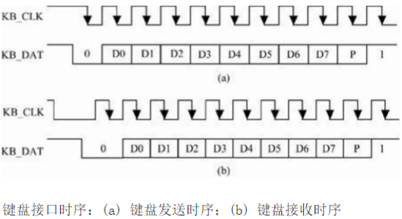

从PS／2向PC机发送一个字节可按照下面的步骤进行：

 (1) 检测时钟线电平，如果时钟线为低，则延时50μs；

 (2) 检测判断时钟信号是否为高，为高，则向下执行，为低，则转到 (1)；

 (3) 检测数据线是否为高，如果为高则继续执行，如果为低，则放弃发送（此时PC机在向 PS／2设备发送数据，所以PS／2设备要转移到接收程序处接收数据）；

 (4) 延时20μs（如果此时正在发送起始位，则应延时40μs）；

（5）输出起始位（0）到数据线上。这里要注意的是：在送出每一位后都要检测时钟线，以确保PC机没有抑制PS／2设备，如果有则中止发送；

（6）输出8个数据位到数据线上；

（7）输出校验位；

（8）输出停止位（1）；

（9）延时30μs（如果在发送停止位时释放时钟信号则应延时50μs）；

   通过以下步骤可发送单个位：

（1）准备数据位（将需要发送的数据位放到数据线上）；

（2）延时20μs；

（3）把时钟线拉低；

（4）延时40μs；

（5）释放时钟线；

（6）延时20μs。

    ＰＳ／２设备从ＰＣ机接收一个字节

由于PS／2设备能提供串行同步时钟，因此，如果PC机发送数据，则PC机要先把时钟线和数据线置为请求发送的状态。PC机通过下拉时钟线大于100μs来抑制通讯，并且通过下拉数据线发出请求发送数据的信号，然后释放时钟。当PS／2设备检测到需要接收的数据时，它会产生时钟信号并记录下面8个数据位和一个停止位。主机此时在时钟线变为低时准备数据到数据线，并在时钟上升沿锁存数据。而PS／2设备则要配合PC机才能读到准确的数据。具体连接步骤如下：

（1）等待时钟线为高电平。

（2）判断数据线是否为低，为高则错误退出，否则继续执行。

（3）读地址线上的数据内容，共8个bit，每读完一个位，都应检测时钟线是否被PC机拉低，如果被拉低则要中止接收。

（4）读地址线上的校验位内容，1个bit。

（5）读停止位。

（6）如果数据线上为0（即还是低电平），PS／2设备继续产生时钟，直到接收到1且产生出错信号为止（因为停止位是1，如果PS／2设备没有读到停止位，则表明此次传输出错）。

（7 输出应答位。

（8）检测奇偶校验位，如果校验失败，则产生错误信号以表明此次传输出现错误。

 （9）延时45 μs，以便PC机进行下一次传输。

读数据线的步骤如下：

（1）延时20μs；

（2）把时钟线拉低

（3）延时40μs

（4）释放时钟线

（5）延时20μs

（6）读数据线。

下面的步骤可用于发出应答位；

（1）延时15μs；

（2）把数据线拉低；

（3）延时5μs；

（4）把时钟线拉低；

（5）延时40μs；

（6）释放时钟线；

（7）延时5μs；

（8）释放数据线。

键盘的处理器如果发现有键被按下或释放将发送扫描码的信息包到计算机。扫描码有两种不同的类型：通码和断码。当一个键被按下就发送通码，当一个键被释放就发送断码。每个按键被分配了唯一的通码和断码。这样主机通过查找唯一的扫描码就可以测定是哪个按键。每个键一整套的通断码组成了扫描码集。有三套标准的扫描码集：分别是第一套，第二套和第三套。所有现代的键盘默认使用第二套扫描码。

       虽然多数第二套通码都只有一个字节宽，但也有少数扩展按键的通码是两字节或四字节宽。这类的通码第一个字节总是为E0。

       正如键按下通码就被发往计算机一样，只要键一释放断码就会被发送。每个键都有它自己唯一的通码和断码。幸运的是你不用总是通过查表来找出按键的断码。在通码和断码之间存在着必然的联系。多数第二套断码有两字节长。它们的第一个字节是F0 ，第二个字节是这个键的通码。扩展按键的断码通常有三个字节，它们前两个字节是E0h,F0h ，最后一个字节是这个按键通码的最后一个字节。下面列出了几个按键的第二套通码和断码：

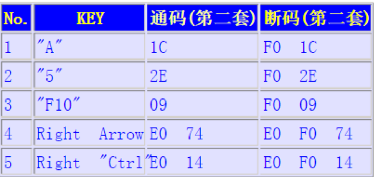

一个键盘发送值的例子：

      通码和断码是以什么样的序列发送到你的计算机从而使得字符G 出现在你的字处理软件里的呢？因为这是一个大写字母，需要发生这样的事件次序：按下Shift 键-按下G键-释放G 键-释放Shift 键。与这些时间相关的扫描码如下：Shift 键的通码12h，G 键的通码34h ，G 键的断码F0h 34h ，Shift 键的断码F0h 12h 。因此发送到你的计算机的数据应该是：

12h 34h F0h 34h F0h 12h
