# 简单组合逻辑电路

## verilog 中的数字表示

在 Verilog HDL 中一个信号可能有如下四种基本的值：  
i.0：逻辑 0 或假  
ii.1：逻辑 1 或真  
iii.x：未知  
iv.z：高阻态（三态）  
在门电路的输入端或是表达式中的 z  值通常会被译为一个 x 值（待确定）。通常情况下，Verilog HDL 是区分大小写的，但是作为值来表示时是不区分大小写的。  

在 Verilog HDL 中有三种常量类型：(i) 整型，(ii) 实型，和 (iii) 字符串。在整型常量和实型常量中可以使用下划线（_）来增加可读性。但它不能出现在第一个和最后一个字符的位置上。  

整数可以写成 (i) 简单的十进制数或者是 (ii) 带进制格式。一个写成简单十进制形式的整数由一个可省略的 + 或是一个 - 和一串数字组成。比如，  
15  
-32  
其中 15 可以被写成 5 比特格  式的二进制数 01111，-32 可以写成 6 比特格式的 100000。简单的十进制数在硬件中最终会占用 32 比特。

一个数也可以被表示为进制格式，语法格式如下： [size]’base value
其中 size 代表数的比特数，base（基）是 o 或者 O（代表八进制 octal），b 或者 B（代表二进制 Binary），d 或者 D（代表十进制 Decimal），h 或者 H（代表十六进制 hexadecimal）中的一个。Value 是一个在该进制下有效的数字的序列。Value 必须是无符号的。比如，wire [4:0] 5'O37 //5 比特八进制表示
reg [3:0] 4'B1x_01 //4 比特二进制
wire [3:0] 4'd-4 //不合法，value 不能是负数
wire [11:0] 7'Hx //7 比特 x 扩展到 xxxxxxx
如果 size 设定得比设定的常数的值的大小要大，这个数会被用 0 扩展到左边，除非最左边的比特是 x 或 z，此时也会相应地用 x 或 z 扩展。如果 size 设定得更小，那左边的多余的位会被忽略。如果 size 未设定，那么就会使用 32 比特。

## 实验目标

完成本次实验后，你将能做到：  

- 定义不同进制的数  
- 设计能将数据从一个进制转化到另一个的组合电路  
- 设计能实现简单的加法操作的组合电路  
- 学到一个能提高加法操作速度的技巧  

## 设计一个 BCD 码到 7 段数码管的译码器

### 数码管原理

7 段数码管显示器包含 7 段，编号从 a 到 g，可以用来显示一个字符。根据不同的输入类型，可能需要做类型转换。如果需要显示 4bit 的 BCD 码，则需要一个 BCD 码到 7 段数码管的译码器。下表展示了你要显示一个数字的 bit 图样。
(需要注意的是，你如果需要点亮某一段，则要输出逻辑 0 到这一段，并且这个显示器的阳极需要用板上的逻辑 0 驱动)。  

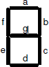

| 输入 | a    | b    | c    | d    | e    | f    | g    |
| :----: |:----: | :----: | :----: |: ----: | :----: | :----: | :----: |
|   0000   |  0    |0      | 0     | 0     |  0    |  0    |1      |
|0001|1|0|0|1|1|1|1|
|0010|0|0|1|0|0|1|0|
|0011|0|0|0|0|1|1|0|
|0100|1|0|0|1|1|0|0|
|0101|0|1|0|0|1|0|0|
|0110|0|1|0|0|0|0|0|
|0111|0|0|0|1|1|1|1|
|1000|0|0|0|0|0|0|0|
|1001|0|0|0|0|1|0|0|
|1010 到 1111|X|X|X|X|X|X|X|

Nexys4 DDR 开发板包含两个 4 位 7 段数码管 LED 显示器。每个模块中 4 位的每 1 位都由 7 段组成，每一段都嵌入了一颗 LED，顺序如下图。每段的 LED 可以被单独点亮。因而通过点亮特定的段，熄灭其他段，全部 128 种图样都可以在 1 位上实现。在这 128 种图样中，10 种数字的图样最有用。

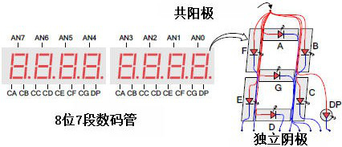

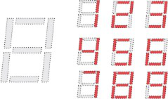

组成每一位的 7 颗 LED 的阳极被连接在一起，称为“共阳极”的电路节点，但 LED 的阴极是独立的。共阳极节点的信号可以被获取作为 4 位显示器的使能信号。不同位，相同段的阴极信号分别接到 7 个电路节点，从 CA 到 CG (比如上图中 4 位的“D”笔画的阴极被连接到一起，连接到“CD”这个电路节点)。这 7 个阴极节点信号可以被获取作为 4 位显示器的输入信号。这种信号连接的方案支持了多路复用的显示，虽然每个笔 画的阴极信号是 4 位共用的，但它们只能点亮阳极信号生效的位上的笔画。  

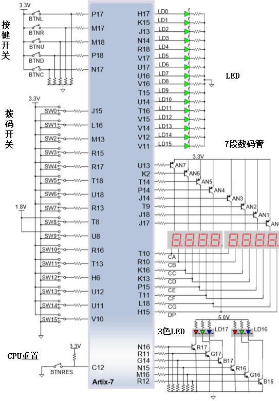

扫描显示控制器电路可以用来控制这个显示器显示一个 4 位数。这个电路根据阴极图样，以高于人眼可分辨地频率，对每一位的阳极信号进行重复地、持续地、接连地驱动。如果它的更新或“刷新”率降到大约 45 Hz 时，大多数人能看出显示在闪烁。从 Lab 8（体系结构向导和知识产权目录）开始你将设计和使用一个扫描电路。

### 实验步骤

1. 打开 Vivado，创建一个名为 lab2.1 的空白工程（project）。

2. 创建一个顶层 Verilog module，命名为 bcdto7segment_dataflow，按数据流建模风格添加 4-bit data
输入 (x[3:0]),阳极使能输出信号 (an[3:0])，7-bit 输出 (seg[6:0]) 。
(提示：你必须在纸上推导 7 个段的七个表达式。). 对 an[3:0] 输出合适的信号使得只有最右边的一位显示。

3. 添加对应开发板的 XDC 文件到工程。编辑 XDC 文件，将 SW3-SW0 赋给 x[3:0]，CA, CB, CC, CD, CE, CF, CG 给 seg[0]到 seg[6]，J17, J18, T9,J14, P14, T14, K2, U13 给 an7, an6, an5, an4,an3,
an2, an1, an0 (Nexys4 DDR 开发板)
4. 综合你的设计。
5. 实现你的设计。
6. 生成比特流文件，将其下载到 Basys3 或 Nexys4 DDR 开发板，并验证功能。

### 参考代码

 module lab2_1(
     input [3:0]x,
     output reg [7:0]seg,
     output  [7:0]an
     );
     assign an=8'b1111_1110;
  always@(*)
    case(x)
        0: seg= 8'b 1100_0000;
        1: seg= 8'b 1111_1001;
        2:seg= 8'b 1010_0100;
        3: seg= 8'b 1011_0000;
        4: seg= 8'b 1001_1001;
        5: seg= 8'b 1001_0010;
        6: seg= 8'b 1000_0010;
        7: seg= 8'b 1111_1000;
        8: seg= 8'b 1000_0000;
        9:seg= 8'b 1001_0000;
       default seg=8'bxxxx_xxxx;
        endcase
 endmodule

修改对应的 xdc 文件段落，大致如下图：

 ​ set_property -dict { PACKAGE_PIN T10   IOSTANDARD LVCMOS33 } [get_ports { seg[0] }]; #IO_L24N_T3_A00_D16_14 Sch=ca
 ​ set_property -dict { PACKAGE_PIN R10   IOSTANDARD LVCMOS33 } [get_ports { seg[1] }]; #IO_25_14 Sch=cb
 ​ set_property -dict { PACKAGE_PIN K16   IOSTANDARD LVCMOS33 } [get_ports { seg[2] }]; #IO_25_15 Sch=cc
 ​ set_property -dict { PACKAGE_PIN K13   IOSTANDARD LVCMOS33 } [get_ports { seg[3] }]; #IO_L17P_T2_A26_15 Sch=cd
 ​ set_property -dict { PACKAGE_PIN P15   IOSTANDARD LVCMOS33 } [get_ports { seg[4] }]; #IO_L13P_T2_MRCC_14 Sch=ce
 ​ set_property -dict { PACKAGE_PIN T11   IOSTANDARD LVCMOS33 } [get_ports { seg[5] }]; #IO_L19P_T3_A10_D26_14 Sch=cf
 ​ set_property -dict { PACKAGE_PIN L18   IOSTANDARD LVCMOS33 } [get_ports { seg[6] }]; #IO_L4P_T0_D04_14 Sch=cg
​

 set_property -dict { PACKAGE_PIN H15   IOSTANDARD LVCMOS33 } [get_ports { seg[7] }]; #IO_L19N_T3_A21_VREF_15 Sch=dp

 set_property -dict { PACKAGE_PIN J17   IOSTANDARD LVCMOS33 } [get_ports { an[0] }]; #IO_L23P_T3_FOE_B_15 Sch=an[0]
 set_property -dict { PACKAGE_PIN J18   IOSTANDARD LVCMOS33 } [get_ports { an[1] }]; #IO_L23N_T3_FWE_B_15 Sch=an[1]
 set_property -dict { PACKAGE_PIN T9    IOSTANDARD LVCMOS33 } [get_ports { an[2] }]; #IO_L24P_T3_A01_D17_14 Sch=an[2]
 set_property -dict { PACKAGE_PIN J14   IOSTANDARD LVCMOS33 } [get_ports { an[3] }]; #IO_L19P_T3_A22_15 Sch=an[3]
  set_property -dict { PACKAGE_PIN P14   IOSTANDARD LVCMOS33 } [get_ports { an[4] }]; #IO_L8N_T1_D12_14 Sch=an[4]
  set_property -dict { PACKAGE_PIN T14   IOSTANDARD LVCMOS33 } [get_ports { an[5] }]; #IO_L14P_T2_SRCC_14 Sch=an[5]
  set_property -dict { PACKAGE_PIN K2    IOSTANDARD LVCMOS33 } [get_ports { an[6] }]; #IO_L23P_T3_35 Sch=an[6]
  set_property -dict { PACKAGE_PIN U13   IOSTANDARD LVCMOS33 } [get_ports { an[7] }]; #IO_L23N_T3_A02_D18_14 Sch=an[7]

## 将 4 比特的输入转化为相应的 2 位十进制数（BCD 码）后输出到 LED 灯（最高位）和最右边的七段数码管（更低位）上

### 原理介绍

设计一个能将 4 比特的二进制数 v 转换到它相应的 2 位十进制数，z 和 m。由于正确的输入范围是 0 到 15，最高位可以只使用一个 LED 等来显示。下表显示了要求的输出值。下图中给出了设计框图。它包含一个检查 v 值是否大于 9 的比较器（comparator），并使用比较器的输出来控制七段数码管的显示。提示：只要 v 大于二进制的 1001，m3 就会是 0。

| v[3:0] | z    | m[3:0] |
| ------ | ---- | ------ |
|0000| 0| 0000|
|0001| 0| 0001|
|0010| 0| 0010|
|0011| 0| 0011|
|0100| 0| 0100|
|0101| 0| 0101|
|0110| 0| 0110|
|0111| 0| 0111|
|1000| 0| 1000|
|1001| 0| 1001|
|1010| 1| 0000|
|1011| 1| 0001|
|1100| 1| 0010|
|1101| 1| 0011|
|1110| 1| 0100|
|1111| 1| 0101|

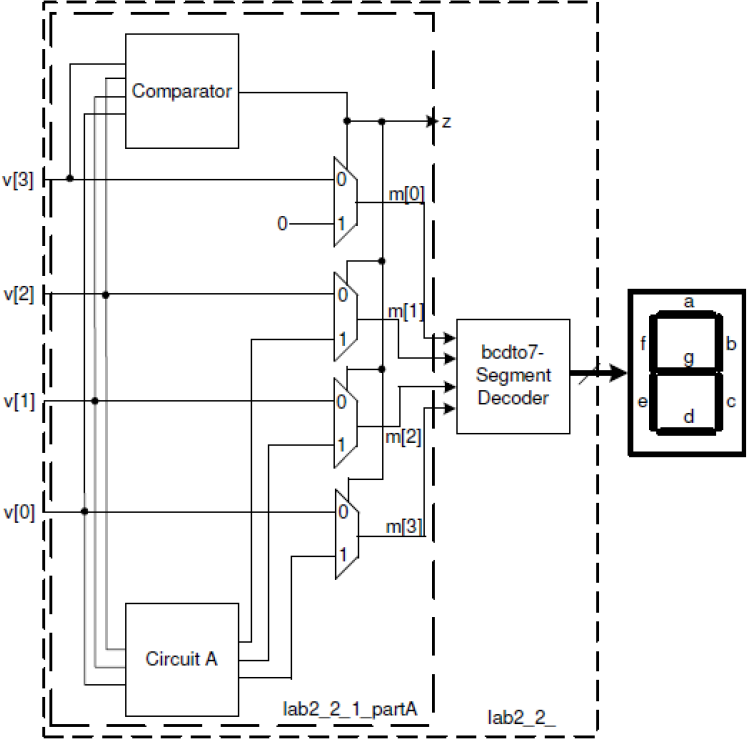

### 模块调用

#### 模块

Verilog HDL 程序是由模块构成的。每个模块的内容都是嵌在 module 和 endmodule 两个语句之间。每个模块实现特定的功能。模块可以进行层次嵌套。  
每个模块要进行端口定义，并说明输入输出口，然后对模块的功能进行行为逻辑描述。  
Verilog HDL 程序的书写格式自由，一行可以写几个语句，一个语句也可以分写多行。  
除了 endmodule 语句外，每个语句和数据定义的最后必须有分号。  
可以用/…../和//…….对 Verilog HDL 程序的任何部分作注释。一个好的，有使
用价值的源程序都应当加上必要的注释，以增强程序的可读性和可维护性。

#### Verilog 模块调用端口的连接规则

在 verilog 中，所有的端口隐含地声明 wire 类型；如果输出类型的端口需要保存数值，则必须将其显式地声明为 reg 数据类型。  
不能将 input 和 inout 类型的端口声明为 reg 数据类型，因为 reg 类型的变量是用于保存数值的，而输入端口只反映与其相连的外部信号的变化。  
在 verilog 中，有两种端口声明风格：  

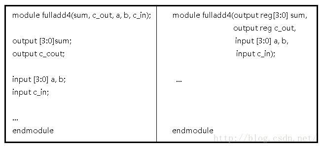

##### 具体端口连接规则

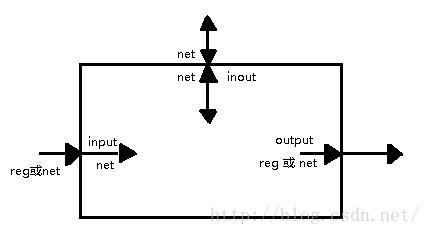

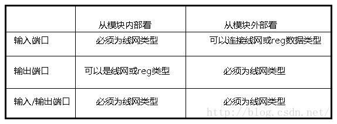

端口连接规则 将一个端口看成由相互链接的两个部分组成，一部分位于模块内部，另一部分位于模块外部。当在一个模块中调用（实例引用）另一个模块时，端口之间的连接必须遵守一些规则。

1. 输入端口：从模块内部来讲，输入端口必须为线网数据类型，从模块外部来看，输入端口可以连接到线网或者 reg 数据类型的变量。
2. 输出端口：从模块内部来讲，输出端口可以是线网或者 reg 数据类型，从模块外部来看，输出必须连接到线网类型的变量（显式，隐式），而不能连接到 reg 类型的变量。
3. 输入/输出端口（必须为 wire）从模块内部来讲，输入/输出端口必须为线网数据类型；从模块外部来看，输入/输出端口也必须连接到线网类型的变量。

### 实验步骤

1. 打开 Vivado，创建一个名为 lab2_2_1 的空白工程。

2. 创建并添加一个 Verilog 模块（命名为 lab2.2）以 v[3:0]为输入，z 和 m[3:0] 作为输出。创建并添加模块，使用数据流结构（dataflow constructs）来完成比较器数据流（comparator_dataflow），lab2 的电路 A 的数据流（lab2_circuitA_dataflow），实例化 2-to-1 多路选择器（Lab1 的），并将它们按上图连接起来。

3. 创建一个包含 bcdto7segment_dataflow decoder（你在 Lab1 中开发的）的顶层模块（lab2.1）并提供一个 7 比特的输出 seg0 而不是 m。

4. 将与开发板对应的 XDF 文件添加到工程中，编辑文件添加相关的端口。将输入 v 赋给 SW3 到 SW0，z 赋给 LED0，seg0 赋给七段数码管显示阴极 CA 到 CG，将 an 赋给端口 J17，J18，T9，J14，P14，T14，K2，U13（对于 Nexys4 DDR）或是 U2，U4，V4，W4（对于 Basys3）。

5. 综合（Synthesize）并实现（implement）设计。

6. 生成比特流（bitstream），将它下载到 Basys3 或是 Nexys4 DDR 开发板上，并验证它的功能。

### 参考代码及讲解

由对应关系：

| v[3:0] | z    | m[3:0] |
| ------ | ---- | ------ |
|0000| 0| 0000|
|0001| 0| 0001|
|0010| 0| 0010|
|0011| 0| 0011|
|0100| 0| 0100|
|0101| 0| 0101|
|0110| 0| 0110|
|0111| 0| 0111|
|1000| 0| 1000|
|1001| 0| 1001|
|1010| 1| 0000|
|1011| 1| 0001|
|1100| 1| 0010|
|1101| 1| 0011|
|1110| 1| 0100|
|1111| 1| 0101|

我们可以首先写出输入 m 与输出 m 与 z 的关系，使用数据流的模式来实现

    reg  [3:0]m;
    always@(*)
    begin
        case(v)
        4'b0000: begin z=0; m=4'b0000;  end
        4'b0001: begin z=0; m=4'b0001;  end
        4'b0010: begin z=0; m=4'b0010;  end
        4'b0011: begin z=0; m=4'b0011;  end 
        4'b0100: begin z=0; m=4'b0100;  end
        4'b0101: begin z=0; m=4'b0101;  end
        4'b0110: begin z=1; m=4'b0000;  end 
        4'b0111: begin z=1; m=4'b0001;  end
        4'b1000: begin z=1; m=4'b0010;  end
        4'b1001: begin z=1; m=4'b0011;  end
        4'b1010: begin z=1; m=4'b0100;  end
        4'b1011: begin z=1; m=4'b0101;  end
        4'b1100: begin z=1; m=4'b0110;  end
        4'b1101: begin z=1; m=4'b0111;  end
        4'b1110: begin z=1; m=4'b1000;  end
        4'b1111: begin z=1; m=4'b1001;  end
        endcase

添加我们在 lab1 中的代码：

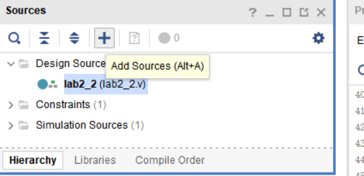

在这里选择添加，也可以使用快捷键 ALT+A

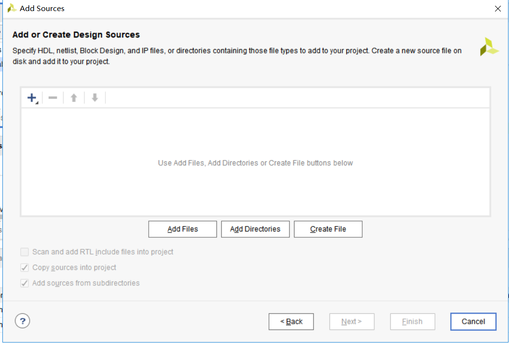

选择 add desgin source 并且选择你的 lab1 文件 source 中的代码  

在 lab2.2 函数中写入这个函数，并且实例化它  

综上所述，具体的代码如下：

 module lab2_2(
     input [3:0]v,
     output reg z,
     output  [7:0]seg,
     output [7:0]an
     );
     reg  [3:0]m;
     always@(*)
     begin
         case(v)
         4'b0000: begin z=0; m=4'b0000;  end
         4'b0001: begin z=0; m=4'b0001;  end
         4'b0010: begin z=0; m=4'b0010;  end
         4'b0011: begin z=0; m=4'b0011;  end
         4'b0100: begin z=0; m=4'b0100;  end
         4'b0101: begin z=0; m=4'b0101;  end
         4'b0110: begin z=0; m=4'b0110;  end
         4'b0111: begin z=0; m=4'b0111;  end
         4'b1000: begin z=0; m=4'b1000;  end
         4'b1001: begin z=0; m=4'b1001;  end
         4'b1010: begin z=1; m=4'b0000;  end
         4'b1011: begin z=1; m=4'b0001;  end
         4'b1100: begin z=1; m=4'b0010;  end
         4'b1101: begin z=1; m=4'b0011;  end
         4'b1110: begin z=1; m=4'b0100;  end
         4'b1111: begin z=1; m=4'b0101;  end
         endcase
     end
     lab2_1 A(m,seg,an);  //A 是实例化的名称
 endmodule

在你具体在函数中写入调用函数时，会自动生成两个函数之间的调用关系，这是你可以看到 lab2_2 函数成为了顶层模块。

## 仅使用数据流级建模创建一个 4 比特波纹进位加法器

### 执行加法

当两个 1 比特的数相加时，它们可能会产生一个 2 比特的输出。比如，1 + 1 = 10（都是二
进制）。当你将三个 1 比特的数相加是，结果也会是 2 比特，比如，1 + 1 = 11。这种简单的操作可以被视为将两个比特与一个更低位的操作的进位输入相加，结果产生一个和与一个进位输出——左边的比特是进位输出，右边的比特是和。下图显示了一个 4 比特的加法器。由于进位是像波纹一样从最低比特位 (cin) 向最高比特位传递的，这样的加法器也叫波纹进位加法器（待确定）。

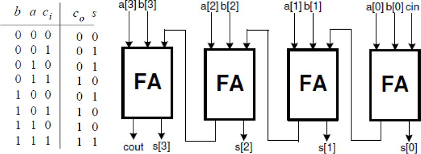

### 实验步骤

1. 打开 Vivado 并创建一个名为 lab2.3 的空白工程。

2. 创建并使用数据流级建模添加一个有三个输入（a, b, cin）和两个输出（s 和 cout）的名为 fulladder_dataflow 的 Verilog module。所有的输入和输出都应该是 1 比特位宽的。

3. 在工程中创建并添加一个有三个输入（a, b, cin）和两个输出（s 和 cout）的 Verilog module（名为 rca_dataflow），实例化全加器（FA）四次，并将它们按所需连接起来。这里的 a，b，和 s 应该是一个 4 比特的向量，cin 和 cout 应该是 1 比特位宽。

4. 对设计进行仿真（行为仿真）80ns 并验证功能。

5. 将与开发板对应的 XDF 文件添加到工程中，编辑文件添加相关的端口。将 SW4 到 SW7 赋给 a，将 SW0 到 SW3 赋给 b，LED3 到 LED0 赋给 s，SW15 赋给 cin，LED15 赋给 cout。

6. 综合（Synthesize）并实现（implement）设计。

### 参考代码及讲解

首先，我们需要编写一个一位的加法，具体原理请看前面的讲解：  

 module one_bit_add(
     input a,
     input b,
     input cin,
     output s,
     output reg cout
     );
     assign s=a^b^cin;
     always@(*)
     begin
         if(a&b|a&cin|b&cin)
         cout=1;
         else
         cout=0;
     end

 endmodule

在 lab2.3 的工程中重复调用这个模块，来实现我们的四位加法器，具体代码如下：  

 module lab2_3(
     input [3:0]a,
     input [3:0]b,
     output [3:0]s,
     input cin,
     output cout
     );
     wire temp0,temp1,temp2;
     one_bit_add A(a[0],b[0],cin,s[0],temp0);
     one_bit_add B(a[1],b[1],temp0,s[1],temp1);
     one_bit_add C(a[2],b[2],temp1,s[2],temp2);
     one_bit_add D(a[3],b[3],temp2,s[3],cout);
 endmodule

#### 仿真代码

因为对参数中的变量手动一次次修改对于比较大的数字较为麻烦，所以在这里使用了循环语句。

 module lab2_3_tb(

     );
     reg [3:0]a;
     reg [3:0]b;
     wire [3:0]s;
     reg cin;
     wire cout;
     integer k;
     lab2_3 dut(a,b,s,cin,cout);
     initial
     begin
     a=0; b=0; cin=0;
         for(k=0;k<20;k=k+1)
         begin
          #10   if(k<10)
                a=a+1;
                else
                b=b+1;
                if(k==10)
                cin=1;            
         end
     end
 endmodule

查看仿真代码，确定自己的代码是否正确：

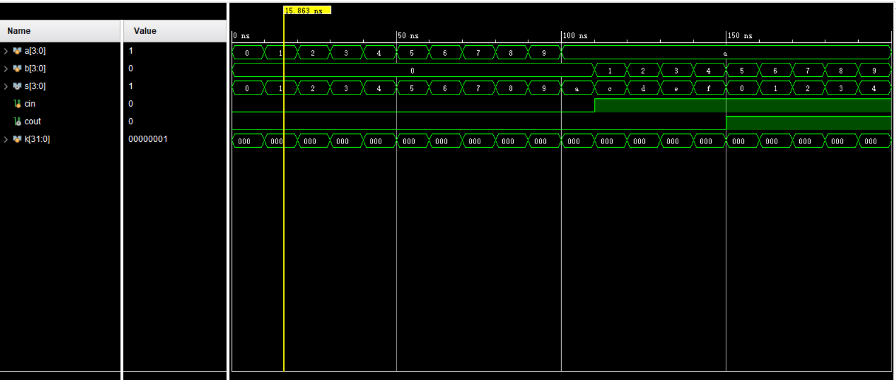

## 扩展实验内容

### 扩展实验 1

修改 3 中的工程，将 4 比特的输入看作 BCD 码完成加法，生成 BCD 码的结果并在 LED0 和最右边的七段数码管上显示出来。使用开关来输入两个 4 比特 BCD 数并用 SW15 输入进位。根据需求复用 2 和 3 中开发的模型。使用数据流级建模。

#### 具体要求

1. 打开 Vivado 并创建一个名为 lab2.kuozhan1 的空白工程。
2. 按需求修改 3 中的工程，使之能完成需求的功能并将结果输出到 LED0 和最右边的七段数码管上显示

3. 将与开发板对应的 XDF 文件添加到工程中，编辑文件添加相关的端口。使用开关
SW72-SW0 来给两个 4 比特的 BCD 提供输入，SW15 给进位。
4. 综合（Synthesize）并实现（implement）设计。
5. 生成比特流（bitstream），将它下载到 Basys3 或是 Nexys4 DDR 开发板上，并验证它的功能。

### 扩展实验 2

通过修改 3 中的工程并使用数据流级建模创建一个超前进位加法器电路

#### 实验简介

波纹进位加法器在处理两个很大的数（比如 8 比特，16 比特，32 比特）的加法时会花很长时间运算。为了降低运算时间，可以使用另一个结构，超前进位加法器。它的工作方式是，基于以下轻轻为每个比特位分别创建两个信号（P 和  G）：进位信号是否会从较低比特位传播过来（即至少有一个输入是 1），进位信号是否由此比特位生成（即两个输入均为 1），或者进位信号是否会被此比特位消灭（两个输入均为 0）。P 和 G 生成后，每个比特位的进位信号也生成了。

此处𝑃𝑖 = 𝐴𝑖 + 𝐵𝑖，𝐺𝑖 = 𝐴𝑖𝐵𝑖。在超前进位单元内，𝐶𝑖+1 = 𝐺𝑖 + 𝑃𝑖𝐶𝑖。这个加速是通过使
𝐶𝑖和相应的第 i 为一起生成而达到的。

#### 具体要求

1. 打开 Vivado 并打开你在 3 中创建的工程。

2. 按需修改 3 中的工程，来使用超前进位结构完成两个 4 比特的数的加法并将结果输出到 LED 灯上。有由 SW15 提供进位。提示：你只需要将全加器修改为输出𝑃𝑖和
𝐺𝑖，然后创建并添加另一个超前进位（CLA）模块来完成超前进位功能（即输入𝑐0 和
𝑝𝑖𝑔𝑖（i = 0 到 3）并输出𝑐4、𝑝𝑔和𝑔𝑔。

3. 修改 XDF 文件来通过 SW3-SW0 提供输入 b，通过 SW7-SW4 提供输入 a，SW15
输入 cin。通过 LED15 输出 cout，LED3-LED0 输出 sum。
4. 综合（Synthesize）并实现（implement）设计。
5. 生成比特流（bitstream），将它下载到 Basys3 或是 Nexys4 DDR 开发板上，并验证它的功能。

## 总结

在这个实验中，你会学到如何定义不同进制的数。你还会使用数据流设计不同的转换数字的电路。你还会学习到一个提高加法速度的技能。
