# 简单时序逻辑电路

[TOC]

## 1. 时序逻辑电路概念

​ 在前述的组合逻辑中，任意时刻的输出只与该时刻的输入信号所决定；而在接下来要讲的时序电路中，任意时刻的输出信号不仅与当时刻的输入有关，而且与电路原来的状态有关。这需要电路要能记住历史输入，所以要引入时序概念。用时钟信号保障时序电路按照时序来运行。

## 2. 锁存器和触发器

​ 锁存器和触发器是时序电路中常用的存储器设备。接下来将学习模拟各种类型的锁存器和使用带有控制信号的触发器。

### 2-1. 锁存器

​ 锁存器是一种具有两种稳定状态的器件：高输出和低输出。锁存器具有反馈路径，因此设备可以保留信息。锁存器是易失性存储器设备，并且只要设备通电就可以存储一位数据。顾名思义，锁存器用于“锁定”信息并保持信息。

#### 2-1-1. SR 锁存器

​ **SR 锁存器**（置位/复位）是一个异步器件：它不依赖于控制信号工作，仅依赖于 S 和 R 输入的状态。它的符号表示、使用异或门级电路实现和真值表如下所示：

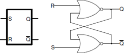


​ 虽然 Xilinx FPGA 可以使用一个 LUT（查找表）电路实现这种锁存器，但以下 Verilog 代码显示了如何使用门级电路和数据流建模对这种电路进行建模。

```verilog
门级：
module SR_latch_gate (input R, input S, output Q, output Qbar);
nor (Q, R, Qbar);
nor (Qbar, S, Q); 
endmodule
数据流：
module SR_latch_dataflow (input R, input S, output Q, output Qbar); 
assign #2 Q = ~ (R | Qbar);
assign #2 Qbar = ~ (S | Q); 
endmodule
```

##### 实验目的

​ 使用上面显示的代码设计 SR 锁存器。合成设计并查看合成设计的原理图。设计一个 Testbench 进行测试并验证设计。

​ 该实验中将 S 输入分配给 SW0，将 R 输入分配给 SW1。将 Q 分配给 LED0，将 Qbar 分配给 LED1。实现该设计并进行仿真验证以及下载。

##### 实验步骤

​ **1.** 打开 Vivado 并创建一个名为 lab5_1_1 的空白项目。

​ **2.** 使用 SR_latch_dataflow 代码创建和添加 Verilog 模块。

​ **3.** 设计一个 Testbench 进行测试（也可以使用参考代码中的 Testbench），执行 100ns 的行为仿真，并验证设计。

​ 若使用供参考的 Testbench，波形应该如下：

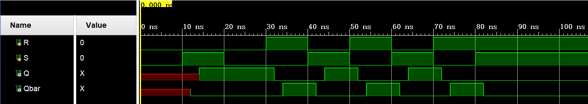

​ **4.** 将适当的板相关主 XDC 文件添加到项目中并编辑它以包括相关引脚，将 S 输入分配给 SW0，将 R 输入分配给 SW1，将 Q 分配给 LED0，将 Qbar 分配给 LED1。

​ **5.** 在“Bitstream Settings”中设置 tcl.pre 选项以指向提供的 lab5_prehook.tcl 文件。此文件允许将组合循环上载到电路板。

​ **6.** 合成设计并在 Synthesized Design 过程组下查看原理图。验证它使用 2 个 LUT 和 4 个 IO（2 个 IBUF 和 2 个 OBUF）。

​ **7.** 实现设计并查看项目摘要。它应该显示 2 个 LUT 和 4 个 IO。

​ **8.** 生成比特流，将其下载到 Nexys4 DDR 板，并验证功能。

##### 参考代码

```verilog
module RS_latch_tb();
    reg R,S;
    wire Q,Qbar;
    RS_latch TB (.R(R),.S(S),.Q(Q),.Qbar(Qbar));
    initial begin
        R = 0;
        S = 0;
        #10 S = 1;
        #10 S = 0;
        #10 R = 1;
        #10 R = 0; S = 1;
        #10 R = 1; S = 0;
        #10 R = 0; S = 1;
        #10 R = 1; S = 0;
        #10 S = 1; 
    end
endmodule
```

#### 2-1-2. 门控 SR 锁存器

​ 在某些情况下，可能需要指示锁存器何时需要锁存数据和何时不能锁存数据。这就引入了门控 SR 锁存器，门控 SR 锁存器是 SR 锁存器的简单扩展，它提供一条使能线，必须将其置为高电平才能够改变锁存器中锁存的数据。但即使现在有了控制线，SR 锁存器也不是同步的，因为即使在使能处于高电平时，输入可以随时改变输出。当使能输入为低电平时，AND 门的输出也为低电平，因此 Q 和条 Q 输出保持锁存到先前的数据。只有当 Enable 输入为高电平时，锁存器的状态才会发生变化，如真值表所示。当使能线被置高电平时，门控 SR 锁存器在操作上与 SR 锁存器相同。Enable 线有时是时钟信号，但通常是读或写控制线。门控 SR 锁存器的符号、电路和真值表如下所示。

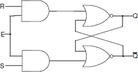

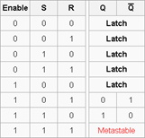

##### 实验目的

​ 使用数据流建模设计门控 SR 锁存器（如上图所示）。合成设计并查看合成设计的原理图。设计一个 Testbench 进行测试并验证设计。仿真设计。将 S 输入分配给 SW0，将 R 输入分配给 SW1，并将输入分配给 SW2。将 Q 分配给 LED0，将 Qbar 分配给 LED1。实现设计并进行仿真和下载。

##### 实验步骤

​ **1.** 打开 Vivado 并创建一个名为 lab5_1_2 的空白项目。

​ **2.** 创建并添加 Verilog 模块，该模块将使用数据流建模对门控 SR 锁存器进行建模。为模型中使用的每个赋值语句分配 2 个单位延迟。

​ **3.** 仿真 100ns。

​ 若使用参考的 Testbench，得到的波形应该如下：

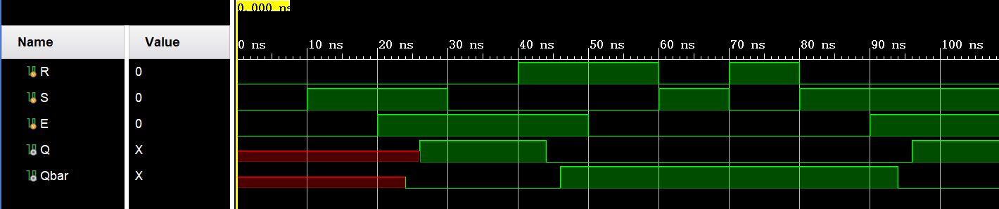

​ **4.** 将适当的电路板相关主 XDC 文件添加到项目中并对其进行编辑以包括相关引脚，将 S 输入分配给 SW0，将 R 输入分配给 SW1，将启用分配给 SW2，将 Q 分配给 LED0，将 Qbar 分配给 LED1。

​ **5.** 在“Bitstream Settings”中设置 tcl.pre 选项以指向提供的 lab5_prehook.tcl 文件。此文件允许将组合循环上载到电路板。

​ **6.** 合成设计并在 Synthesized Design 过程下查看原理图。验证它使用 2 个 LUT 和 5 个 IO

​ **7.** 实现设计并查看项目摘要。它应该显示 2 个 LUT 和 5 个 IO。

​ **8.** 设计 Testbench 以仿真和验证设计。它应产生的输入如上面图中。

​ **9.** 生成比特流，将其下载到 Nexys4 DDR 板，并验证功能。

##### 参考代码

```verilog
module SR_latch_enable (input R, input S, input E, output Q, output Qbar); 
    wire R_i,S_i;
    assign #2 R_i = R & E;
    assign #2 S_i = S & E;
    assign #2 Q = ~ (R_i | Qbar); 
    assign #2 Qbar = ~ (S_i | Q);
endmodule

Testbench：
module SR_latch_enable_tb();
    reg R,S,E;
    wire Q,Qbar;
    SR_latch_enable TB (.R(R),.S(S),.E(E),.Q(Q),.Qbar(Qbar));
    initial begin
        R = 0;
        S = 0;
        #10 S = 1;
        #20 S = 0;
        #10 R = 1;
        #20 R = 0; S = 1;
        #10 R = 1; S = 0;
        #10 R = 0; S = 1;
    end
    initial begin
        E = 0;
        #20 E = 1;
        #30 E = 0;
        #40 E = 1;
    end
endmodule
```

#### 2-1-3. D 锁存器

​ D 锁存器（D 源于”data”），也叫作透明锁存器，是门控 SR 锁存器的简单扩展，其消除了无效输入状态（亚稳态）的可能性。由于门控 SR 锁存器允许我们在不使用 S 或 R 输入的情况下锁存输出，我们可以通过使用互补驱动器驱动设置和复位输入来移除其中一个输入，即我们移除一个输入并自动使其成为另一个输入的互补输入。只要 Enable 线为高电平，D 锁存器就会输出 D 输入，否则输出是当 Enable 输入为最后一个高电平时 D 输入的输出。这就是为什么它也被称为透明锁存器 - 当 Enable 被置位时，锁存器被称为“透明” - 它信号直接传播通过它，好像它不存在一样。

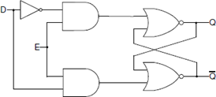

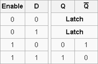

​ D 锁存器可以在行为建模中建模，如下所示：

```verilog
module D_latch_behavior (input D, input Enable, output Q, output Qbar);
 always @ (D or Enable) if(Enable)
 begin
  Q <= D;
  Qbar <= ~D;
 end 
endmodule
```

​ 请注意，由于当 Enable 为低电平时我们没有做什么，电路会“记住”之前的状态。当 Enable 为高电平，由于 always 块也对 D 敏感，Q 和 Qbar 将随时更新 D，从而使其具有“透明”行为。另请注意，这里使用非阻塞赋值运算符（<=）代替已在数据流建模中使用的阻塞运算符（=）。本文档最后介绍了阻塞和非阻塞分配之间的区别。

##### 实验目的

​ 使用数据流建模设计 D 锁存器（如上图所示）。合成设计并查看合成设计的原理图。实现一个 Testbench 进行测试并验证设计。模拟设计。将 D 输入分配给 SW0，并将输入分配给 SW1。将 Q 分配给 LED0，将 Qbar 分配给 LED1。实现设计并验证硬件中的功能。

##### 实验步骤

​ **1.** 打开 Vivado 并创建一个名为 lab5_1_3 的空白项目。

​ **2.** 创建并添加将使用数据流建模对 D 锁存器建模的 Verilog 模块。为模型中使用的每个赋值语句分配 2 个单位延迟。

​ **3.** 实现一个 Testbench 以测试和验证设计。它应该产生输入刺激。

​ 若使用参考的 Testbench，得到的波形应该如下：

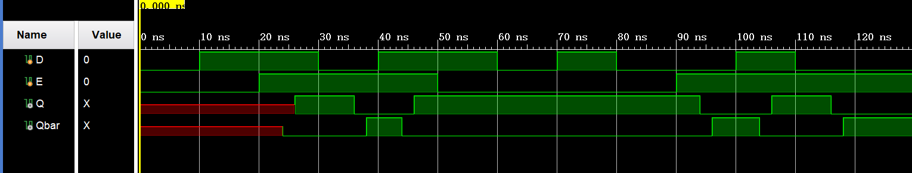

​ **4.** 将适当的板相关主 XDC 文件添加到项目中并编辑它以包 0 括相关引脚，将 D 输入分配给 SW0，将输入分配给 SW1，Q 分配给 LED0，Qbar 分配给 LED1。

  **5.** 在“Bitstream Settings”中设置 tcl.pre 选项以指向提供的 lab5_prehook.tcl 文件。此文件允许将组合循环上载到电路板。

  **6.** 合成设计并在 Synthesized Design 过程组下查看原理图。验证它使用 2 个 LUT 和 4 个 IO。

  **7.** 实现设计并查看项目摘要。它应该显示 2 个 LUT 和 4 个 IO。

  **8.** 生成比特流文件，将其下载到 Nexys4 DDR 板，并验证功能。

##### 参考代码

```verilog
module D_latch_enable (input D, input Enable, output Q, output Qbar);
    wire Dbar,R_i,S_i;
    assign #2 Dbar = ~ D;
    assign #2 R_i = Dbar & Enable;
    assign #2 S_i = D & Enable;
    assign #2 Q = ~(R_i | Qbar);
    assign #2 Qbar = ~(Q | S_i);
endmodule

module D_latch_enable_tb();
    reg D,E;
    wire Q,Qbar;
    D_latch_enable TB (.D(D),.Enable(E),.Q(Q),.Qbar(Qbar));
    initial begin
        D = 0;
        #10 D = 1;
        #20 D = 0;
        #10 D = 1;
        #20 D = 0; 
        #10 D = 1;
        #10 D = 0;
        #20 D = 1;
        #10 D = 0;
    end
    initial begin
        E = 0;
        #20 E = 1;
        #30 E = 0;
        #40 E = 1;
    end
endmodule
```

### 2-2. 触发器

​ 在实际的数字系统中往往包含大量的存储单元，而且经常要求他们在同一时刻同步动作，为达到这个目的，在每个存储单元电路上引入一个时钟脉冲（CLK）作为控制信号，只有当 CLK 到来时电路才被“触发”而动作，并根据输入信号改变输出状态。把这种在时钟信号触发时才能动作的存储单元电路称为触发器，以区别没有时钟信号控制的锁存器。

#### 2-2-1. D 触发器

​ D 触发器是一种广泛使用的触发器类型。它也被称为数据或延迟触发器。D 触发器在时钟周期的某一部分（例如时钟的上升沿）捕获 D 输入的值。捕获的值成为 Q 输出。在其他时候，输出 Q 不会改变。D 触发器可以被视为存储器单元或延迟线。触发器中的有效边沿可以为上升，也可为下降。又分为上升（也称为正）边沿触发 D 触发器和下降（负边沿）触发 D 触发器。

​ 可以使用行为建模对正边沿触发的 D 触发器建模，如下所示：

```verilog
module D_ff_behavior (input D, input Clk, output reg Q); 
 always @ (posedge Clk)
  if(Clk) begin
   Q <= D;
  end 
endmodule
```

​ 请注意，always 块对 Clk 信号的上升沿很敏感。当敏感信号发生更改（事件）时，将执行 if 块中的语句。posedge 灵敏度使触发器行为成为可能。对于下降沿灵敏度使用属性 negedge。

​ 通常需要让同步元素以定义的输出开始。在某些电路中，还需要强制同步元素到一个已知的输出，而忽略了 D 信号的输入。可以修改上面讨论的 D 触发器以具有这样的功能。如果在时钟的有效边沿上获得所需的输出，则这种 D 触发器被称为具有**同步置位**和复位功能的 D 触发器，否则它被视为具有异步预置和清除的 D 触发器。这样的 D 触发器可按照下面的方法实现：

```verilog
module D_ff_with_synch_reset_behavior(input D, input Clk, input reset, output reg Q);      // 同步置位和复位功能的D触发器
 always @(posedge Clk) 
     if (reset) begin
   Q <= 1'b0;
  end 
     else begin
   Q <= D;
  end 
endmodule
```

​ 在 FPGA 中，位于不同可配置逻辑块（CLB）中的 LUT 和 FF 使用路由资源连接。在实施过程中，工具将使用这些资源，具体取决于电路的建模方式，所需资源的类型和数量，以及电路的驱动速度。通常用于交换信息的资源是彼此靠近的;但是，可能存在无法实现的情况。当相关的触发器（信息交换之间）彼此远离时，到达源触发器和目标触发器的时钟可能不会同时产生所谓的时钟偏移。时钟偏移可以改变电路的行为。在某些其他情况下，某些触发器可能不需要在每个断言的时钟边沿更新其输出。为了控制行为，FPGA 中的触发器有一个额外的控制信号，称为时钟使能（CE）。在 ASIC 技术中，门控时钟用于控制行为。带有 CE 的触发器的符号如下所示：

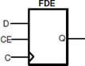

##### 实验目的

​ 使用行为建模对具有同步复位和时钟使能的 D 触发器进行建模。开发一个 testbench 进行测试（如图所示生成输入）并验证设计。仿真设计。将 D 输入分配给 SW0，复位到 SW1，ce 到 SW2，Clk 到 SW15，并将 Q 输出到 LED0。验证硬件设计。

##### 实验步骤

​ **1.** 打开 Vivado 并创建一个名为 lab5_2_4 的空白项目。

​ **2.** 创建并添加 Verilog 模块，该模块将使用同步复位和时钟使能对 D 触发器进行建模。

​ **3.** 开发 testbench 以测试和分析设计行为。它应该产生输入激励。

​  若使用供参考的 Testbench，得到的波形应该如下：


​ **4.** 将适当的板相关主 XDC 文件添加到项目中并编辑它以包括相关引脚，将 D 分配给 SW0，reset 为 SW1，ce 分配给 SW2，Clk 分配给 SW15，Q 分配给 LED0。

​  set_property CLOCK_DEDICATED_ROUTE FALSE [get_nets { clk }];

​  需要将上面的代码行添加到 XDC 文件中，以允许将 SW15 用作时钟。

  **5.** 在“Bitstream Settings”中设置 tcl.pre 选项以指向提供的 lab5_prehook.tcl 文件。此文件允许将组合循环上载到电路板。

  **6.** 合成并实现设计。查看项目摘要并注意使用了 1 个 BUFG 和 5 个 IO。使用 BUFG 是因为在设计中使用了时钟信号。

​  **7.** 生成比特流，将其下载到 Nexys4 DDR 板，并验证功能。

##### 参考代码

```verilog
module D_ff_with_ce_and_synch_reset_behavior(input D, input Clk, input reset, input ce, output reg Q);
    always @(posedge Clk) 
        if (reset) begin
            Q <= 1'b0;
        end 
        else if (ce) begin
            Q <= D;
        end 
endmodule

module D_ff_tb();
    reg D,Clk,ce,reset;
    wire Q;
    D_ff_with_ce_and_synch_reset_behavior TB (.D(D),.Clk(Clk),.ce(ce),.reset(reset),.Q(Q));
    initial begin
        D = 0;
        #20 D = 1;
        #80 D = 0;
        #120 D = 1;
    end
    initial begin
        Clk = 0;
        forever begin
            #10 Clk = 1;
            #10 Clk = 0;
        end
    end
    initial begin
        ce = 0;
        #60 ce = 1;
        #20 ce = 0;
        #100 ce = 1;
        #20 ce = 0;
        #60 ce = 1;
        #20 ce = 0;
    end
    initial begin
        reset = 0;
        #120 reset = 1;
        #20 reset = 0;
    end
endmodule
```

#### 2-2-2. T 触发器

​ 在数字电路中，另一种称为 T 或 Toggle 的触发器用于实现时钟分频器电路。它可用于将输入信号频率变为原来的 1/2.如果级联 n 个 T 触发器，则时钟分频为原来的 (1/2)^n。T 触发器具有 T 输入（数据），时钟输入，以及可选的复位和使能控制信号。

```verilog
module clock_divider_behavior(input Clk, output reg Q); 
 always @(negedge Clk)
  Q <= ~Q;
endmodule
```

​ T 触发器还可以具有称为 CE（时钟使能）的控制信号，其将允许时钟分频仅在其时钟边沿时发生。以下代码模拟了 T 触发器的功能，该触发器对时钟的下降沿敏感，并具有低电平有效复位和高电平有效 T 控制信号。

```verilog
module T_ff_enable_behavior(input Clk, input reset_n, input T, output reg Q); 
 always @(negedge Clk)
  if (!reset_n) Q <= 1'b0;
  else if (T) Q <= ~Q;
endmodule
```

## 3. 总结

### 3-1. 同步异步问题

​ 同步电路：存储电路中所有触发器的时钟输入端都接同一个时钟脉冲源，因而所有触发器的状态的变化都与所加的时钟脉冲信号同步。

​ 异步电路：电路没有统一的时钟，有些触发器的时钟输入端与时钟脉冲源相连，这有这些触发器的状态变化与时钟脉冲同步，而其他的触发器的状态变化不与时钟脉冲同步。

​ 下面以 D 触发器为例子来讲述同步和异步之间的差别。

​ 先用 verilog 描述一个异步的 D 触发器，即就是当时钟信号、复位信号或置位信号任一发生变化时，触发器都会随之发出响应。

```verilog
module D_yb(input clk,input rst,input set,input d,output q);
 always @(posedge clk or negedge rst or negedge set) begin
     if(!rst)       
      q<= 0;
  else if(!set)
      q<= 1;
  else 
      q<=d;
 end
endmodule
```

​ 再来描述一个同步的 D 触发器，当有时钟脉冲时才会做出响应，而 reset 和 set 发生时只会等时钟发生变化才会做出响应。

```verilog
module D_tb（input clk，input rst，input ser,input d,output  q）；
 always @(poedge clk) begin
  if(rst)
         q<= 0;
        else if(set)
         q<=1;
  else
         q<=d;
    end
endmodule
```

​ 有兴趣的同学们可以在测试用例中使用相同的信号，以方便观察两个触发器的区别。

### 3-2. 阻塞非阻塞赋值问题

​ 阻塞赋值：在本语句中“右式计算”和“左式更新”全部完成之后，才开始执行下一条语句。

​    非阻塞赋值：当前语句的执行不会阻塞下一语句的执行。

​ 例如，下面的例子使用了非阻塞赋值：

```verilog
 module nonblocking(input clk, input a,output reg c); 
  reg b;
 always @(posedge clk) begin
      b <= a;
     c <= b;
   end
 endmodule
```

​ 实现出来的 RTL 原理图如下：

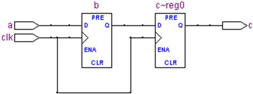

​ 这是因为在每个 clk 的上升沿，电路并发实现两条非阻塞赋值语句，所以需要两个 D 触发器。

​ 而下面的例子和上个例子几乎完全一样，只是把非阻塞赋值改成了阻塞赋值，如下：

```verilog
module blocking(input clk, input a,output reg c); 
 reg b;
 always @(posedge clk) begin
     b = a;  
     c = b;
 end
endmodule
```

​ 实现出来的 RTL 原理图如下：

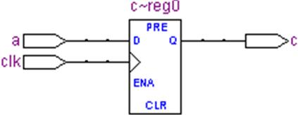

​ 事实上，由于在每个时钟周期上升沿执行完这个 begin-end 块语句后，b 和 c 的值完全一样，所以 RTL 中就把 b 给优化掉了。

​ 如果你还有更多探索的兴趣，可以先试试把上面的例子中 b = a; c = b;的顺序交换一下，再把实现出来的结果和非阻塞赋值例子的结果相比较，看看是不是相同。
