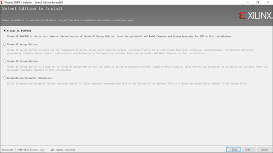
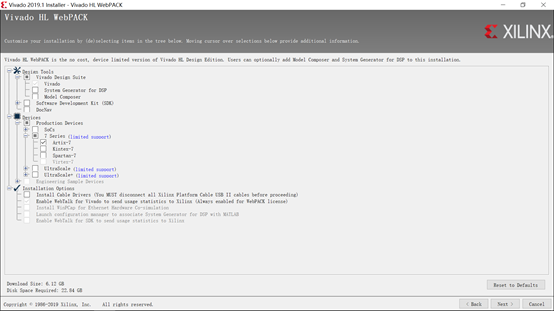
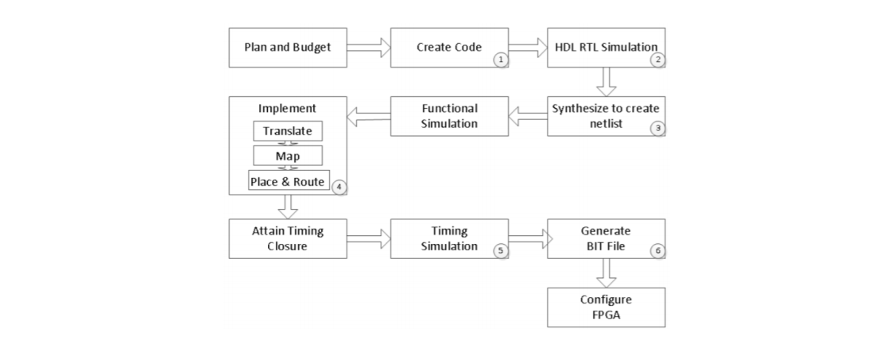
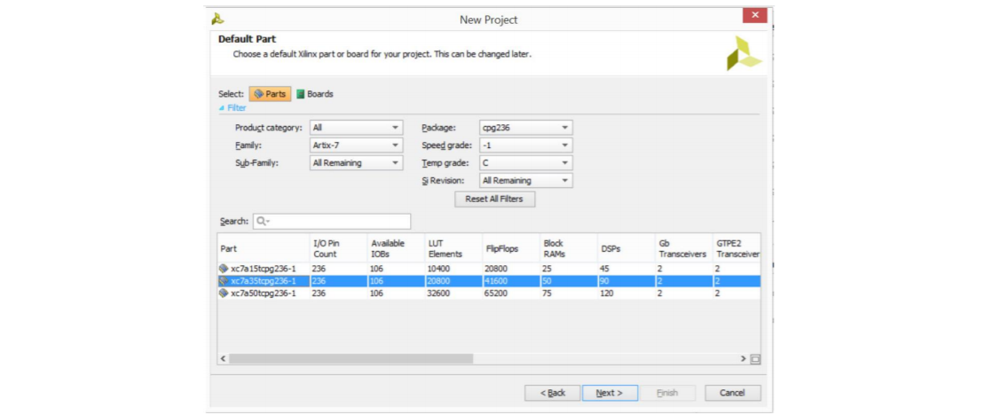
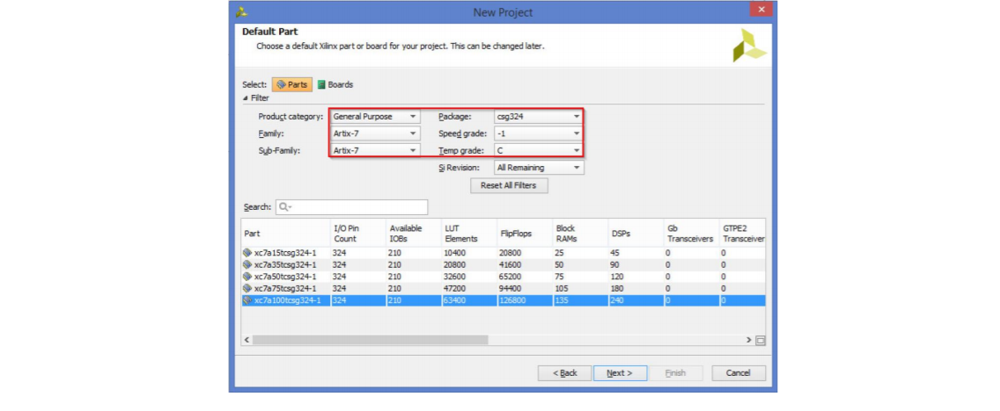

# Vivado 安装和使用

## 1. vivado 安装

首先下载 vivado webpack installer，目前最新版本为 2019.1。

开始安装，可以选择 VIvado HL Webpack 版本点击 next 继续安装。

接下来的一步可以使用默认选项继续安装，但是这样占用的存储空间比较大。也可以使用如用所示的最小安装方式。

接下来就是比较漫长的安装过程了。你可以先做其他事情，等会再来瞅一下。

## 2. Vivado 使用

本使用指南将指导读者在 Xilinx Vivado 环境下，使用 Verilog HDL 语言设计一个简单的数字电路样例。一个典型的设计流程包括创建 model，创建用户约束文件，创建 Vivado 项目，导入已创建的 model，编译约束文件，选择性调试运行时的行为仿真，综合你的 design，实现 design，生成 bitstream 文件，最后将 bitstream 文件下载到硬件中，并确认硬件能否正确的实现功能。读者即将学习的设计流程将基于 Artix-7 芯片的 Basys3 基板和 Nexys4 DDR 基板。一个典型的设计流程如下图所示，画圈数字的顺序将和本指南中的指导步骤的顺序一致。

### 2-1. 目标

在完成了本指南的所有内容后，你应该具备以下能力：

1. 创建一个采用 HDL 模型的 Vivado 项目，并针对位于 Basys3 和 Nexys4 DDR 板上的特定 FPGA 器件进行开发
2. 使用提供的已部分完成的 Xilinx Design Constraint (XDC) 文件来约束某些引脚的位置
3. 使用 Vivado 的 Tcl 脚本功能来增加额外的约束
4. 使用 XSim 仿真器来仿真你的设计
5. 综合并实现你的设计
6. 生成 bitstream 文件
7. 使用已生成的 bitstream 文件配置 FPGA 设备并确认功能

### 2-2. 流程

若要实现以上的目标，就请你按照下面的步骤完整做一遍。以下是 2015.1 版本的教程，但是和 2019.1 的步骤是差不多的。

#### 2-2-1. 使用 IDE 创建 Vivado 项目

启动 Vivado 并创建一个针对 `xc7a35tcpg236-1`（Basys3）或者 `xc7a100tcsg324-1`（Nexys4 DDR）设备的项目，并使用 Verilog HDL 语言。使用在 sources / tutorial 目录中提供的 `tutorial.v` 和 `Nexys4DDR_Master.xdc` or `Basys3_Master.xdc` 文件。

1. 打开 Vivado → Start → All Programs → Xilinx Design Tools → Vivado 2015.1 → Vivado 2015.1。

2. 单击“Create New Project”以启动向导。你将看到“Create A New Vivado Project”对话框。点击 Next。

3. 单击 New Project 窗体的 Project location 字段的 Browse 按钮，浏览到 `C:\xup\digital`，然后单击 Select。

4. 在 Project name 中输入 tutorial。确保选中“Create Project Subdirectory”框，点击 Next。

1. 在 Project Type 表单中选择 RTL Project，点击 Next。
2. 在 Add Sources 表单中选择 Verilog 作为 Target language 和 Simulator language。
3. 单击 Green Plus 按钮，然后单击 Add Files...按钮，浏览到 `C:\xup\digital\sources\tutorial` 目录，选择 `tutorial.v`，单击 Open，并确认已选中 Copy sources into project，然后单击 Next。
4. 因为我们没有在此设计中使用任何预先固定的 IP，故单击 Add Existing IP form 表单中的 Next
5. 在 Add Constraints 表单中，单击 Green Plus 按钮，然后单击 Add Files ...按钮，浏览到 `C:\xup\digital\sources\tutorial` 目录，选择 `Basys3_Master.xdc`（对应 Basys3）或 `Nexys4DDR_Master.xdc`（对应 Nexys4 DDR），单击 Open，然后单击 Next。XDC 约束文件将 FPGA 上的物理 IO 位置分配给主板上的开关和 LED。这些信息可以通过电路板的原理图或电路板的用户指南获得。
6. 在 Default Part 表单中，使用 Parts 选项和 Fliter 部分的各种下拉字段，选择 `xc7a35tcpg236-1` part（对于 Basy3）或 `xc7a100tcsg324-1` part（对于 Nexys4DDR）。点击 Next。

1. 单击 Finish 以创建 Vivado 项目。使用 Windows 资源管理器并查看 `C:\xup\digital\tutorial` 目录。你将看到 `tutorial.srcs` 和其他目录以及 `tutorial.xpr`（Vivado）项目文件已创建。在 `tutorial.srcs` 目录下创建了两个子目录 `constrs_1` 和 `sources_1`；在它们的下方，分别放置了复制的 `Nexys4DDR_Master.xdc` 或 `Basys3_Master.xdc`（约束）和 `tutorial.v`（源）文件。

#### 2-2-2. 打开 tutorial.v 文件并分析内容

1. 在 Sources 窗格中，双击 tutorial.v 条目以在文本模式下打开文件。

1. 请注意，在 Verilog 代码中，第一行定义了仿真器的 timescale 指令。第 2-5 行是描述模块名称和模块用途的注释行

2. 第 7 行定义了开头（用关键字 module 标记），第 19 行定义了模块的结尾（用关键字 endmodule 标记）。

3. 第 8-9 行定义输入和输出端口而第 12-17 行定义实际功能。

#### 2-2-3. 打开 Basys3_Master.xdc 或 Nexys4DDR_Master.xdc 源，分析内容并编辑文件

1. 在 Sources 窗 格 中，展 开 Constraints 文 件 夹，然 后 双 击 Basys3_Master.xdc（Basys3）或 Nexys4DDR_Master.xdc（Nexys4 DDR）条目以在文本模式下打开文件。

1. 通过删除＃符号或突出显示 `SW[7:0]` 并按 Ctrl / 来取消注释 `SW[7:0]`。取消注释 `LED[7:0]`，引脚名称需要进行更改，以匹配 tutorial.v 文件中的引脚名称。将 sw 更改为 swt，将 LED 更改为 led。

1. 将 `sw[*]` 名称更改为 `swt[*]`，将 `LED[*]` 更改为 `led[*]`，因为模型中的端口名称是 swt 和 led。
2. 关闭并保存文件。

#### 2-2-4. 对源文件执行 RTL 分析

1. 展开 Flow Navigator 窗格的 RTL Analysis 任务下的 Open Elaborated Design 条目，然后单击 Schematic。

2. 单击 OK 以运行分析。将详细说明模型（设计）并显示设计的逻辑视图。

请注意，某些开关输入会通过逻辑门后再被输出到 LED，而其余部分将和文件中的模型一样直接输出到 LED。
